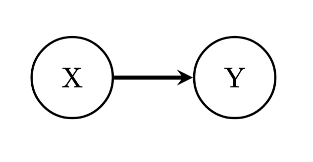
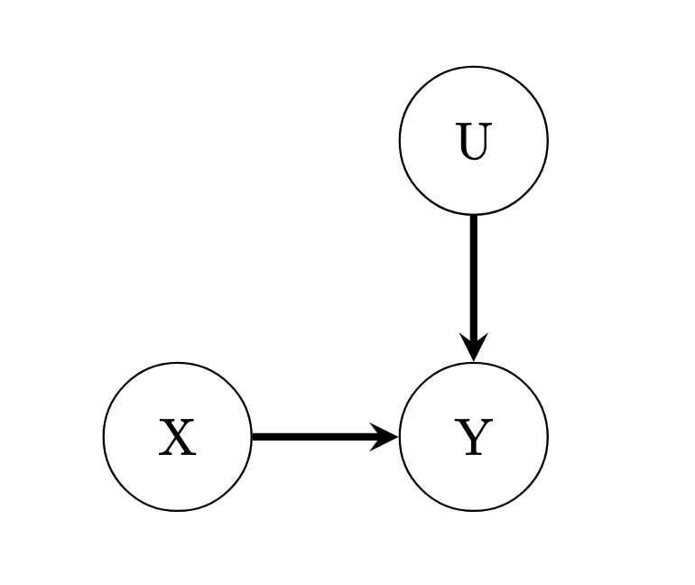
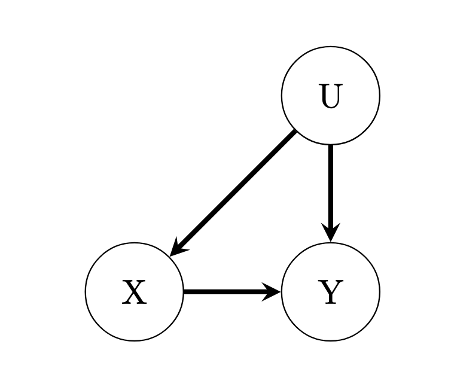
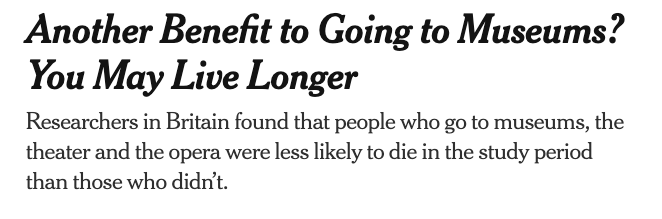
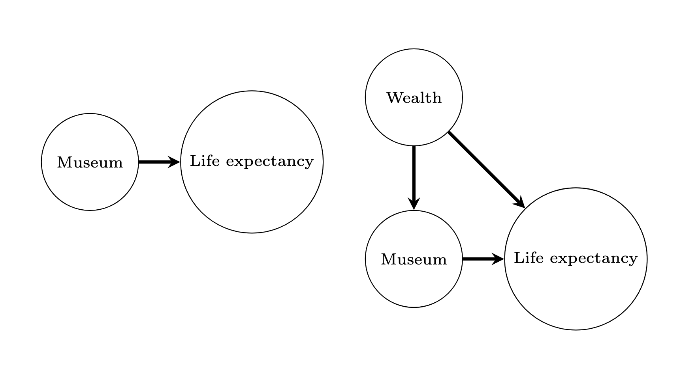
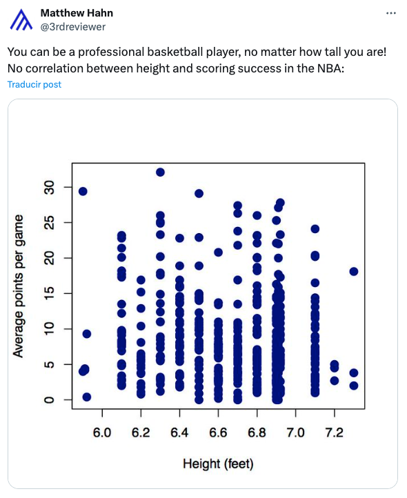
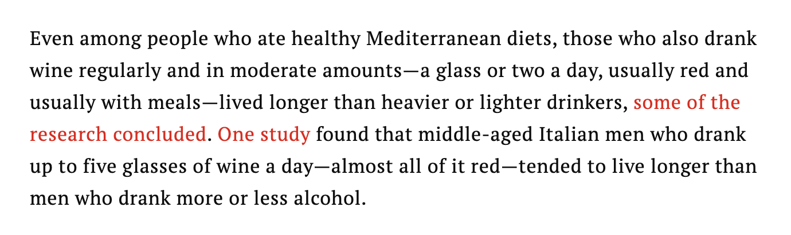

# Logistics

## Assignments

-   Did you send me a quarto file? If not, please do

## Announcements

-   This Wed: RStudio and Quarto workshop

## Agenda for today

::: {.incremental}
1. Recap: The fundamental problem of causal inference
2. What is **confounding**?
3. How **randomization** solves confounding
4. Can we do causal inference with **observational data**?
:::

# Recap: The Fundamental Problem

## Causality as Explanation

::: incremental
-   Last week, we discussed the fundamental problem of causal inference:

    -   We can never observe what *could have happened* - or the **counterfactual outcome**

-   This prevents us from ever observing *individual* treatment effects...
:::

. . .

::: {.callout-important}
## But there's hope!
When treatment assignment is **independent** of our outcomes, we can *estimate* **average causal effects**
:::

## Causality as Explanation

**Key Questions:**

- What is independence in the **statistical** sense?

. . .

- In the **substantive** sense?

. . .

- Is independence **observed** or **assumed**?

## Independence: Statistical Sense

::: {.callout-tip}
## Statistical Independence
Two variables X and Y are **statistically independent** if knowing the value of X tells you **nothing** about the value of Y (and vice versa).
:::

. . .

Formally: $P(Y | X) = P(Y)$

. . .

**Example:**

- If a coin flip (X) is independent of your test score (Y), then knowing the coin landed heads doesn't change our prediction of your score
- The distribution of Y is the **same** regardless of X

## Independence: Substantive Sense

::: {.callout-important}
## Substantive Independence (for Causal Inference)
Treatment assignment is independent of **potential outcomes** — meaning who gets treated is **unrelated** to how they would respond to treatment.
:::

. . .

**In plain language:**

- The people who got treated are **not systematically different** from those who didn't
. . .

Independence is **assumed**, not observed

# Confounding: The Enemy of Causality

## DAGs: A Visual Language for Causality

One useful way to think about causality is using **Directed Acyclical Graphs (DAGs)**

. . .

::: {.callout-tip}
## Why DAGs?
Causal inference requires assumptions and DAGs are ways for us to **visualize those assumptions**
:::

. . .

In a DAG, each **node** is a variable and the **edge** represents a causal relationship. For example "X causes Y":

{fig-align="center" width="241"}


## DAGS: Multicausality

What if multiple things cause Y?

{fig-align="center" width="241"}

. . .

::: {.callout-note}
## Key Insight
X and Y are **independent** if X is "separated" from other variables that go to Y.
:::

## DAGs: The Confounder Problem {.smaller}

What if X *and* Y are **both caused** by some other variable, U?

. . .

{fig-align="center" width="230"}

. . .

Are X and Y independent? Can we plug-in $\bar{Y_c}$ and $\bar{Y_t}$ and subtract?

. . .

**NO!** U is a **confounder** — it creates a "backdoor path" between X and Y

## Confounders in the wild

{fig-align="center" width="463"}

## Which is it?

{fig-align="center" width="241"}

## Selection as a confounder

{fig-align="center"}

# The Solution: Randomization

## Randomization as a way to get independence

::: {.callout-important}
## The Core Challenge
Independence between treatment and outcome is a **hard assumption**!
:::

. . .

One way to make it more convincing is to **randomize treatment assignment**:

. . .

> If treatment assignment depends on **luck**, not X, then we have a good theoretical reason to assume X and Y are independent.

## {background-color="#2c3e50"}

::: {.r-fit-text}
**Example: Project STAR**
:::

::: {.fragment}
*One of the most influential education experiments in history*
:::

## What is Project STAR?

::: {.incremental}
- **S**tudent **T**eacher **A**chievement **R**atio
- A **landmark randomized experiment** conducted in Tennessee (1985-1989)
- Over **11,000 students** in 79 schools participated
- Students were **randomly assigned** to one of three class types:
  - Small classes (13-17 students)
  - Regular classes (22-25 students)
  - Regular classes with a teacher's aide
- Students followed from **kindergarten through 3rd grade**
:::

## Why Project STAR Matters

::: {.callout-tip}
## A Rare Opportunity
It's very hard to run large-scale education experiments. STAR cost **$12 million** and required buy-in from teachers, parents, and school districts.
:::

. . .

The results have influenced education policy for **decades** — including debates about class size reduction in California, Wisconsin, and beyond.

## The Research Question

::: {.r-fit-text}
What is the **causal effect** of class size on educational outcomes?
:::

. . .

Why is this hard to answer without an experiment?

## The Confounding Problem

Class size and educational outcomes are probably **confounded**:

. . .

::: {.incremental}
- **Parent's wealth** — richer parents may choose schools with smaller classes
- **Where people live** — suburban vs. urban schools differ systematically
- **School quality** — better schools might have both smaller classes AND better outcomes
- **Student ability** — struggling students might be placed in smaller classes
:::

. . .

What else can you think of?

## The Experimental Solution

::: {.callout-note}
## Research Design
**Randomize the size of classrooms!**
:::

. . .

- **Hypothesis:** Kids learn better in smaller classrooms

. . .

- **Key insight:** By randomly assigning students to class sizes, we **break** the link between class size and all confounders

## Loading the Data

```{r star, echo = T, results=T}
star <- read.csv("./code/STAR.csv")
dim(star)
head(star)
```

## Exploring Treatment Assignment

```{r, echo = T, results=T}
table(star$classtype)
prop.table(table(star$classtype, star$graduated), 1)
```

## The Difference-in-Means Estimator

What is the **average causal effect** of class size on education outcomes?

. . .

**The Estimator:**

$$\hat{\tau} = \bar{Y}_{\text{treated}} - \bar{Y}_{\text{control}}$$

. . .

- $\bar{Y}_{\text{treated}}$ = average outcome for the treatment group
- $\bar{Y}_{\text{control}}$ = average outcome for the control group


## Difference-in-Means: Code

```{r echo = T, results=T}
# 1. Mean Math score for people assinged to small classroom
math_treat <- mean(star$math[star$classtype=="small"])
# 2. Meam math score for people in regular classroms
math_control <-  mean(star$math[star$classtype=="regular"])
# 3. Mean reading for treatment
reading_treat <- mean(star$reading[star$classtype=="small"])
# 4. Reading control
reading_control <- mean(star$reading[star$classtype=="regular"])

### difference-in-means estimators ####
math_treat - math_control
reading_treat - reading_control
```

## Interpreting the Results

::: {.callout-important}
## What do these numbers mean?
- Students in **small classes** scored about **5-8 points higher** on standardized tests
:::

. . .

Long-term follow-ups found that STAR students in small classes were also more likely to:

- Graduate high school
- Attend college
- Earn higher wages

# But What If We Can't Randomize?

## Can we do observational causal research?

::: {.incremental}
-   Causality hinges on **independence** between treatment and outcome
-   By randomizing treatment assignment, RCTs plausibly *fabricate* independence
-   But **not everything can or ought to be randomized!**
:::

. . .

::: {.callout-tip}
## The Observational Approach
Find and leverage *accidentally or conditionally occurring* **random variation** in treatment assignment
:::

## {background-color="#2c3e50"}

::: {.r-fit-text}
**Natural Experiments**
:::

::: {.fragment}
*When nature (or history) randomizes for us*
:::

## Example: Russian TV in Ukraine

::: {.callout-note}
## The Study
[Electoral Effects of Biased Media: Russian Television in Ukraine](https://www.jstor.org/stable/26598765) (Peisakhin and Rozenas, 2018)
:::

. . .

**Research Question:** Does exposure to state-funded pro-Russia news make Ukrainians more pro-Russia?

## Why This Study Matters

::: {.callout-important}
## The Context
This study examines Ukraine **before** the 2014 Russian annexation of Crimea and the ongoing war.
:::

. . .

::: {.incremental}
- Russian state TV (channels like Channel One, Russia-1) broadcast **heavily biased** content
- Many Ukrainians, especially in the East, could receive these broadcasts
- Can foreign propaganda influence domestic elections?
:::

## The Challenge

**Why is this hard?** People don't watch TV randomly!

. . .

::: {.incremental}
- Pro-Russia Ukrainians might **seek out** Russian TV
- Anti-Russia Ukrainians might **avoid** Russian TV
- Political views and TV watching are **confounded**
:::

## The Clever Solution

Due to **geography and topography**, TV reception is **as-if-random**

. . .

::: {.incremental}
- Signal strength depends on distance from transmitters and terrain (hills, valleys)
- Two neighboring villages might have very different reception
- Residents didn't choose where to live based on TV signal
- This creates **arbitrary variation** in who can receive Russian TV
:::

## The Research Design

**Key idea:** Compare nearby areas that are plausibly the same in all respects — except some receive Russian TV and others don't, due to accidents of geography

. . .

::: {.incremental}
- Find pairs of **neighboring areas** with different signal strength
- These neighbors should be similar in demographics, history, economy
- The **only systematic difference** is TV access
- Any difference in voting behavior → effect of Russian TV
:::

## The Key Assumptions

**What must we believe for this to work?**

::: {.incremental}
- TV signal strength is **unrelated** to other factors affecting political views
- People didn't **move** based on TV availability
- The signal variation creates **comparable** groups
- No other differences between signal/no-signal areas
:::

. . .

Are these assumptions plausible?

## The Findings

The study found that exposure to Russian TV:

::: {.incremental}
- **Increased** pro-Russia voting by 5-10 percentage points
- **Decreased** support for Ukrainian nationalist parties
- Effects were **strongest** in areas with historical ties to Russia
:::

. . .

::: {.callout-important}
## Policy Implication
State-controlled media can be a powerful tool for political influence — even across borders
:::

# Dealing with Confounders

## Using Controls

::: incremental

-   If we feel theoretically confident that we can **observe all variables** that confound the relationship between X and Y, we can **control** for them and estimate causal effects

-   This is a **BIG BIG BIG** assumption (called the **Conditional Independence Assumption**)

-   We cannot do anything with confounders **we cannot observe!**
:::

## {background-color="#722f37"}

::: {.r-fit-text}
Does drinking wine make you live longer?
:::

## The Wine Study

From [Time magazine](https://time.com/5552041/does-red-wine-help-you-live-longer/)

{fig-align="center"}

## Does drinking wine make you live longer?

::: incremental
-   The researchers compared only Italian men who were the same age, and ate about the same.
-   I.e., they "controlled" for age, diet, origin.
-   If **nothing else** confounds the relationship between drinking wine and life expectancy, then they identified a causal effect!
-   Do we believe them? What else might be confounding?
:::

# Wrapping Up

## Key Takeaways

::: {.incremental}
1. Causality **ALWAYS** requires assumptions!
   - DAGs are good ways to clarify our assumptions
2. Whether our conclusions are causal depends on whether our **assumptions hold**
3. Assumptions refer to what we **cannot see** — they are un-testable!
4. Good research argues why a setting is **well-suited** to answer causal questions
:::
