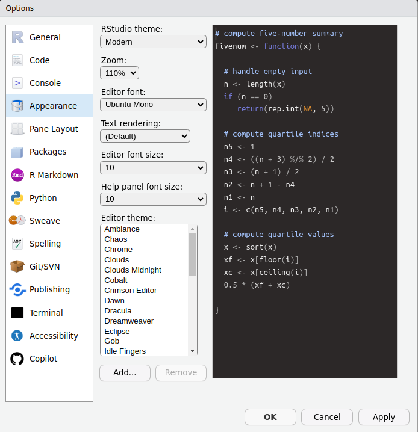

# R and RStudio

## Preparedness

You should have...

- R + RStudio installed
- Quarto doc rendered and sent to CT
- GitHub account created and posted to Slack

## Motivation: My Story

- Unconventional path: 4 years at an NGO in Mexico before the PhD
- All I did was data analysis in R — became very proficient
- Came to NYU without the typical econ masters background
- My peers knew the literature, they knew math proofs — but I knew something they didn't: how to code
- That skill saved me

## Motivation: The Market

- Data skills remain highly marketable
- R is free (Stata: $600+/year) and widely used in policy, research, and industry
- Same workflow at World Bank, think tanks, tech companies

## On AI and Coding

- In the age of GPT and Claude, coding is changing
- But the mental structure it gives you — how to think about problems — is worth learning
- My two cents: don't ask AI to do something you couldn't do yourself
- But it's fine to ask it to do something you *could* do, just faster or better

## Resources

Free, open-source textbook that teaches statistics using R

- Statistical Inference via Data Science: A ModernDive into R and the Tidyverse [(moderndive.com)](https://moderndive.com/1-getting-started.html)
- R for Data Science [(r4ds.had.co.nz)](https://r4ds.had.co.nz/index.html)
- [JPAL Online Course](https://sites.google.com/povertyactionlab.org/2021jpalusrst/course-content/stata-r-and-surveycto?authuser=0) 

Support for R:

- ChatGPT (OpenAI), Claude (Anthropic), Gemini (Google)
- Stack Overflow

## What are R and RStudio?

- R is a programming language and free computing environment for statistical computing and graphics
- RStudio is an integrated development environment (IDE) that provides an interface by adding many convenient features and tools
- Think of R as a car's engine and RStudio as the dashboard
- RStudio can also be used to manage projects, produce documents, build websites

:::{.notes}
R is a programming language and free computing environment for statistical computing and graphics. It can be runs on a wide variety of operating systems, including Linux, Windows, and MacOS. RStudio is an integrated development environment (IDE) that provides an interface by adding many convenient features and tools.

You can think of R as a car's engine and RStudio as the dashboard. In the same way that having access to a speedometer and a navigation system makes driving much easier, using RStudio’s interface makes using R much easier as well.

R and RStudio are entirely free and updated on a regular basis, making them much more accessible and widely used than paid alternatives. You can conduct nearly any analysis using R, ranging from calculating the average of a variable to creating maps and conducting spatial analysis to conducting the analysis for an impact evaluation.
:::

## Peronalization

- Customize the appearance of your R IDE by going to Tools -> Global Options -> Appearance 

## Quarto

- Quarto integrates code into document production (R, Python, etc.)
- Useful for producing professional `.pdf` or `.html` files, building websites
- All assignments will require building `.html` files in Quarto
- Final project will build a public website presenting an original analysis

