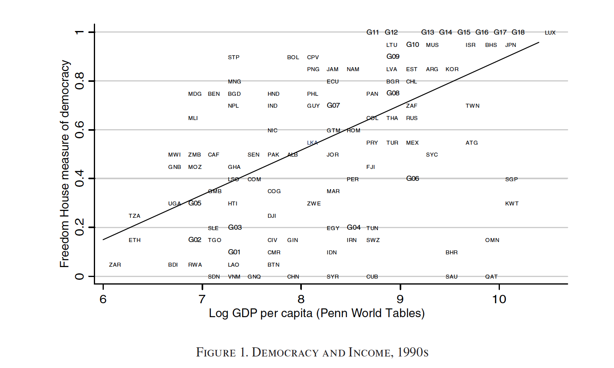
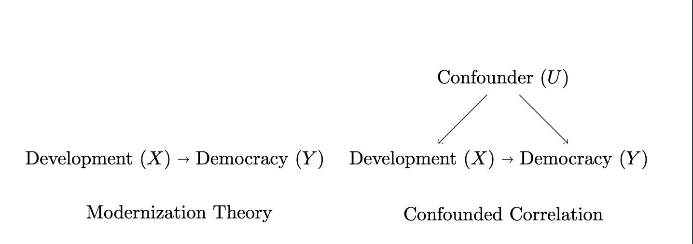

## Agenda

-   Democracy as a consequence of development
-   Democracy as a cause of development
-   Fixed effects

## Democracy and Development

{fig-align="center"}

## Two explanations

::: incremental
1.  Direct causal link

    -   Development $\rightarrow$ democracy
    -   Democracy $\rightarrow$ development

2.  Indirect link or correlation

    -   Income $\rightarrow$ regime survival
    -   Omitted variable
:::

# Development as cause

## Modernization Theory, Lipset (1960)

**Development causes democracy**

::: incremental
-   Economic development requires investing in education, infrastructure, urbanization...

    -   Modernizing.

-   Modernization triggers changes making democracy more likely

    -   Society becomes more complex and organized
    -   Education facilitates democratic citizenship
    -   Infrastructure and urbanization facilitate political competition
:::

## The Threat of Revolution

::: incremental
-   [Acemoglu and Robinson (2001)](https://www.aeaweb.org/articles?id=10.1257/aer.91.4.938)
-   Rich elites control autocratic societies
    -   But they fear revolution!
-   How to prevent it?
    -   Democratize and redistribute some of the resources
-   Elites and non-elites are better off
:::

# Development as consequence

## Democracy Spurs Development

Dictatorship, Democracy, and Development [(Olson, 1993)](https://www.jstor.org/stable/2938736?seq=5)

::: incremental
-   Autocrats want a wealthy country.

-   Why would citizens produce wealth if it can be expropriated by an autocrat?

    -   Solution: **Credibly** tie your own hands with democratic institutions

-   By sharing political power and enshrining property rights, create incentives to produce wealth

-   Democracy $\rightarrow$ development
:::

# Other Explanations

## Democratic Survival

::: incremental
-   Democracy is established independently of development ...

-   But development helps democracies survive

-   "The more well-to-do a nation, the greater the chances it will sustain democracy" (Lipset, 1959)

-   Empirical implications: There will be a correlation btw democracy and development even if development does not cause democracy!
:::


## Democracy and Development in Research

- Are the theoretical arguments for $Democracy \rightarrow Development$ convincing?

- Are the theoretical arguments for $Development \rightarrow Democracy$ convincing?

## Democracy and Development in Research 

- [Paglayan, 2020](https://www.cambridge.org/core/journals/american-political-science-review/article/nondemocratic-roots-of-mass-education-evidence-from-200-years/8C8C594AA07996A00ED4BEFC66B133B7) 

    - Reconsiders whether democratization increases the provision of education. Finds that democratization *can* increase education provision, but that education is also a powerful for autocrats
    
- [Fujiwara, 2015](https://www.cambridge.org/core/journals/american-political-science-review/article/nondemocratic-roots-of-mass-education-evidence-from-200-years/8C8C594AA07996A00ED4BEFC66B133B7) 

    - Electronic voting in Brazil reduced mistakes when voting from poorest, resulting in better accountability and more spending in health care

## Democracy and Development in Research

-   [Ferraz and Finan, 2008](https://academic.oup.com/qje/article/123/2/703/1930865)

    -   Random audits of Brazilian majors reduces the chances that corrupt politicians are re-elected

-   [Mori, et. al., 2024](https://www.journals.uchicago.edu/doi/10.1086/727799)

    -   Use gender quotas to examine if female politicians use local budget more or less effectively

-   [Pailler, 2018](https://www.sciencedirect.com/science/article/pii/S0095069616301577?casa_token=lxyQWsb-OwEAAAAA:_UixyIjFcdpfLphKULMOGM-1IhqRDTooRDDUTqx5n6SrEAwKe3NS0hnMVNxaNQ_qL-Ho4L2hEi4)

    -   Democratic competition increases deforestation!

## That Correlation Again

{fig-align="center"}

## Acemoglu et. al. 2008

-   The criticism: correlation of democracy and development does not mean causation

::: incremental
-   Alternative: countries embark on divergent development paths

-   Empirical implication: observed association is correlational
:::

## Which is the correct DAG?



## The Problem

- If the confounded DAG is correct, we need to control for U

- What U do the authors propose?

. . .

> *"The major source of potential bias in a regression of democracy on income per capita is country-­specific, historical factors influencing both political and economic development."*

- Cannot control for all historical factors individually. So what do we do?

# Fixed Effects

## Strategy 1: Fixed Effects

> *"We utilize two strategies to investigate the causal effect of income on democracy. Our first strategy is to control for country-specific factors affecting both income and democracy by including country fixed effects"*

## From Between to Within

- The standard regression compares rich countries to poor countries (*between* variation)

> *"The idea of fixed effects is to move beyond this comparison and investigate the "within-country variation," t"*

- When a country gets richer *than its own average*, does it become more democratic *than its own average*?

## Why Does This Matter? Simpson's Paradox

```{r simpson_sim, include=T, message=F, warning=F, error=F, echo=F, fig.width=10, fig.height=4.5}
pacman::p_load(tidyverse, patchwork)

set.seed(123)
n_per <- 40
sim <- bind_rows(
  tibble(Group = "Group A", x = rnorm(n_per, 2, 0.6)) %>%
    mutate(y = 2 - 0.4 * (x - 2) + rnorm(n_per, 0, 0.3)),
  tibble(Group = "Group B", x = rnorm(n_per, 5, 0.6)) %>%
    mutate(y = 5 - 0.4 * (x - 5) + rnorm(n_per, 0, 0.3)),
  tibble(Group = "Group C", x = rnorm(n_per, 8, 0.6)) %>%
    mutate(y = 8 - 0.4 * (x - 8) + rnorm(n_per, 0, 0.3))
)

p1 <- ggplot(sim, aes(x = x, y = y)) +
  geom_point(alpha = 0.5) +
  geom_smooth(method = "lm", se = FALSE, color = "blue", linewidth = 1.2) +
  labs(x = "X", y = "Y", title = "Pooled: positive trend") +
  theme_minimal(base_size = 14)

p2 <- ggplot(sim, aes(x = x, y = y, color = Group)) +
  geom_point() +
  geom_smooth(method = "lm", se = FALSE, linewidth = 1) +
  labs(x = "X", y = "Y", title = "By group: negative trends") +
  theme_minimal(base_size = 14) +
  theme(legend.position = "bottom")

p1 + p2
```

## Simpson's Paradox

A trend in pooled data can reverse when the data is split into groups. The overall trend is driven by differences *between* groups, not by the relationship *within* groups

## FE = Unit-Level Intercepts

- FE give each unit its own intercept, just like splitting by group

- The pooled regression mixes *between* and *within* variation

- FE isolates only *within-group* variation, which can flip conclusions

## Fixed Effects in Practice

Add a dummy variable for each country (one intercept per country, one shared slope)

Go from

```{=tex}
\begin{equation*}
Dem_{it} = \alpha + \beta_1 Income_{it} + \epsilon_{it}
\end{equation*}
```
To

```{=tex}
\begin{align*}
Dem_{it} = &\alpha + \beta_1 Income_{it} + \mu_1 USA + \\
\mu_2 France & + ... \mu_n Zimbabwe + \epsilon_{it}
\end{align*}
```

## Why Time-Invariant Only?

> *"If these omitted characteristics are, to a first approximation, time-invariant, the inclusion of fixed effects will remove them and this source of bias. "*

- Colonial history and geography are in the past. They do not change. FE absorbs them

- But new things happen: wars, oil discoveries, coups. These change the within-country link between income and democracy in new, unexpected ways

# Applying FE to the Acemoglu Data

## Load and Prepare Data

```{r code_load, include=T, message=F, error=F, echo=T}
pacman::p_load(readxl, tidyverse, here)

d <- read_xls(here("./slides/code/Income-and-Democracy-Data-AER-adjustment.xls"),
              sheet = 2) %>%
  filter(!is.na(lrgdpch), !is.na(polity4)) %>%
  arrange(country, year) %>%
  group_by(country) %>%
  mutate(lag_dem = lag(polity4),
         lag_income = lag(lrgdpch)) %>%
  ungroup()
# polity4: standardized democracy score (-10 to 10)
summary(d$polity4)
# lrgdpch: log real GDP per capita
summary(d$lrgdpch)
```

## Cross-Sectional Correlation

This is the pattern that modernization theory predicts

```{r code_scatter, include=T, message=F, error=F, echo=T, fig.align='center'}
ggplot(d, aes(y = polity4, x = lag_income)) +
  geom_point(alpha = 0.3) +
  geom_smooth(method = lm, se = FALSE) +
  labs(x = "Lagged Log GDP per capita", y = "Polity Score") +
  theme_bw()
```

## OLS Regression (no FE)

::: {style="font-size: 0.75em;"}
```{r code_ols, include=T, message=F, error=F, echo=T}
mod_ols <- lm(polity4 ~ lag_dem + lag_income, data = d)
modelsummary::modelsummary(mod_ols, stars = TRUE,
  coef_omit = "Intercept",
  gof_omit = "AIC|BIC|Log.Lik|F")
```
:::

## Why Lag?

- Why use *lagged* GDP and not current GDP?

. . .

- Lagged income happened *before* the current democracy score, which makes the causal direction clearer

- Why include lagged democracy?

. . .

- Democracy is persistent: this year's regime looks a lot like last year's

- Without controlling for it, we might confuse "income causes democracy" with "democracy causes democracy"

## Adding Fixed Effects with lm

::: {style="font-size: 0.7em;"}
```{r code_fe_lm, include=T, message=F, error=F, echo=T}
mod_fe <- lm(polity4 ~ lag_dem + lag_income +
               factor(country) + factor(year), data = d)
modelsummary::modelsummary(
  list("OLS" = mod_ols, "Country + Year FE" = mod_fe),
  stars = TRUE,
  coef_omit = "factor|Intercept",
  gof_omit = "AIC|BIC|Log.Lik|F|R2")
```
:::

## What Changed?

- In OLS, lag_income is positive and significant

- With FE, the income coefficient drops to almost zero, not distinguishable from zero

- This is Acemoglu et al.'s key finding

## A Better Package: estimatr

::: {style="font-size: 0.65em;"}
```{r code_robust, include=T, message=F, error=F, echo=T}
pacman::p_load(estimatr)
# cluster-robust SEs + efficient FE
mod_robust <- lm_robust(polity4 ~ lag_dem + lag_income,
  fixed_effects = country + year,
  clusters = country, data = d)
modelsummary::modelsummary(mod_robust, stars = TRUE,
  coef_omit = "Intercept",
  gof_omit = "AIC|BIC|Log.Lik|F|R2")
```
:::

## Visualizing FE in Our Data

```{r simpson_data, include=T, message=F, warning=F, error=F, echo=F, fig.width=10, fig.height=5}
cty <- c("Australia", "Nigeria", "Nicaragua", "China", "France", "Jordan")
tempo <- d %>% filter(country %in% cty)

# FE slope from the full specification (country + year FE + lag_dem control)
full_fe_mod <- lm(polity4 ~ lag_dem + lag_income +
                    factor(country) + factor(year), data = d)
fe_slope <- coef(full_fe_mod)["lag_income"]

cty_means <- tempo %>%
  group_by(country) %>%
  summarise(mean_x = mean(lrgdpch, na.rm = TRUE),
            mean_y = mean(polity4, na.rm = TRUE))
cty_means <- cty_means %>%
  mutate(intercept = mean_y - fe_slope * mean_x)

p_pooled <- ggplot(d, aes(x = lrgdpch, y = polity4)) +
  geom_point(alpha = 0.15, size = 0.8) +
  geom_smooth(method = "lm", se = FALSE, color = "blue", linewidth = 1.2) +
  labs(x = "Log GDP per capita", y = "Polity Score",
       title = "Pooled OLS: positive slope") +
  theme_minimal(base_size = 14)

p_fe <- ggplot(tempo, aes(x = lrgdpch, y = polity4, color = country)) +
  geom_point(size = 2, alpha = 0.7) +
  geom_abline(data = cty_means,
              aes(slope = fe_slope, intercept = intercept, color = country),
              linewidth = 1) +
  labs(x = "Log GDP per capita", y = "Polity Score",
       title = "Country FE") +
  theme_minimal(base_size = 14) +
  theme(legend.position = "bottom", legend.title = element_blank())

p_pooled + p_fe
```

## Why Are Rich Countries Democratic?

> *"These results naturally raise the following important question: why is there a cross-sectional correlation between income and democracy? In other words, why are rich countries democratic today?"*

## The Authors' Answer

> *"At a statistical level, the answer is clear: even though there is no relationship between changes in income and democracy in the postwar era or over the past 100 years or so, there is a positive association over the past 500 years. "*

## Historical Roots of the Correlation

> *"In particular, for the whole world sample, the positive association is considerably weakened when we control for date of independence, early constraints on the executive, and religion. "*

## Do We Buy It?

- Acemoglu et al.'s claim: the income-democracy correlation reflects deep historical divergence, not a modern causal effect of income on democracy

- What do you think? Is this convincing?

- What would it take to change your mind?

## Summing up

-   Good theoretical reasons to think democracy is causally related to development

-   Most extant work focuses on micro, sub-national dynamics

-   Fixed effects control for **time-invariant** unobserved confounders

-   If confounders change over time, FE cannot help

# Appendix: Instrumental Variables {visibility="uncounted"}

## Strategy 2: Instrumental Variables

> *"Our second strategy is to use instrumental-variables (IV) regressions to estimate the impact of income on democracy"*

- When FE is not enough (time-varying confounders remain), IV provides another approach

- Core idea: find a variable Z that shifts income but has no direct effect on democracy

## IV Intuition

- We need a variable Z (the "instrument") that:
    1. Is correlated with income (relevance)
    2. Affects democracy *only* through income (exclusion restriction)

- Z isolates the part of income variation that is "as-if random"

- Acemoglu et al. use **trade-weighted world income** as instrument: global economic shocks shift a country's income but arguably do not directly cause democratization

## The Exclusion Restriction

- The critical assumption: Z affects democracy ONLY through income

$$Z \rightarrow Income \rightarrow Democracy$$

- There must be **no direct arrow** from Z to Democracy

- This is untestable; it must be argued on substantive grounds

- If the exclusion restriction fails, IV estimates are biased

## IV in Acemoglu et al.

- Instrument: trade-weighted world income

- Logic: when your trading partners get richer, your income goes up (relevance)

- Exclusion: your partners' income growth does not directly change your political institutions

- Result: IV estimates also show no causal effect of income on democracy

## Limitations of IV

- Exclusion restriction is never testable

- Results depend heavily on instrument choice

- IV estimates a *local* effect (for observations affected by the instrument)

- Combined with FE evidence, strengthens the case against modernization theory
