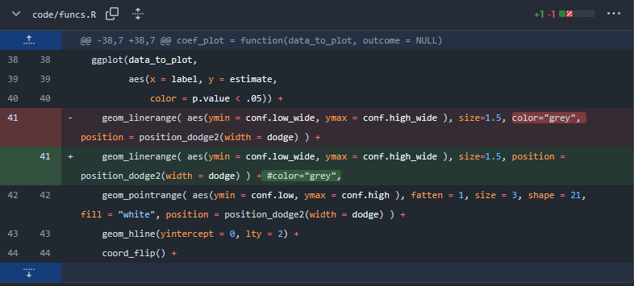
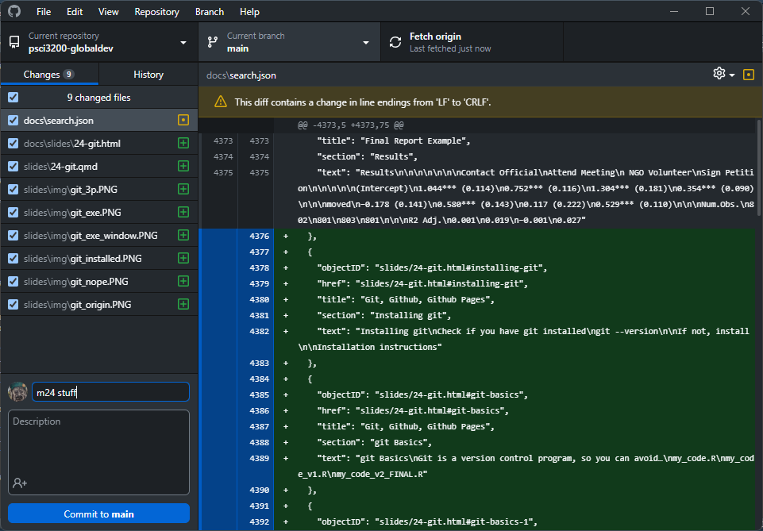
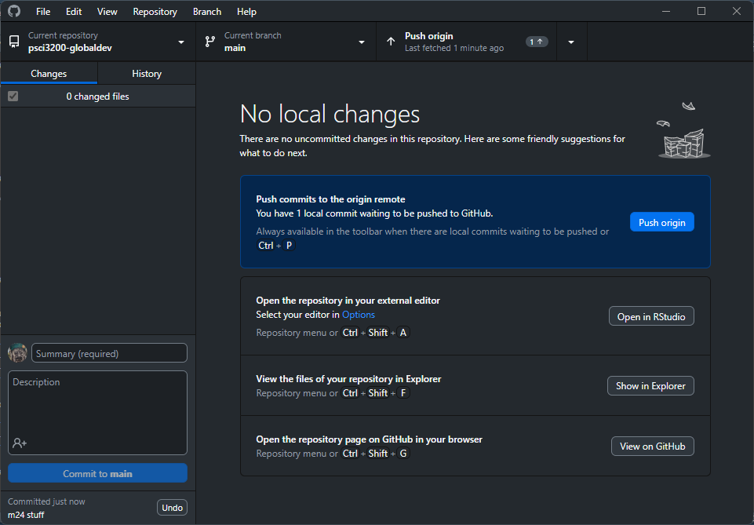
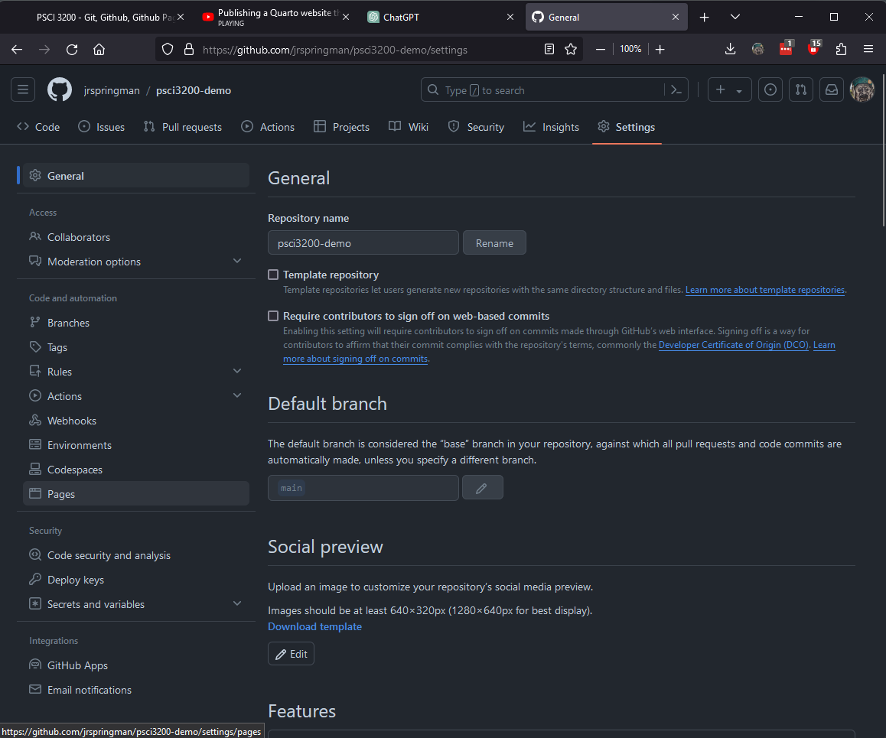
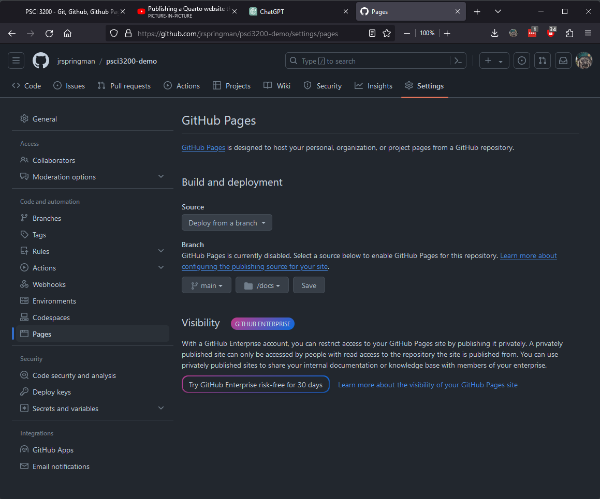

# Logistics

## Final Project Assignments

\

| Milestone                    | Due Date|
|:-----------------------------|:--------|
| ~~Create a GitHub repository~~| ~~Feb 23~~ |
| ~~Research Question and Data~~| ~~Feb 23~~ |
| [**Research Design**](https://carolina-torreblanca.github.io/psci3200-globaldev-main/assignments/04_fpdesign.html)          | Mar 18  |
| [Expanded Research Design](https://carolina-torreblanca.github.io/psci3200-globaldev-main/assignments/05_fptest.html)            | Apr 6  |
| [Final Project](https://carolina-torreblanca.github.io/psci3200-globaldev-main/assignments/final_project.html)   | Apr 29 |

::: {.callout-warning}
Late assignments deduct 2 points per day
:::

## Today's Goal

By the end of class, you will have a **live website** hosting your final project

. . .

Your workflow for the rest of the semester:

1. Edit `.qmd` file in RStudio
2. Render
3. Commit + push with GitHub Desktop
4. Your website updates automatically

# Pre-Work Check

## Did Everyone Complete the Setup?

Open GitHub Desktop right now

::: incremental
1. Can you see your `psci3200_yourname` repo?
2. Is it cloned to a local folder on your computer?
3. Did you successfully push a test commit last week?
:::

. . .

If not — raise your hand and we'll troubleshoot

## Troubleshooting

**"I created my repo on github.com but never installed git"**

- That's OK! Follow the [setup instructions](https://carolina-torreblanca.github.io/psci3200-globaldev-main/assignments/02b_gitsetup.html) now
- Mac: open Terminal, run `xcode-select --install`
- Windows: download from [git-scm.com](https://git-scm.com/download/win)

. . .

**"GitHub Desktop won't let me push"**

- Sign out and back in: Preferences → Accounts → Sign Out → Sign In
- Make sure you're signed into the account that owns the repo

# Quick Git Recap

## What is Git?

**Git is a version control program**, so you can avoid...

```{.default}
analysis.R
analysis_v1.R
analysis_v2.R
analysis_v2_FINAL.R
```

:::{.fragment}

**Version control allows you to precisely track changes**

{fig-align="center"}
:::

## Git Basics

\

**Git hosts data and code**

- "Remote" (`main`) on github.com
- "Local" on your harddrive(s) in a designated folder
- Resembles Dropbox/Drive synch + Version history

## Git Basics

**The workflow**

- `git pull origin main` — download latest changes
- `git add .` — stage your changes
- `git commit -m "describe your changes"` — save a snapshot
- `git push origin main` — upload to github.com

. . .

GitHub Desktop does all of this with buttons instead of commands

## Git Basics

**Commit + Push in GitHub Desktop**

{fig-align="center"}

## Git Basics

**Push to your repo**

{fig-align="center"}


# Github Pages

## What is Github Pages?

- Free website hosting from GitHub
- Your repo becomes a website at `yourusername.github.io/reponame`
- Push changes to your repo → website updates automatically

. . .

We are going to turn your `psci3200_yourname` repo into a website for your final project

## Step 1: Turn Your Repo into a Quarto Website

**In RStudio**: Open your cloned `psci3200_yourname` folder as a project

- File → Open Project → navigate to your repo folder

. . .

**Create `_quarto.yml`**: File → New File → Text File → Save as `_quarto.yml`

```{.yaml}
project:
  type: website
  output-dir: docs

website:
  title: "Your Name - PSCI 3200"
```

## Step 1: Turn Your Repo into a Quarto Website

**Why `output-dir: docs`?**

- When you render, Quarto creates `.html` files from your `.qmd` files
- `output-dir: docs` tells Quarto to put them in a `docs/` folder (created automatically)
- Later, we'll tell Github Pages to serve whatever is in `docs/` as your website

## Step 2: Set Up Your Homepage

**Create `index.qmd`**: File → New File → Quarto Document → Save as `index.qmd`

```{.markdown}
---
title: "Your Name - PSCI 3200 Final Project"
---

## Welcome

This site hosts my final project for PSCI 3200.
```

. . .

**Render it**: click the Render button in RStudio or run in terminal:

```{.default}
quarto render
```

## Step 3: Add Your RQ Assignment

- Copy your Research Question and Data `.qmd` file into the **root folder** of your repo (not `docs/` — never put files there manually)
- Add the page to your `_quarto.yml` navigation:

```{.yaml}
project:
  type: website
  output-dir: docs

website:
  title: "Your Name - PSCI 3200"
  navbar:
    left:
      - href: index.qmd
        text: Home
      - href: rq_data.qmd
        text: Research Question
```

## Step 3: Add Your RQ Assignment

**Render again** to generate the full site:

```{.default}
quarto render
```

You should see a `docs/` folder appear with `.html` files

## Step 4: Push to GitHub

**In GitHub Desktop:**

1. You should see all the new files under "Changes"
2. Write a commit message (e.g., "set up project website")
3. Click **Commit to main**
4. Click **Push origin**

{fig-align="center" height=3in}

## Step 5: Enable Github Pages

**On github.com**, go to your repo → **Settings** → **Pages** (left sidebar)

{height=5in fig-align="center"}

## Step 5: Enable Github Pages

**Set source**: Branch → `main`, Folder → `/docs` → **Save**

{height=5in fig-align="center"}

## Step 6: See It Live!

Wait 1-2 minutes, then visit:

`https://yourusername.github.io/psci3200_yourname/`

. . .

You should see your homepage and your Research Question page in the navigation bar

. . .

**This is now your final project website for the rest of the semester**

# The Workflow Going Forward

## Edit → Render → Push → Live

Every time you work on your final project:

::: incremental
1. **Edit** your `.qmd` file in RStudio
2. **Render** (button or `quarto render`)
3. **Commit + Push** in GitHub Desktop
4. **Check** your website — changes appear in 1-2 minutes
:::


## Building Your Final Project Over Time

- Right now you have your RQ assignment as a `.qmd` on your site
- For your final project, you will create a **new `.qmd`** that brings everything together
- As you complete milestones (Research Design, Expanded Design), practice the workflow: add a new `.qmd` → update `_quarto.yml` → render → push
- By the end of the semester, your site hosts your complete final project

## Example: The Course Website Repo

This is the repo for the website you've been using all semester:

```{.default}
psci3200-globaldev-main/
├── _quarto.yml            ← website config + navbar
├── index.qmd              ← homepage
├── syllabus.qmd           ← another page
├── schedule.qmd           ← another page
├── assignments/           ← assignment pages
├── materials/             ← lecture material pages
├── slides/                ← slide decks
├── data/                  ← data files
└── docs/                  ← generated by quarto render
```

. . .

Same structure you're building just with more pages!

## Your Repo Structure

By the end of today, your repo should look like:

```{.default}
psci3200_yourname/
├── _quarto.yml
├── index.qmd
├── rq_data.qmd          ← your RQ assignment
└── docs/                 ← generated by quarto render
    ├── index.html
    └── rq_data.html
```

## Workshop Deliverable

**By end of day today**, send me on Slack:

- The URL of your live Github Pages site (e.g., `https://yourusername.github.io/psci3200_yourname/`)
- Your Research Question and Data assignment should be visible on the site

. . .

If you get stuck, post on Slack — troubleshooting git is a rite of passage
