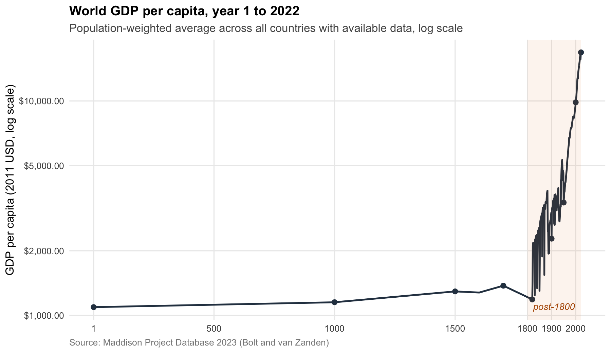

# Logistics

## Housekeeping

- **Today:** the arc of the course
- **Wednesday:** in classroom, open Q&A
  + Final project questions
  + Git, GitHub, pushing
- **May 10:** Final project due

## A quick exercise

**You've been hired by the World Bank**

They want a measure of development at the **state level**, within the United States

:::{.fragment}
**What would you measure?**
**Slack me the answer (last quiz!)
:::

# I. What is development?

## Three countries

- Saudi Arabia: rich (~\$60k GDP per capita)
- Cuba: poor (~\$10k GDP per capita), life expectancy near US level
- United States: rich, worst infant mortality in the OECD

:::{.fragment}
**Which country is "developed"?**
:::

## How to measure development

- Income
- Health
- Human capital
- Political rights
- Inequality

:::{.fragment}
How do these correlate? Something else we misssed?
:::

## The choice is normative

If every axis covaried perfectly, development would be a single ladder

:::{.fragment}
**Development is multidimensional, picking a measure is a normative call**
:::

## The perils of measurement

**Three choices baked into any development index**

- What dimensions count
- How they are weighted
- Whether it measures levels or changes

## Not the historical norm

**Per-capita income fluctuated in a narrow band for most of recorded history**

## The long view

{fig-align="center" width="85%"}

## A working definition

**Development is sustained, compounding improvement in material conditions**

- *Sustained* ?
- *Compounding* ?
- *Material* ?

# II. What have we learned about development?

## Three threads kept reappearing

We have a definition. What did the course teach about achieving it?

- **Accountability:** who answers to whom
- **State capacity:** who can deliver
- **Distribution:** who receives, who pays

## Democracy

*Theory:* informed citizens hold governments accountable

:::{.fragment}
*Evidence:* report cards on Ugandan clinics raised utilization, cut child mortality (Björkman and Svensson 2009)
:::

:::{.fragment}
*Catch:* this works only where elections can punish (Ferraz and Finan 2011; Chong et al. 2015)
:::

:::{.fragment}
**Information binds contingently**
:::

## Representation

*Theory:* identities of politicians shape priorities

:::{.fragment}
*Evidence:* reserved seats for women in India shifted spending to water, child health, schools (Chattopadhyay and Duflo 2004)
:::

:::{.fragment}
*Catch:* representation shits policy only when interests differ / not crystalized
:::

## Security

*Promise:* security is the foundation of development

:::{.fragment}
*But also:* development sustains security. The arrow runs both ways.
:::

:::{.fragment}
*Evidence:* less productive years raise civil war risk (Miguel et al. 2004); Ugandan child soldiers earned less for decades after the war (Blattman and Annan 2010)
:::

:::{.fragment}
**Insecurity blocks development. Underdevelopment fuels insecurity.**
:::

## Crime

*Promise:* democratic accountability should improve policing

:::{.fragment}
*Catch:* policing shapes who participates. Punitive contact produces *custodial citizenship* (Weaver and Lerman 2010)
:::

:::{.fragment}
*Puzzle:* cross-nationally, crime victims are *more* engaged, not less (Bateson 2012)
:::

:::{.fragment}
**Who and how the state polices is cause and consequence of participation**
:::

## Migration

Money. Education. Conflict. Opportunity. All push people to move.

:::{.fragment}
**How does movement reshape sending and receiving countries?**
:::

:::{.fragment}
*Sending:* lose workers, gain remittances. Filipino remittance windfalls funded schooling and microenterprise (Yang 2008)
:::

:::{.fragment}
*Receiving:* gain labor. What rights for those who arrived?
:::

## Service Delivery

The biggest bang per dollar. Also the slowest.

:::{.fragment}
*Health:* north of China's Huai River, coal subsidies cut life expectancy ~5 years (Chen et al. 2013)
:::

:::{.fragment}
*Education:* Indonesian school construction raised lifetime earnings, where labor markets absorbed graduates (Duflo 2001)
:::

:::{.fragment}
**Big returns. Short political horizons. Who has incentives to provide?**
:::

## Climate

A global collective action problem with unequal stakes

:::{.fragment}
*Evidence:* 1°C of warming cuts poor-country growth ~1pp. Rich countries are less affected (Dell, Jones, and Olken 2012)
:::

:::{.fragment}
*Mitigation:* rich countries emitted the carbon. Few electoral pressures to cut
:::

:::{.fragment}
*Adaptation:* the bill lands on poor countries with the least capacity to pay
:::

:::{.fragment}
**The puzzle: how do you solve a global issue without supragovernment authority?**
:::

## Aid

*Promise:* aid moves resources to where the need is greatest

:::{.fragment}
*But aid is non-tax revenue.* It can build state capacity, or substitute for it
:::

:::{.fragment}
*And:* it shifts whom the state must answer to: from citizens (who pay taxes) to donors (who set priorities)
:::

:::{.fragment}
*Evidence:* aid concentrates where politically convenient for donors, bypassing the poorest within recipients (Briggs 2016)
:::

:::{.fragment}
**Aid funds development. It also reshapes accountability.**
:::

## Suppose we know what works

Security. Health. Education. Clean energy. Accountability. Representation.

:::{.fragment}
All can be good for development.
:::

:::{.fragment}
But funds are limited. Capacity is finite.
:::

:::{.fragment}
**Where do we invest first?**
:::

## The triage problem

- *Health:* fast, large gains per dollar
- *Education:* slow, compounding, contingent on labor markets
- *Violence reduction:* a precondition for anything else
- *Anti-corruption:* hard to engineer from outside
- *Redistribution:* politically explosive, but tractable

 
## And the externalities?

Programs rarely affect only their targets

- Cash transfers spill into local prices and demand
- Conflict spreads across borders and generations
- Climate adaptation in one place lowers risk elsewhere
- Schooling has labor market effects beyond the educated

# III. How do we evaluate development policy?

## How do we evaluate policy?

A counterfactual question.

:::{.fragment}
We want to know: what would have happened *without* the policy?
:::

## Constrained comparison

:::{.fragment}
- *Randomization (RCTs)
- *Natural experiments and instruments*
- *Within comparisons (FEs)
- *Difference-in-differences
:::

:::{.fragment}
**Each constrains the comparison differently and rests different assumptions**
:::

## A claim in the wild: "Aid recipients are still poor, so aid is wasted"

Aid flows to poor countries *because* they are poor

:::{.fragment}
Comparing recipients to non-recipients estimates the selection rule, not the treatment
:::

:::{.fragment}
**Counterfactual: what would recipients look like with substantially less aid?**
:::

# V. What do we do?

## What we know

**High confidence**

- Direct health interventions (vaccines, malaria, deworming) are cost-effective almost everywhere
- Cash transfers outperform paternalistic alternatives, with no labor supply hit
- Schooling expansion has positive returns, moderated by labor market absorption

## What we don't know

**Low confidence**

- How to cause institutional change from outside
- How to accelerate democratic consolidation
- Why industrial policy worked in a handful of countries and not others

**Effectively unknown**

- Climate adaptation at scale
- Reconstructing legitimate states after conflict

## Where should we invest?

- The defensible answer: human capital
- The harder answer: state capacity, which is difficult to build from outside
- The urgent answer: climate adaptation and CC mitigation

# Thank you
