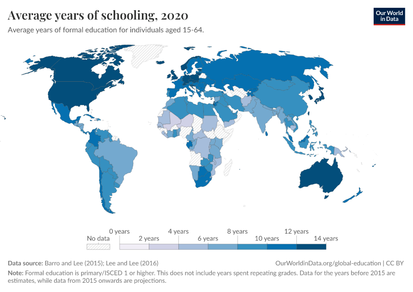
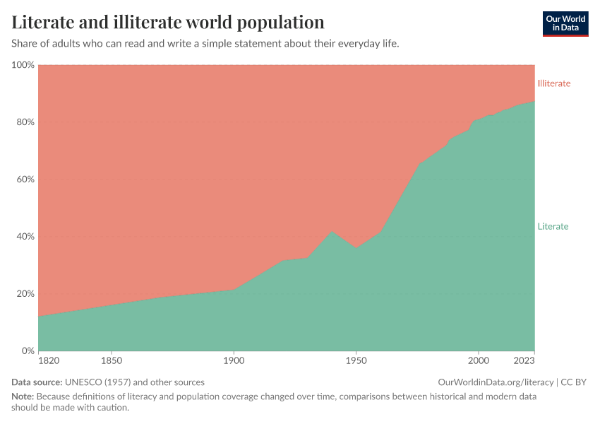
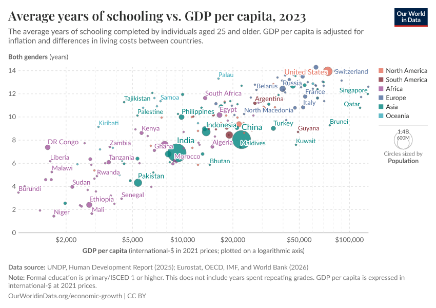
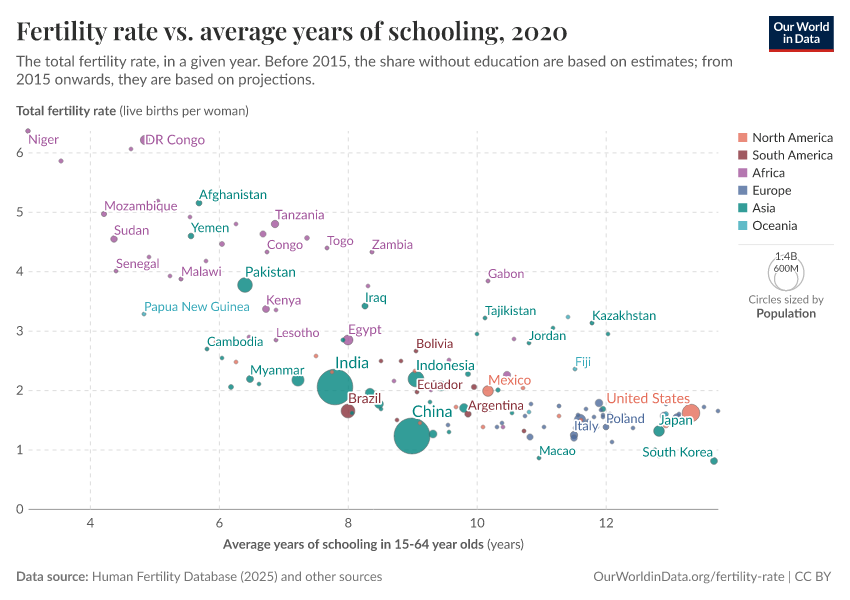
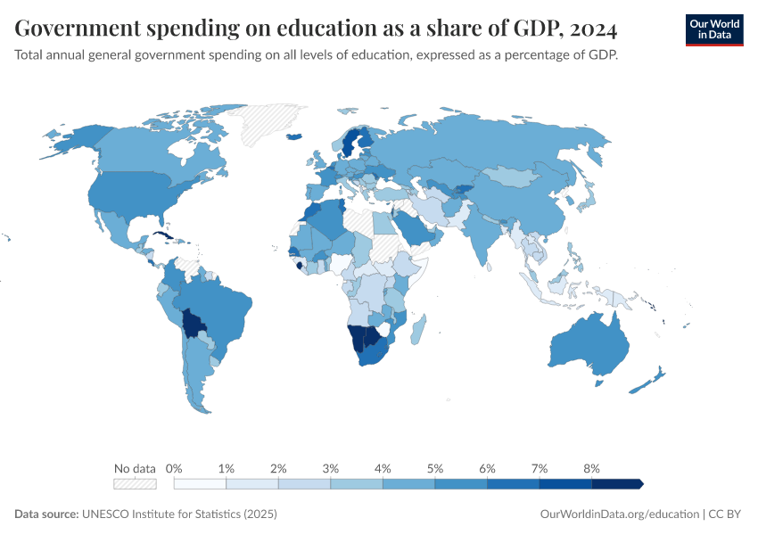

```{=html}
<style>
.reveal h2 { font-size: 1.3em !important; }
</style>
```

## Agenda

1. The education miracle
2. Private vs social returns
3. Duflo (2001)
4. From private to social
5. Education challenges today

## Deadlines

- **Final Project** due Sunday May 10 by 11:59pm ET
- Wednesday April 22: in-class work session

# The Education Miracle

## The Central Question

::: incremental
- Can education make a **person** rich?
- Does it make a **country** rich?
:::

## Schooling

{fig-align="center" height="5in"}

## Most of the World Now Literate

{fig-align="center" height="5in"}

## Schooling and Income

{fig-align="center" height="5in"}

## Schooling and Fertility

{fig-align="center" height="5in"}

## Governments Invest

{fig-align="center" height="5in"}

## Our Questions

::: incremental
- Does education **cause** development, or just correlate with it?
- If it causes it, **why**? Through what channels?
- Does more schooling make a **person** richer?
- Does more schooling make a **country** richer?
- Does more schooling produce **other** good outcomes: politics, health, safety?
:::

# Private vs Social Returns

## Three Kinds of Return

::: incremental
- **Private return**: how *my* schooling raises *my* wages
- **External return**: how *my* schooling helps *others*
- **Social return** = Private + External
- Policy should care about the social return; I only care about the private one
:::

## Private Return: Becker

::: incremental
- School builds productive skills
- Skills raise productivity, productivity raises wages
- This is the human capital story
- Measured by the Mincer wage equation
:::

## The Mincer Equation

$$\ln(w_i) = \alpha + \beta \, S_i + \gamma_1 X_i + \gamma_2 X_i^2 + \varepsilon_i$$

::: incremental
- $w_i$: wage of worker $i$; $S_i$: years of schooling; $X_i$: years of work experience
- $\beta$: the *return to schooling*; percent wage gain per extra year of school
- Log wage makes the coefficient a percent: $\beta = 0.08$ means 8% more per year
- Typical OLS estimate across countries: $\beta \approx 0.07$ to $0.10$
:::

## Private Return: Spence

::: incremental
- Employers cannot see your ability; they can see your degree
- School is *information* to the people who pay you
- High-ability types find school cheap; low-ability types find it costly; the diploma separates them
- Content may not even matter: the credential does the work
:::

## External: Spillovers at Work

The idea: *your* wage depends on *other people's* schooling, not just your own

::: incremental
- You are more productive when your coworkers are skilled: teamwork, learning on the job
- Firms buy better machinery when workers can run it; that raises everyone's wages
- More educated cities attract better employers
- This is a true **externality**: you benefit from their schooling without paying for it
:::

## External: Non-Economic

::: incremental
- Educated citizens vote more, follow politics, demand accountability
- Educated citizens pay taxes, expand the fiscal base
- Educated mothers raise healthier children
- Educated populations have lower crime and disease spread
:::

## The Market Fails

::: incremental
- I decide how much school to get based on *my* wage gain
- I do not factor in: your wages, your votes, your kids' health, your firm's productivity
- So I under-buy schooling; every student does
- The country ends up with less education than is socially optimal
- Classic externality: markets alone do not deliver the social optimum
- This is why every rich country subsidizes or mandates schooling
:::

# The Causal Problem

## Is the Mincer $\beta$ Causal?

::: incremental
- Mincer regressions say: one extra year of school, ~8-10% higher wages
- But schooling is *chosen*, not assigned
- The kids who get more school are also higher ability, from richer families, in better places
- OLS bundles the effect of school with everything else that travels with it
:::

## What We Need

::: incremental
- Variation in schooling that is *not* driven by individual choice
- Ideally: a shock that gave some people more school, for reasons unrelated to ability
- Supply-side expansions are a natural candidate
- Duflo (2001) uses exactly this
:::

# A Quick DiD Refresher

## The 2×2

|            | Before | After |
|------------|--------|-------|
| Treated    | $Y_{T,0}$ | $Y_{T,1}$ |
| Control    | $Y_{C,0}$ | $Y_{C,1}$ |

. . .

$$\hat\delta = (Y_{T,1} - Y_{T,0}) - (Y_{C,1} - Y_{C,0})$$

## DiD Is an Interaction

$$Y_{it} = \alpha_i + \lambda_t + \delta (\text{Treated}_i \times \text{Post}_t) + \varepsilon_{it}$$

::: incremental
- $\alpha_i$: unit fixed effects (level differences)
- $\lambda_t$: time fixed effects (common shocks)
- $\delta$: coefficient on the interaction = the DiD estimate
- Parallel trends: without treatment, both would have moved the same way
:::

## Continuous DiD

::: incremental
- Treatment does not have to be 0/1
- It can be a *dose*: more or less of the treatment across units
- Interaction: (dose in your unit) × (are you in the post period?)
- This is Duflo's setup
:::

# Duflo (2001)

## The Setting

::: incremental
- Indonesia, early 1970s
- Primary enrollment ~60%, large regional gaps
- 1973: oil prices quadruple; government has cash
- Decision: spend it on primary schools
:::

## INPRES

::: incremental
- 1973-1978: **61,807** new primary schools
- Roughly doubles the stock of schools
- Allocation across 283 regions
- Rule: more schools to regions with fewer existing schools per child
:::

## The Design

::: incremental
- Two dimensions of variation:
  - **Region**: some got many new schools, others got few
  - **Cohort**: kids aged 2-6 in 1974 were fully exposed; kids aged 12+ were too old
- Compare: did young cohorts in high-intensity regions get more schooling than young cohorts in low-intensity regions?
- This is a DiD with a continuous treatment (intensity × exposure)
:::

## Placebo: Older Cohorts

::: incremental
- Check cohorts too old to be treated (age 12-17 vs 18-24 in 1974)
- Neither group was exposed to the new schools
- If intensity still predicts differences, parallel trends unlikely
- It does not; the effect turns on precisely at age 12
:::

## The Main Result

::: incremental
- Building schools caused kids to get more education AND earn more as adults
- Each year of extra schooling (caused by INPRES) → **~7-11% higher wages**
- Similar to the OLS Mincer estimate in the same data (~7.5%)
:::

## What It Means

::: incremental
- Supply-side access was binding in 1970s Indonesia: more schools → more education
- Returns to that extra schooling are economically large
- Building schools was a good investment for individuals
- But this is the **private return**; what about everyone else?
:::

# From Private to Social

## The Pivot

::: incremental
- Duflo gave us the **private** return: ~8% per year of schooling
- But why do *countries* invest 4-6% of GDP in education?
- Because schooling changes more than just the student's own life
- It changes the lives of the people around them
:::

## Quick Check

Your neighbor just finished medical school

. . .

Who else is better off because of this?

. . .

::: incremental
- Her future patients get better care
- Her coworkers learn from her
- The local tax base grows
- Her kids are more likely to finish school too
- *You*, if you ever need a doctor
:::

## What Is a Spillover?

A spillover: *someone else's* treatment changes *your* outcome

. . .

**Private return** (Mincer / Duflo):

$$\text{My wage} = \alpha + \beta \cdot (\text{My schooling}) + \varepsilon$$

. . .

**With spillovers**:

$$\text{My wage} = \alpha + \beta \cdot (\text{My schooling}) + \gamma \cdot (\text{Others' schooling}) + \varepsilon$$

. . .

::: incremental
- $\gamma > 0$: education has positive externalities
- $\gamma = 0$: no spillover; education is purely private
:::

## Why Spillovers Are Hard

::: incremental
- Educated people cluster: same firms, same cities, same countries
- Your coworkers are educated AND your city pays better AND your firm is more productive
- All correlated; none necessarily causal
- Clean spillover estimates require exogenous variation in *others'* schooling
- This is why the spillover literature is much messier than the Mincer literature
:::

## Channels of Spillover

How many ways can *your* education benefit *others*?

. . .

::: incremental
- **Workplace**: educated coworkers → you learn faster; firms invest in better capital
- **Politics**: educated citizens vote more, demand accountability, pay more taxes
- **Health**: educated mothers have healthier children
- **Safety**: more education, less crime
- **Innovation**: educated workers spread ideas; ideas are non-rival
:::

## The Virtuous Circle

::: incremental
- **Economic**: educated workers → higher wages → higher productivity → more tax revenue
- **Political**: educated citizens → better accountability → better public goods → better schools
- **Intergenerational**: educated mothers → healthier, better-educated children
- **Innovation**: educated workers → new ideas → spillovers to everyone else
- Each channel feeds the others: positive externalities compound
:::

# Education Challenges Today

## The Learning Crisis

::: incremental
- Years of schooling have risen; learning has not kept pace
- Rural India: half of grade 5 students cannot read a grade 2 text
- In many low-income countries, grade 3 students cannot subtract single digits
- Access is now less binding than *quality*
:::

## Why Quality Is Hard

::: incremental
- Teachers absent, undertrained, or poorly paid
- Curricula designed for the top students, not the median
- Parents demand credentials, not skills
- Political pressure to expand access, not measure outcomes
:::

## The Funding Shock

::: incremental
- USAID historically funded ~20% of global basic education aid
- 2025: US foreign assistance frozen; USAID dismantled
- Countries heavily dependent on donor-funded education programs face immediate cuts
- Teacher salaries, textbooks, school feeding at risk
:::

## Education in the Age of AI

::: incremental
- If AI can substitute for cognitive labor, what is the return to schooling?
- Optimistic view: AI is a tool; educated users get more out of it; returns rise
- Pessimistic view: AI compresses the premium on education; ladder collapses
- Open question for developing countries: leapfrog or left behind?
- The externalities (politics, health, civic life) do not disappear with AI
:::

## Takeaways

::: incremental
- Education has **many positive externalities**
- Private return is well identified (Duflo): ~8% per year
- Spillovers run through work, politics, health, safety, innovation
- Private returns alone do not justify why states fund education; externalities do
- The frontier today is learning, not just access
:::
