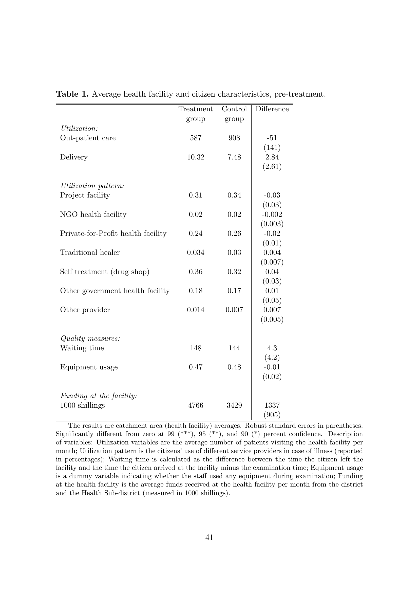
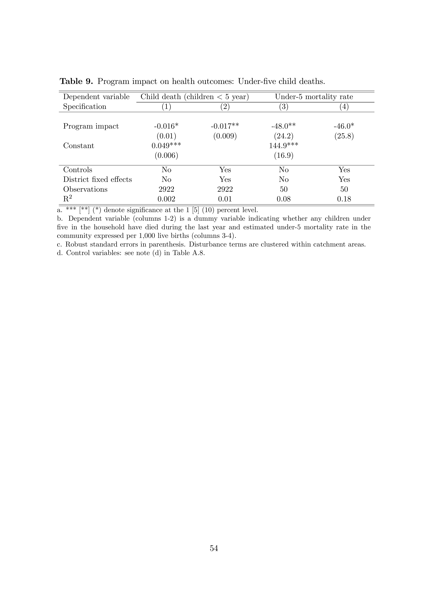

## Assignments

- Final Project Git Repo: should have been submitted today

- Research Question and Data sketch: due **Monday, February 23**

## Agenda

- Background (Accountability 101)
- Björkman and Svensson, 2009
- Interaction terms

# Democracy, Accountability, and Representation

## Przeworski, Stokes, and Manin, 1999

::: incremental
**What do we mean by representation?**

-   Acting in the voter's best interests

-   What is the claim connecting democracy and representation?

-   Under democracy, governments are representative because they are elected

-   But why?
:::

## Mandate view:

**Elections serve to select good policy**

::: incremental
-   Fundamentally *prospective*
-   During campaign parties inform citizens what policies they want to follow and why
-   Voters select the best one
-   Politicians do what they propose (the platform is the mandate)
:::

## Accountability view

**Elections serve to hold governments accountable for their past actions**

::: incremental
-   Fundamentally *retrospective*

-   Voters retain politicians only when they acted in their best interest

-   Politicians anticipate this and serve!
:::

## Taking stock

-   Do we feel these mechanisms are plausible?

-   What might be some issues with these characterizations of representation?

## Reconsidering: Some potential pitfalls

::: incremental
-   Citizens are not omniscient, *for better and for worse*

-   Imperfect evaluation of what politicians **should do**

-   Imperfect evaluation of whether they did what they **ought to have done**

-   Politicians have goals, interests, and values of their own, and monitoring is costly
:::

## Pitfalls in the Mandate View

-   Is it plausible to think governments will do what they propose?

-   Is it desirable?

-   Politicians are not legally compelled to abide by their platform in any democratic system! Why?

## Pitfalls in the Accountability View

-   Idea is reward or punish depending on their performance

-   Is it plausible to think citizens have enough information to evaluate politicians?

-   What if politicians do not value getting reelected

## The Vote: Our One Blunt Tool

-   In the accountability view, voters are retrospective

    -   They use the vote to punish

-   In the mandate view, voters are prospective

    -   They use the vote to select the best policy / best politicians

-   In reality, voters want to do both: select good policy and punish bad behavior

-   But we only have one vote. Can we achieve both goals?

# Beyond Elections: Accountability in Public Services

## Is Accountability Only About Elections?

- So far we've talked about voters holding *elected politicians* accountable

- But what about public services? Health clinics, schools, water systems?

- The people running these services are often not elected. Should they still be accountable?

# Björkman and Svensson (2009)

## Community-Based Monitoring

*"Community-based monitoring, or social accountability, is an approach towards building accountability that relies on civic engagement where citizens and civil society organizations directly or indirectly participate in extracting accountability"*

## 1. The State of the World

- In many poor countries, clinics are closed when they should be open

- Health workers are frequently absent

- Drugs and vaccines are misused, public funds are stolen

- Top-down monitoring often weak and ineffective

## 2. The Research Question

- Can bottom-up, community-based monitoring improve health service delivery where top-down supervision has failed?

## 3. The Hypotheses

::: incremental
1. Providing communities with information about facility performance will increase monitoring

2. Giving communities tools to organize collectively will increase monitoring

3. Increased monitoring will change provider behavior and improve health outcomes
:::

## 4. Mechanism: The Information Barrier

**H1**: Information $\rightarrow$ monitoring

*"Provision of information on outcomes and performance improves citizens' ability to challenge abuses of the system, since reliable quantitative information is more difficult for service providers to brush aside as anecdotal, partial, or simply irrelevant"*

## 4. Mechanisms: The Organization Barrier

**H2**: Organization $\rightarrow$ monitoring

*"Exerting accountability (monitoring providers) is subject to potentially large free-rider problems. Elite capture further complicates the process of holding providers accountable"*

## 5. The Research Design

- RCT across 50 communities in 9 districts in Uganda
- Treatment communities got:
  + Report cards on health facility performance (targets information barrier)
  + Facilitated community meetings to develop action plans (targets organization barrier)
- Control communities: nothing
- ~5,000 households surveyed per round

## Balance

{fig-align="center"}

## The Main Specification

$$y_{jd} = \alpha + \beta \, T_j + X_{jd}'\gamma + \theta_d + \varepsilon_{jd}$$

::: incremental
- $T_j$: treatment dummy (1 if community got the intervention)
- $X_{jd}$: covariates (baseline characteristics)
- $\theta_d$: district fixed effects
- $\beta$: the treatment effect -- what we want
:::

## Results

**Did monitoring increase?** (H1 + H2)

- Treatment facilities adopted suggestion boxes, numbered waiting cards, posted patient rights
- Communities discussed clinic performance at local council meetings
- 70% of treatment facilities had at least one monitoring tool vs 16% of control

## H3: Health Outcomes

{fig-align="center" width="99%"}

## Another Specification

B&S surveyed households before and after the intervention

They combine ("stack") both survey rounds into one dataset and estimate:

$$y_{ijt} = \gamma \, POST_t + \beta_{DD}(T_j \times POST_t) + \mu_j + \varepsilon_{ijt}$$

What is $T_j \times POST_t$ doing?

# Interaction Terms

## Conditional Hypotheses

- Sometimes we think the effect of one variable depends on the value of another variable

- Does studying more improve your grade? Probably. But does it help **more** if you slept well?

## Example

Imagine you have data on how much your peers slept and how well they performed

```{r}
#| echo: false
#| warning: false
#| fig-align: center
#| fig-height: 4.5

library(ggplot2)
set.seed(42)
n <- 200
students <- data.frame(
  study_hours = runif(n, 1, 10),
  slept_well = sample(c("Yes", "No"), n, replace = TRUE)
)
students$score <- 50 +
  3 * students$study_hours +
  5 * (students$slept_well == "Yes") +
  4 * students$study_hours * (students$slept_well == "Yes") +
  rnorm(n, 0, 5)

ggplot(students, aes(x = study_hours, y = score)) +
  geom_point(alpha = 0.5) +
  geom_smooth(method = "lm", se = FALSE, linewidth = 1.2) +
  labs(x = "Hours Studied", y = "Test Score") +
  theme_minimal(base_size = 16)
```

## Example

We fit a regular OLS, like we know how to do

```{r}
#| echo: true
#| code-fold: true
#| code-summary: "Show code"
summary(lm(score ~ study_hours, data = students))$coefficients |>
  round(3)
```

. . .

But what if the effect of studying depends on whether you slept well?

## What Is an Interaction Term?

We add a product of the two variables to the regression:

$$\text{score} = \alpha + \beta_1 \, \text{study} + \beta_2 \, \text{sleep} + \beta_3 (\text{study} \times \text{sleep}) + \varepsilon$$

## Example

```{r}
#| echo: false
#| warning: false
#| fig-align: center
#| fig-height: 4.5

ggplot(students, aes(x = study_hours, y = score, color = slept_well)) +
  geom_point(alpha = 0.5) +
  geom_smooth(method = "lm", se = FALSE, linewidth = 1.2) +
  labs(x = "Hours Studied", y = "Test Score", color = "Slept Well?") +
  theme_minimal(base_size = 16)
```

## Example

```{r}
#| echo: true
#| code-fold: true
#| code-summary: "Show code"
summary(lm(score ~ study_hours * slept_well, data = students))$coefficients |>
  round(3)
```

## Reading the Output

How many values can `slept_well` take? Two: 0 (No) and 1 (Yes)

. . .

Plug in `slept_well = 0`:

$$\text{score} = \alpha + \beta_1 \, \text{study} + \beta_2 \cdot 0 + \beta_3 (\text{study} \times 0)$$

. . .

$$= \alpha + \beta_1 \, \text{study}$$

One slope: $\beta_1$. This is the line for students who did **not** sleep well

## Reading the Output

Now plug in `slept_well = 1`:

$$\text{score} = \alpha + \beta_1 \, \text{study} + \beta_2 \cdot 1 + \beta_3 (\text{study} \times 1)$$

. . .

$$= \alpha + \beta_1 \, \text{study} + \beta_2 + \beta_3 \, \text{study}$$

Intercept is now $\alpha + \beta_2$. Slope on study is now $\beta_1 + \beta_3$

## Reading the Output

```{r}
#| echo: true
#| code-fold: true
#| code-summary: "Show code"
summary(lm(score ~ study_hours * slept_well, data = students))$coefficients |>
  round(2)
```

## Reading the Output

- `study_hours` = 2.90: for students who did **not** sleep well, one more hour of studying raises their score by about 2.9 points on average
- `slept_wellYes` = 4.81: for a student who studied *zero* hours, going from sleeping bad to well raises their score by 4.8 points on average
- `study_hours:slept_wellYes` = 4.21: for students who slept well, one more hour of studying raises their score by an **extra** 4.2 points

## Back to the Paper

$$y_{ijt} = \gamma \, POST_t + \beta_{DD}(T_j \times POST_t) + \mu_j + \varepsilon_{ijt}$$

- Outcomes change over time for everyone -- people get sick, seasons change, the economy shifts. $\gamma$ captures that

- But did outcomes change **more** in treatment communities? That is what $\beta_{DD}$ tells us

- The interaction $T_j \times POST_t$ separates what changed because of the intervention from what changed just because time passed

## Difference-in-Differences

- When the interaction is between a group and time

- (plus a bunch of assumptions)

- this is a **difference-in-differences**

- More on this later


