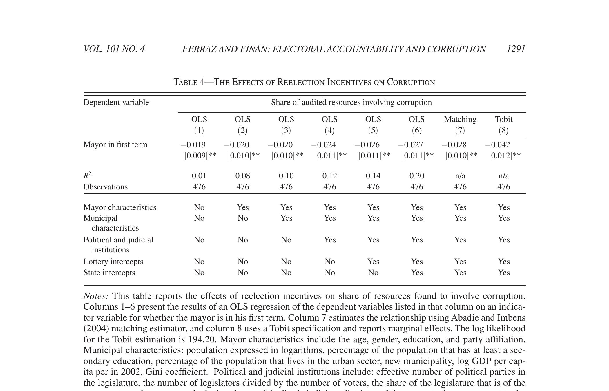
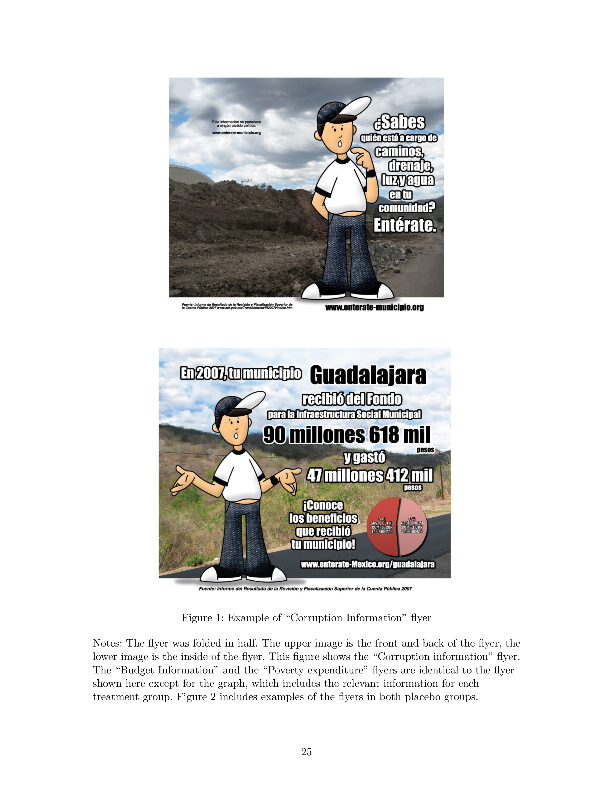
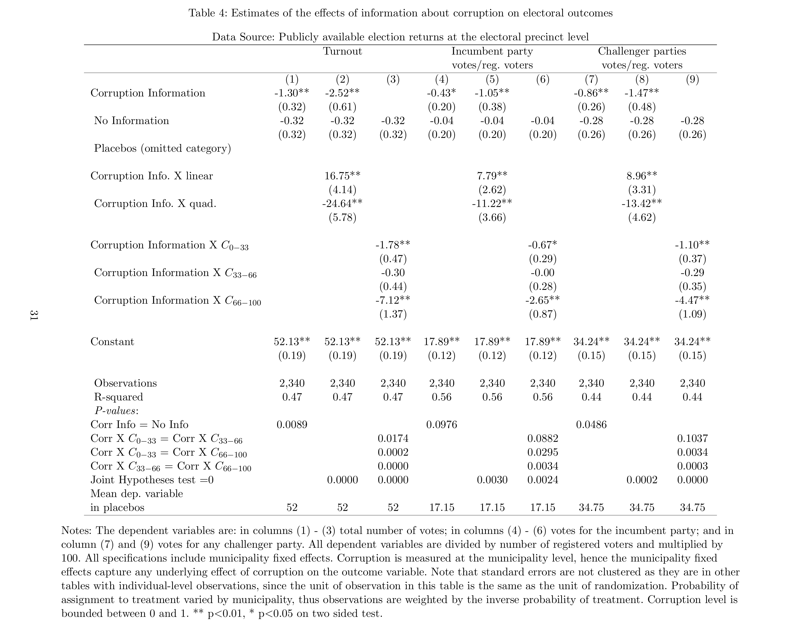

## Agenda

- Ferraz and Finan (2011)
- Chong et al. (2015)
- Statistical Power

# Back to Electoral Accountability

## Recap: Mandate and Accountability

::: incremental
- **Mandate view**: elections select good policy (prospective)
- **Accountability view**: elections hold governments accountable (retrospective)
- In both views, the **vote** is the key mechanism
- Last week: accountability beyond elections (Björkman and Svensson)
- Today: back to electoral accountability
:::

## Two Sides of Accountability

For electoral accountability to work:

::: incremental
- Politicians must have **incentives** to behave well (fear of losing office)
- Voters must have **information** to evaluate politicians
:::

. . .

Today we test both sides

## Corruption in the Developing World

- Corruption in local governments is a major obstacle to development
- Funds intended for health, schools, and roads are diverted for private gain

. . .

*"Corruption in local governments is responsible for losses of approximately US$550 million per year"* — Ferraz and Finan (2011)

## Assumptions

For electoral accountability to discipline corruption, we need:

::: incremental
1. Voters **dislike** corruption
2. Voters **can observe** corruption (or its consequences)
3. Voters **will punish** corrupt politicians at the ballot box
4. Politicians **anticipate** this punishment and restrain themselves
:::

# Ferraz and Finan (2011)

## 1. The State of the World

- Brazil is one of the most decentralized countries in the world
- Local governments receive ~$35 billion/year from the federal government
- Mayors have wide discretion over how to spend these resources
- Common corruption schemes: diversion of funds, phantom firms, fake receipts, rigged procurement

## 2. The Research Question

- Do reelection incentives reduce corruption among local politicians?

. . .

- In 1997, Brazil introduced a constitutional amendment allowing mayors to run for a second consecutive term
- First-term mayors can be reelected; second-term mayors **cannot**
- This creates variation in reelection incentives

## 3. The Hypotheses

::: incremental
1. Mayors who face reelection incentives (first-term) will be **less corrupt** than those who do not (second-term)
2. This effect will be **stronger** where voters have more access to information (e.g., local media)
3. This effect will be **stronger** where judicial punishment is less likely (so electoral accountability is the main constraint)
:::

## 4. The Mechanism

*"A corrupt mayor who faces the possibility of reelection can exploit this information asymmetry to increase reelection chances by refraining from rent-seeking and behaving as a noncorrupt mayor"*

::: incremental
- Corrupt politicians face a trade-off: steal now or behave and win reelection
- If reelection is valuable enough, they restrain themselves
- Second-term mayors face no such trade-off → they are "lame ducks"
:::

## 5. Data and Measurement

**How do you measure corruption?**

::: incremental
- In 2003, Brazil's *Controladoria Geral da União* (CGU) launched an anti-corruption program
- Randomly selected municipalities are audited for their use of federal funds
- 10-15 CGU auditors spend ~1 week inspecting accounts, documents, and public works
- Reports are public: posted online and sent to prosecutors
:::

. . .

**Main measure**: Share of audited resources found to involve corruption

## 5. Data and Measurement

Three types of corruption identified in audits:

::: incremental
1. **Fraud in procurement**: phantom firms, rigged bids, kickbacks
2. **Diversion of funds**: money simply "disappears" from accounts
3. **Overinvoicing**: goods and services purchased at inflated prices
:::

## 6. Research Design

**Key feature**: the CGU audit lottery randomly selects which municipalities get audited

- This gives us **objective measures** of corruption (not perceptions, not self-reports)
- 476 municipalities audited before the 2004 elections

. . .

**Comparison**: first-term mayors (can be reelected) vs second-term mayors (cannot)

$$r_i = \beta I_i + \mathbf{X}_i \varphi + \mathbf{Z}_i \gamma + \varepsilon_i$$

## 6. Research Design

**Is this an experiment?**

::: incremental
- No! Whether a mayor is in their first or second term is **not randomly assigned**
- Potential confounds: ability, experience, selection
:::

## 6. Research Design

**Think about this through the lens of the mandate view**

::: incremental
- The mandate view says elections *select good politicians*
- Second-term mayors have already won reelection — voters selected them as good
- If ability and corruption are correlated, second-term mayors should be **less corrupt** (they are "better" politicians)
- But we find the opposite! This actually **strengthens** the accountability interpretation
- Theory helps us think through the direction of potential confounding
:::

## 6. Research Design

**Robustness**: Regression discontinuity

::: incremental
- Compare municipalities where the incumbent barely won reelection in 2000 (→ second term) vs barely lost (→ new first-term mayor)
- Near the threshold, who gets a first vs second-term mayor is essentially random
- Results hold
:::

## 7. Findings

{fig-align="center"}

## 7. Findings

::: incremental
- First-term mayors misappropriate **27% fewer resources** than second-term mayors
- Lame-duck mayors steal approximately R$150,000 (~US$55,000) more
- Robust to RDD, matching, alternative corruption measures
:::

## 7. Findings

**Heterogeneous effects** (how does this relate to interaction terms?)

::: incremental
- Effects are **stronger** in municipalities without local media
  + Where media is present: little difference (information substitutes for electoral pressure?)
  + Where media is absent: reelection incentives reduce corruption by 9pp
- Effects are **stronger** where elections were competitive
:::

## 8. Implications

::: incremental
- Electoral accountability works: the *threat* of losing office constrains corruption
- But it depends on institutional context (media, competition)
- This is the **politician incentive** side of the story
:::

. . .

But what about the **voter information** side? What happens when you *give* voters information about corruption?

# Chong et al. (2015)

## The Other Side of the Coin

- F&F showed that reelection incentives discipline politicians
- But the accountability view also assumes voters **use information** to punish
- What if we directly give voters information about corruption? Will they punish?

## 1. The State of the World

- Mexico: elected mayors manage federal infrastructure funds (FISM)
- Single-term limits: mayors **cannot** be reelected (unlike Brazil)
- Mexico's federal auditor (ASF) produces public audit reports
- But most voters have never seen them: only ~10% knew FISM existed

## 2. The Research Question

- Does providing voters with information about incumbent corruption change electoral outcomes?

. . .

*"Retrospective voting models assume that offering more information to voters about their incumbents' performance strengthens electoral accountability"*

## 3. The Hypotheses

Two competing predictions:

::: incremental
**"Inspire the fight"**

- Corruption information → voters punish incumbent party → support challengers → turnout increases

**"Quash the hope"**

- Corruption information → voters lose faith in *all* politicians → turnout decreases, challenger support decreases
:::

## 4. The Mechanism

**Why might information backfire?**

::: incremental
- Voters may already suspect corruption; information confirms rather than surprises
- If corruption is perceived as systemic, voters conclude *no candidate* can credibly withdraw from it
- Voting becomes pointless: *"the costs of casting a ballot would be bigger than the benefits"* (Downs, 1957)
:::

## 5. Data and Measurement

**The intervention**: door-to-door distribution of flyers, one week before 2009 municipal elections

{fig-align="center" width="70%"}

## 5. Data and Measurement

**Outcomes** (from official electoral data, precinct-level):

::: incremental
- **Turnout**: total votes / registered voters
- **Incumbent party votes**: votes for incumbent's party / registered voters
- **Challenger votes**: votes for any challenger / registered voters
:::

## 6. Research Design

- Field experiment: 12 municipalities, 2,360 voting precincts
- Flyers distributed door-to-door one week before elections
- Treatment: corruption info flyer vs placebo flyers (budget/poverty info) vs control (no flyer)
- Placebo group is the reference → isolates corruption *content* from receiving *any* flyer

## 6. Research Design

$$Y = \beta_0 + \beta_1 \, CorruptionInfo + \beta_2 \, NoInfo + M_j + \epsilon$$

- $\beta_1$: effect of corruption info relative to placebo
- $M_j$: municipality fixed effects

. . .

**Does the effect depend on how much corruption there is?**

$$Y = \beta_0 + \beta_1 \, CorrInfo \times C_{0-33} + \beta_2 \, CorrInfo \times C_{33-66} + \beta_3 \, CorrInfo \times C_{66-100} + \beta_4 \, NoInfo + M_j + \epsilon$$

## 7. Findings

{fig-align="center"}

## 7. Findings

::: incremental
- Corruption information **decreases turnout** by 2.5%
- **Decreases incumbent party votes** by 0.43pp
- **Decreases challenger votes** by 0.86pp
- Effects are **larger where corruption is higher** (>66%: turnout drops 7pp)
:::

. . .

Information does not "inspire the fight" — it "quashes the hope"

## 8. Implications

::: incremental
- Information about corruption **demobilizes** voters
- It hurts *all* parties, not just the incumbent
- Voters disengage from politics entirely when they learn about corruption
- *"Information is clearly necessary to improve accountability, [but] corruption information is not sufficient because voters may respond to it by withdrawing from the political process"*
:::

# Taking Stock

## Putting It Together

| | F&F (2011) | Chong et al. (2015) |
|---|---|---|
| **Country** | Brazil | Mexico |
| **Tests** | Politician incentives | Voter information |
| **Term limits** | 2 terms | 1 term |
| **Finding** | Reelection incentives reduce corruption 27% | Corruption info *decreases* turnout and challenger votes |

. . .

Electoral accountability requires **both** incentives and information — but information alone may not be enough

# Statistical Power

## A Closer Look at the Findings

Chong et al. find that for **medium levels of corruption** (33–66%), the effect of corruption information on turnout is:

$$\hat{\beta} = -0.30, \quad SE = 0.44, \quad p > 0.10$$

. . .

**Is the effect zero?**

## A Closer Look at the Findings

\

**Can we conclude the effect is zero?**

::: incremental
- We **failed to reject** the null hypothesis
- But failing to reject $\neq$ accepting the null!
- Maybe the true effect is -0.30 and we just couldn't detect it
- This is where **statistical power** comes in
:::

## Statistical Power

**Recall the interpretation of p-values:**

::: incremental
- The probability of observing a test statistic at least as extreme as the one you observed if the true parameter value is zero
- Or, the **probability of rejecting the null** hypothesis when **the null was true**
- This is called a "Type I" error: a false positive
- We also have "Type II" errors: a false negative
:::

## Statistical Power

*Power is the probability of correctly accepting the alternative hypothesis*

::: incremental
- The probability of a true positive

    - Equals (1 - probability of type II error)

    - The common threshold in the discipline is 80% power
:::

You can check out the [EGAP power calculator to understand better](https://egap.shinyapps.io/power-app/)

## Why Does Power Matter Here?

- When the main effect IS significant (turnout drops 2.5%, p < 0.01), we can update

- When a sub-group effect is NOT significant, we should ask: did we have enough power to detect it?

. . .

- Chong et al. had 2,340 precincts — powered to detect ~2.5pp effects overall
- But splitting by corruption level → smaller subgroups → less power
- A non-significant sub-group result does not mean the effect is zero
