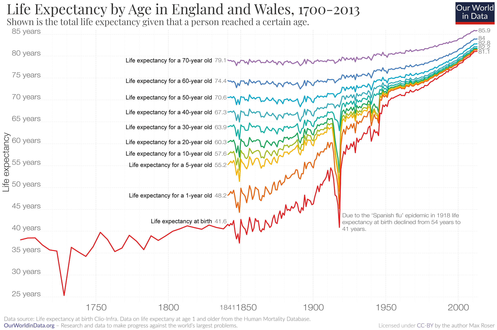
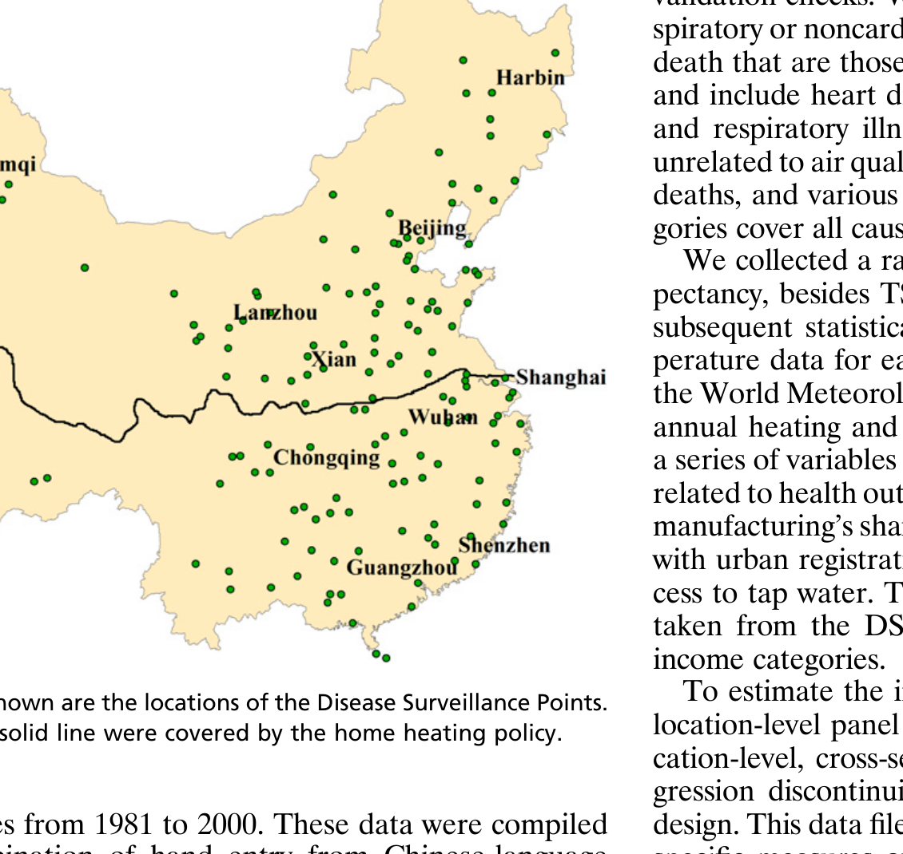
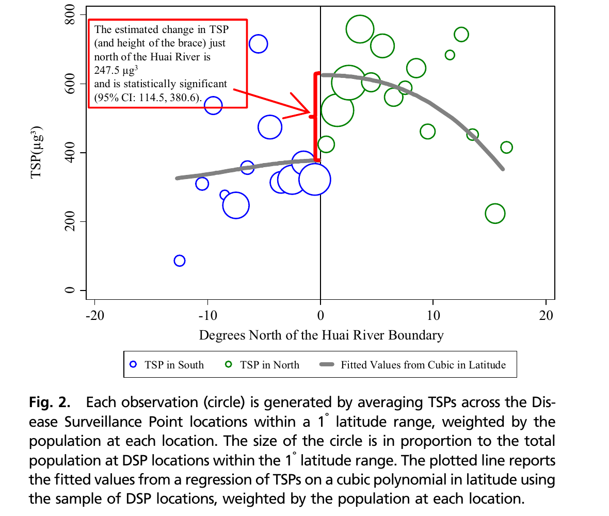
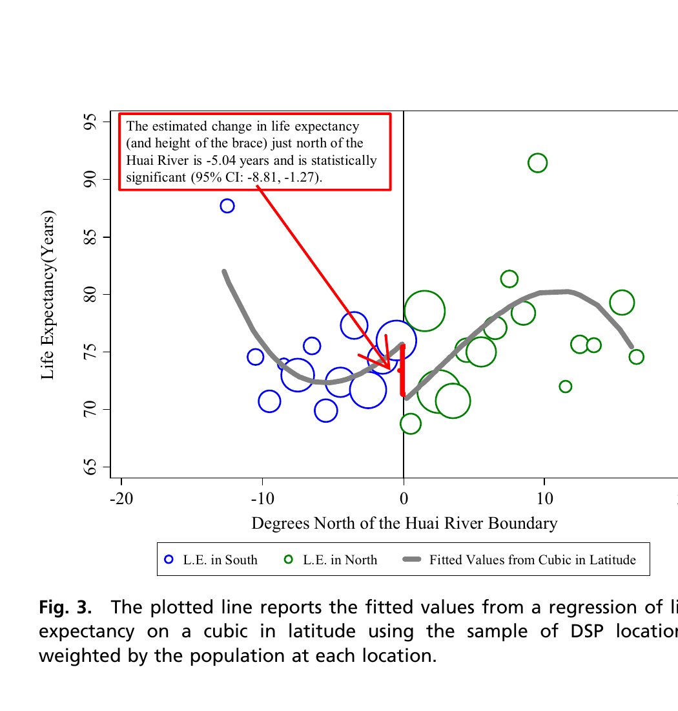

```{=html}
<style>
.reveal h2 { font-size: 1.3em !important; }
</style>
```

## Agenda

1. Health and Development
2. Chen et al. (2013)
3. Regression Discontinuity Design

# Health and Development

## We Live Much, Much Longer

{fig-align="center" height=5in}

## Richer Countries Live Longer

```{r}
#| echo: false
#| warning: false
#| message: false
#| fig-height: 5

library(WDI)
library(ggplot2)
library(dplyr)

wdi <- WDI(indicator = c("SP.DYN.LE00.IN", "NY.GDP.PCAP.PP.KD"),
            country = "all", start = 2020, end = 2020, extra = TRUE) |>
  filter(!is.na(SP.DYN.LE00.IN), !is.na(NY.GDP.PCAP.PP.KD),
         region != "Aggregates") |>
  rename(life_exp = SP.DYN.LE00.IN, gdp_pc = NY.GDP.PCAP.PP.KD)

highlights <- filter(wdi, iso3c %in% c("CHN", "USA", "ZAF", "CUB", "NGA", "JPN"))

ggplot(wdi, aes(x = gdp_pc, y = life_exp)) +
  geom_point(alpha = 0.4, size = 2, color = "grey60") +
  geom_smooth(method = "lm", se = FALSE, color = "#011F5B", linewidth = 1.2) +
  geom_point(data = highlights, color = "red", size = 3.5) +
  ggrepel::geom_label_repel(data = highlights, aes(label = country),
                             color = "red", size = 4, seed = 42,
                             max.overlaps = 10) +
  scale_x_log10(labels = scales::dollar) +
  labs(x = "GDP per capita (PPP, log scale)",
       y = "Life expectancy at birth (years)",
       title = "Income and life expectancy (2020)") +
  theme_minimal(base_size = 16)
```

## Child Mortality Has Collapsed

{fig-align="center" height="5in"}

## Does Development Make Us Healthier?

**Why we might think yes:**

::: incremental
- Vaccines and antibiotics eliminated mass killers
- Sanitation and clean water cut infectious disease
- Better nutrition reduced stunting and mortality
- Heating reduced cold-related deaths
- Richer states can fund hospitals, doctors, public health
:::

## The Dark Side

But development also brings **negative externalities**:

::: incremental
- Air and water pollution
- Industrial hazards
- Environmental degradation
- Inequality in who bears the costs
:::

. . .

Today's paper: a case where a development policy had unintended health consequences

# Chen et al. (2013)

## The State of the World

Air quality in China is notoriously poor

::: incremental
- Between 1981–2001, particulate concentrations were more than **double** China's national standard and **five times** the level in the pre-1970 US
- Premier Zhu Rongji (1999): *"If I work in your Beijing, I would shorten my life at least five years"*
- Was he right?
:::

## The Huai River Policy

During the 1950–1980 period of central planning, the Chinese government gave **free coal winter heating** 

. . .

But due to budgetary constraints, **this right was only extended to areas north of the Huai River**.

## The Huai River Policy

::: incremental
- North: free coal → more coal burning → more air pollution
- South: no free coal → less coal burning → less air pollution
- This created a **massive, arbitrary discontinuity** in pollution levels
:::

## The Huai River

{fig-align="center" height=4.5in}

Cities north of the solid line were covered by the heating policy.


## The Research Question

Does sustained exposure to air pollution reduce life expectancy?

. . .

::: incremental
- Pollution correlates with **everything**: income, urbanization, industry, access to healthcare
- A simple comparison of polluted vs. clean areas confounds pollution with all of these
- The Huai River policy creates a plausible **natural quasi-experiment** 
- Why? 
:::


## The Mechanism

Coal combustion releases **Total Suspended Particulates (TSPs)** into the air

::: incremental
- TSPs penetrate the lungs and enter the bloodstream
- Cause heart disease, stroke, lung cancer, respiratory illness
- The medical evidence linking particulates to mortality is well established
- The question is: **how large is the effect at population scale?**
:::

## Data and Measurement

**Air pollution**: TSP concentrations from 90 cities (1981–2000)

**Health**: Mortality data from China's Disease Surveillance Points (DSPs)

- 145 locations, nationally representative
- Records all deaths and population counts
- ~500,000 recorded deaths between 1991 and 2000

. . .

**Treatment: north or south of the Huai River


# Regression Discontinuity Design

## What Is a Regression Discontinuity?

Imagine you want to know: **does passing a class improve your career?**

::: incremental
- Someone who scored 0 and someone who scored 100 are very different people
- Comparing them confounds *ability* with *passing*
- But what about someone who scored **59** vs. someone who scored **61**?
- Almost the same student. A bit of luck, random noise, one extra question
- The only difference: one passed, the other did not
:::

## RDD: The Logic

::: incremental
- A **cutoff** assigns treatment: score $\geq$ 60 → pass
- Units just below and just above the cutoff are **nearly identical**
- So any **jump** in the outcome at the cutoff is the causal effect of treatment
- The key assumption: nothing else changes abruptly at the cutoff
:::

. . .

This is what Chen et al. exploit: the Huai River is a cutoff that assigns free coal.


## Applying the RDD to the Huai River

::: incremental
- **Running variable**: degrees of latitude (distance from the river)
- **Cutoff**: the Huai River (0 degrees)
- **Treatment**: free coal heating (north of the river)
- A city 1 degree south vs. 1 degree north: similar climate, similar people, but very different pollution
- Compare health outcomes **just above** and **just below** the river
:::

. . .

Key concern: is there anything *else* that jumps at the river?

## What Else Could Jump at the River?

::: incremental
- Education, income, urbanization, tap water access: **no discontinuity** at the river
- Temperature and climate: different north vs. south, but change **smoothly** — no jump
- The Huai River cuts *through* provinces — it is not an administrative boundary
- This is always the hardest part of an RDD: you can check observable things, but you can never be 100% sure
:::


# Findings

## First Stage: Air Pollution

{fig-align="center" height=4.5in}

TSP concentrations jump by ~200 $\mu g/m^3$ at the Huai River.

## The Payoff: Life Expectancy

{fig-align="center" height=4.5in}

Life expectancy drops by **5.5 years** north of the Huai River.


## The Numbers

::: incremental
- North of the river: TSPs are **184 $\mu g/m^3$ higher** (55% more pollution)
- Life expectancy is **5.5 years lower** (95% CI: 0.8, 10.2)
- Almost entirely due to **cardiorespiratory mortality** (heart and lung disease)
- Noncardiorespiratory mortality: **no effect**
- An additional 100 $\mu g/m^3$ of TSP → **3.0 fewer years** of life expectancy at birth
:::


## The Scale

::: incremental
- The population of Northern China between 1990 and 2000 exceeded **500 million**
- The Huai River policy led to a staggering loss of over **2.5 billion life years**
- Current particulate concentrations are 22.9 $\mu g/m^3$ higher (26% higher north of the river)
- Residents of the North **continue to have shortened lifespans**
:::


## Complements or Substitutes?

::: incremental
- The policy was meant to **improve welfare**: free heating in cold winters
- But it **dramatically shortened lives** -- a negative externality, an unintended consequence
- Nobody designed this policy to kill people. But it did.
- *"These results may help explain why China's explosive economic growth has led to relatively anemic growth in life expectancy"*
:::

## Discussion

**What is the counterfactual?**

::: incremental
- The heating policy killed people through pollution
- But without free coal, people in northern China faced brutal winters
- Did the policy kill more people than it saved from freezing?
- How do you even evaluate a policy like this?
:::

. . .

This is the fundamental challenge of policy evaluation: **the counterfactual is never observed**

# RDD in R

## Using `rdrobust`

```{r}
#| echo: true
#| eval: false

# install.packages("rdrobust")
library(rdrobust)

# Estimate the discontinuity
rd <- rdrobust(y = data$life_expectancy,
               x = data$latitude_from_river,
               c = 0)
summary(rd)
```

::: incremental
- `y`: outcome variable
- `x`: running variable (distance from cutoff)
- `c`: the cutoff value
- `rdrobust` automatically picks the optimal bandwidth and polynomial
:::

## Reading the Output

::: incremental
- **Coefficient**: the estimated jump at the cutoff (the treatment effect)
- **Std. Error**: precision of the estimate
- **p-value**: is the jump statistically significant?
- **Bandwidth**: how wide a window around the cutoff is used
- **N left / N right**: how many observations on each side
:::

. . .

Same interpretation as `lm()` — but the estimate is **local** to the cutoff


## Simulating an RDD

```{r}
#| echo: true
#| warning: false
#| code-fold: true
#| code-summary: "Show code"

library(ggplot2)
set.seed(42)

n <- 200
latitude <- runif(n, -8, 8)
north <- as.numeric(latitude >= 0)

# True effect: 5.5 fewer years north of the river
life_exp <- 78 - 0.3 * latitude - 5.5 * north + rnorm(n, 0, 3)

sim_data <- data.frame(latitude, north, life_exp)

ggplot(sim_data, aes(x = latitude, y = life_exp, color = factor(north))) +
  geom_point(alpha = 0.6, size = 2) +
  geom_smooth(method = "lm", se = FALSE, linewidth = 1.2) +
  geom_vline(xintercept = 0, linetype = "dashed", linewidth = 1) +
  scale_color_manual(values = c("0" = "#011F5B", "1" = "red"),
                     labels = c("South", "North")) +
  annotate("label", x = 0, y = 85, label = "Huai River",
           size = 5, color = "grey30") +
  labs(x = "Degrees of latitude from Huai River",
       y = "Life expectancy (years)",
       title = "Simulated RDD: life expectancy drops north of the river",
       color = "") +
  theme_minimal(base_size = 16) +
  theme(legend.position = "bottom")
```


## Running `rdrobust` on Simulated Data

```{r}
#| echo: true
#| warning: false
#| message: false

library(rdrobust)

rd <- rdrobust(y = sim_data$life_exp,
               x = sim_data$latitude,
               c = 0)
summary(rd)
```

## The RDD Plot

```{r}
#| echo: true
#| warning: false
#| message: false

rdplot(y = sim_data$life_exp,
       x = sim_data$latitude,
       c = 0,
       title = "RDD Plot: Life Expectancy at the Huai River",
       x.label = "Degrees of latitude from Huai River",
       y.label = "Life expectancy (years)")
```

## The Perils of RDD

::: incremental
- You estimate a **local** effect -- units right at the cutoff, not the full population
- The cutoff is often arbitrary: cities near the Huai River may not represent all of China
- If the cutoff region is unrepresentative, external validity is limited
- RDD answers: *"what happens just at the threshold?"* -- which may be of little theoretical interest
:::


