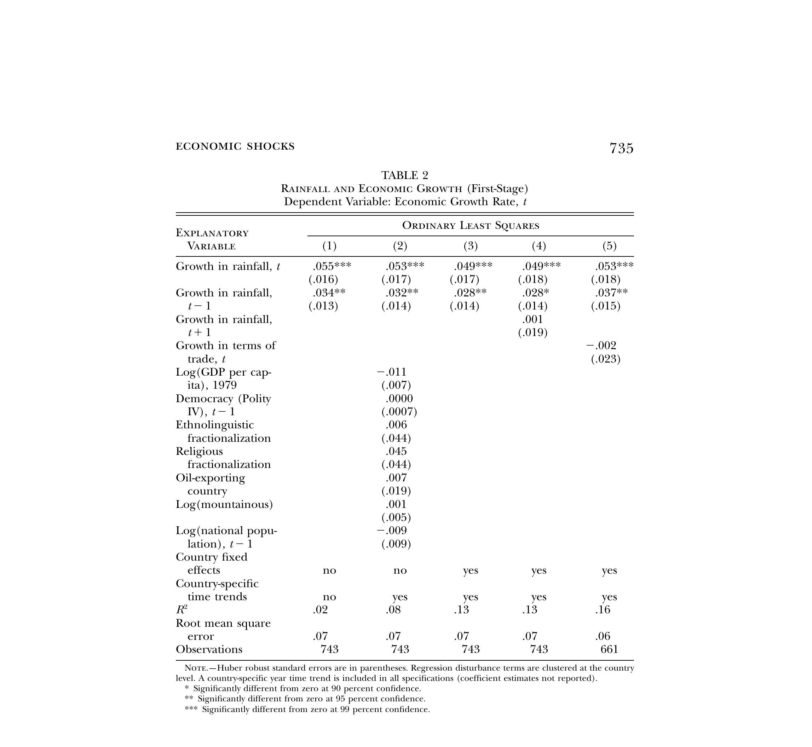
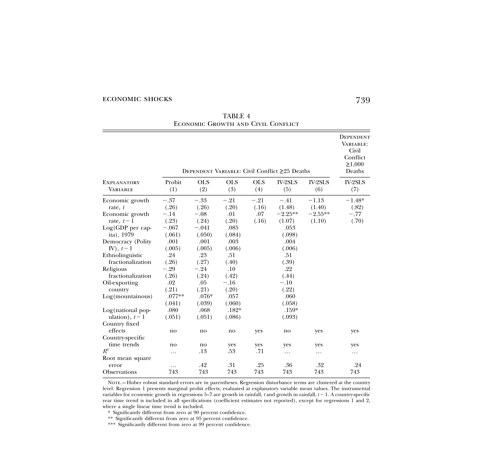

```{=html}
<style>
.reveal h2 { font-size: 1.3em !important; }
</style>
```

## Agenda

1. The Poverty–Violence Correlation
2. Two Mechanisms: Opportunity Cost and Rapacity
3. The Endogeneity Problem
4. Miguel, Satyanath, and Sergenti (2004)
5. Instrumental Variables

. . .

**Final Project Design due Wednesday (3/18)**


# From Crime to Conflict

## Last Week: The State and Security

- Crime can mobilize citizens (Bateson)
- But policing can alienate them (Weaver and Lerman)

. . .

Today: what happens when security **breaks down entirely**?

- Civil war as the extreme failure of the state
- Violence on a scale that reshapes economies and institutions


## How Common Is Civil War?

{fig-align="center" height=4.5in}


## Civil War by the Numbers

::: incremental
- Civil wars have caused **three times** as many deaths as wars between states since WWII (Fearon and Laitin, 2003)
- In sub-Saharan Africa, **27% of country-years** experienced civil conflict between 1981 and 1999 (Miguel, Satyanath, and Sergenti, 2004)
- The number of countries experiencing internal conflict **peaked around 35–37** in the early 1990s and again in the mid-2010s (UCDP)
- Overwhelmingly concentrated in the **poorest countries**
:::


# The Poverty–Violence Correlation

## The Empirical Pattern

```{r}
#| echo: false
#| warning: false
#| message: false
#| fig-height: 5

library(WDI)
library(ggplot2)
library(dplyr)
library(readr)
library(countrycode)

# --- Real UCDP data ---
ucdp <- read_csv("../data/ucdp_acd.csv", show_col_types = FALSE) |>
  filter(type_of_conflict %in% c(3, 4),   # internal + internationalized internal
         year >= 2000, year <= 2020) |>
  mutate(iso3c = countrycode(gwno_a, "gwn", "iso3c"))

# Countries that experienced internal conflict 2000-2020
conflict_iso3 <- ucdp |>
  filter(!is.na(iso3c)) |>
  pull(iso3c) |>
  unique()

# --- WDI GDP data ---
wdi <- WDI(indicator = "NY.GDP.PCAP.PP.KD",
           country = "all", start = 2019, end = 2019, extra = TRUE) |>
  filter(!is.na(NY.GDP.PCAP.PP.KD), region != "Aggregates") |>
  rename(gdp_pc = NY.GDP.PCAP.PP.KD)

wdi$conflict <- ifelse(wdi$iso3c %in% conflict_iso3, "Conflict (2000–2020)", "No conflict")

highlights <- filter(wdi, iso3c %in% c("SYR", "SOM", "AFG", "NOR", "USA",
                                         "JPN", "COD", "SSD", "IRQ", "COL"))

ggplot(wdi, aes(x = gdp_pc, y = as.numeric(conflict == "Conflict (2000–2020)"))) +
  geom_point(aes(color = conflict), alpha = 0.5, size = 2.5,
             position = position_jitter(height = 0.03)) +
  geom_smooth(method = "glm", method.args = list(family = "binomial"),
              se = FALSE, color = "#011F5B", linewidth = 1.2) +
  ggrepel::geom_label_repel(data = highlights, aes(label = country),
                             size = 3.5, seed = 42, max.overlaps = 10,
                             color = "red") +
  scale_x_log10(labels = scales::dollar) +
  scale_color_manual(values = c("Conflict (2000–2020)" = "red", "No conflict" = "grey60")) +
  labs(x = "GDP per capita (PPP, log scale, 2019)",
       y = "Experienced internal conflict (UCDP)",
       title = "Income and civil conflict",
       caption = "Sources: UCDP/PRIO Armed Conflict Dataset v24.1; World Bank WDI",
       color = "") +
  theme_minimal(base_size = 16) +
  theme(legend.position = "bottom")
```


## The Conflict Trap

::: incremental
- Poverty $\rightarrow$ conflict: poor countries are more likely to have civil wars
- Conflict $\rightarrow$ poverty: civil war destroys economies
- This is the **conflict trap** (Collier et al., 2003)
:::

. . .

But does poverty actually *cause* war? Or is the correlation driven by something else?


## Does Poverty Cause Violence?

**Arguments that it does:**

::: incremental
- **Opportunity cost**: when you have nothing to lose, fighting is cheap (we'll formalize this)
- **State weakness**: poor states cannot buy off or suppress rebels
- **Grievance**: deprivation and inequality breed resentment
:::

. . .

**Arguments that it does not:**

::: incremental
- **Bad institutions** may cause both poverty and war
- **Ethnic fractionalization** could drive both
- **Geography** (rough terrain, natural resources) may matter more than income itself
:::


## Where We Focus Today

We will develop two mechanisms in detail:

::: incremental
1. **Opportunity cost**: poverty makes fighting cheap (Dal Bo and Dal Bo)
2. **Rapacity**: wealth can also cause conflict — it depends on the type of economy
:::

. . .

Then: **commitment problems** as an additional channel, and the **endogeneity problem** that makes all of this hard to prove.


# Two Mechanisms

## What Is Opportunity Cost?

The **opportunity cost** of doing something is **what you give up** by doing it.

. . .

**Example**:

::: incremental
- The opportunity cost of coming to class today is whatever else you could be doing — studying, working a shift, sleeping
- If you had a final exam right now, the opportunity cost of being here would be *very high*
- If you had nothing else to do, it would be *very low*
:::


## Opportunity Cost and Conflict

Now apply this to conflict:

::: incremental
- The opportunity cost of **joining a rebel group** is the income you could be earning instead
- If wages are **\$1/day**, fighting doesn't cost you much
- If wages are **\$50/day**, fighting means giving up a lot
- Poverty lowers the opportunity cost of fighting $\rightarrow$ more people choose violence
:::


## Dal Bo and Dal Bo: Formalizing the Intuition

A model of conflict between **producers** and **predators**:

::: incremental
- People choose between two activities: **produce** (earn wages) or **fight** (take what others produce)
- When wages fall, producing becomes less attractive
- Fighting becomes relatively better $\rightarrow$ more insurrection
- This is "insurrection as competition for resources"
:::


## The Rapacity Effect

::: incremental
- So far: poverty makes fighting cheaper. Fewer resources $\rightarrow$ more conflict
- But what about the **opposite**?
- More resources could mean **more things to fight over**
- Oil is discovered, land becomes more valuable $\rightarrow$ groups fight harder to **capture** it
- This is the **rapacity effect**: wealth increases can ALSO cause conflict
:::

. . .

So which is it? Does more wealth cause peace or war?


## The Economic Makeup of a Country Shapes the Answer

::: incremental
- **Labor-intensive** production (agriculture, manufacturing):
  - A good economic shock $\rightarrow$ higher wages $\rightarrow$ higher opportunity cost of fighting $\rightarrow$ **peace**
  - Example: better harvest $\rightarrow$ farm workers earn more $\rightarrow$ less incentive to join a militia
- **Capital-intensive** production (oil, minerals, diamonds):
  - A good economic shock $\rightarrow$ more valuable resources to capture $\rightarrow$ **conflict**
  - Example: oil price rises $\rightarrow$ whoever controls the oil fields gets richer $\rightarrow$ more worth fighting over
:::


## Because Economic Makeup Covaries with Violence

::: incremental
- Sub-Saharan Africa: overwhelmingly **agricultural** and **labor-intensive**
- Only ~1% of cropland is irrigated in the median African country
- Agricultural output depends heavily on **rainfall**
- A drought $\rightarrow$ lower agricultural income $\rightarrow$ lower wages $\rightarrow$ lower opportunity cost of fighting $\rightarrow$ **conflict**
:::

. . .

This is exactly what Miguel, Satyanath, and Sergenti (2004) will test.


## Commitment Problems

One more channel linking poverty to conflict:

::: incremental
- Even when a bargain exists that both sides prefer to war, groups may not be able to **credibly commit** to it
- If one side could become stronger in the future, the other has incentive to fight **now** (Fearon, 1995)
- **Weak states** cannot enforce agreements or make credible promises
- Weak states tend to be poor states $\rightarrow$ poverty again
:::


## War Making and State Making

::: incremental
- Tilly (1985): in Europe, war and state-building were intertwined
- States that fought wars built fiscal and administrative capacity
- In the developing world, **colonial borders were imposed** — states never went through this process
- Many post-colonial states are weak precisely because they were never forged through conflict
:::


## Taking Stock

Multiple channels link poverty to conflict:

::: incremental
1. Poverty $\rightarrow$ low opportunity cost $\rightarrow$ insurrection (Dal Bo and Dal Bo)
2. Poverty $\rightarrow$ weak state $\rightarrow$ commitment problems $\rightarrow$ conflict
3. Conflict $\rightarrow$ destruction $\rightarrow$ poverty (the trap)
:::

. . .

But how do we **prove** poverty causes conflict? We can't randomly make countries poor.


# The Endogeneity Problem

## Correlation Is Not Causation

Blattman and Miguel (2010):

> *"The correlations of civil conflict with both low income levels and negative income shocks are arguably the most robust empirical patterns in the literature... but the **direction of causality remains contested**."*

. . .

> *"Even the use of lagged national income growth does not eliminate this concern, since the **anticipation of future political instability** and conflict can affect current investment behavior and thus living standards."*


## Three Problems with a Naive Regression

::: incremental
1. **Reverse causality**: conflict destroys income — we confuse the effect with the cause
2. **Omitted variables**: institutions, ethnic tensions, geography may cause **both** poverty and conflict
3. **Anticipation**: if people expect instability, they stop investing $\rightarrow$ income falls *before* conflict starts
:::

. . .

We need something that changes income but has no direct effect on conflict.

. . .

We can't randomly assign poverty. But nature randomly assigns **droughts**.


# Miguel, Satyanath, and Sergenti (2004)


## The Setting

::: incremental
- Sub-Saharan Africa: the region with the most civil wars since 1960
- Also the poorest region and the most agriculturally dependent
- Agriculture is overwhelmingly **rain-fed**
- A bad rainfall year means a bad economic year
:::


## The Research Question

Does economic growth **reduce** the likelihood of civil conflict in sub-Saharan Africa?

. . .

::: incremental
- Do negative economic shocks — **caused by drought** — increase the probability of civil war onset?
- 41 sub-Saharan African countries, 1981–1999
:::


# Instrumental Variables

## What Is an Instrumental Variable?

::: incremental
- Income and conflict are **tangled together** — we cannot separate cause from effect
- We need a **third variable** — an "instrument" — that:
  1. Affects income (it changes how much people earn)
  2. Does NOT directly cause conflict (only matters through income)
  3. Is essentially random (nobody controls it)
:::

. . .

Nature running an experiment for us: we can't randomly assign poverty, but nature randomly assigns droughts.


## The Three Conditions

For a variable $Z$ to be a valid instrument for $X$ (income) in predicting $Y$ (conflict):

::: incremental
1. **Relevance**: $Z$ must affect $X$
   - Does rainfall affect income? **Yes** — droughts destroy harvests
2. **Exclusion restriction**: $Z$ affects $Y$ **only through** $X$
   - Does rainfall cause conflict for reasons other than income? We need to argue **no**
3. **Independence**: $Z$ is as-good-as-random
   - Does anyone control the weather? **No**
:::


## IV in a Picture

$$\text{Rainfall (Z)} \longrightarrow \text{Income (X)} \longrightarrow \text{Conflict (Y)}$$

$$\text{Confounders (institutions, ethnicity, ...)} \longrightarrow \text{Income (X)} \text{ AND } \text{Conflict (Y)}$$

. . .

$$\text{But: Confounders} \not\longrightarrow \text{Rainfall}$$

::: incremental
- Confounders affect both Income and Conflict — that's the endogeneity problem
- But they do NOT affect Rainfall — that's why the instrument works
- Rainfall gives us **clean variation** in income
:::


## How 2SLS Works

**Two-Stage Least Squares**:

::: incremental
- **Stage 1 (First Stage)**: Regress income on rainfall
  - "How much does rainfall predict economic growth?"
  - If the answer is "a lot," we have a good instrument
- **Stage 2 (Second Stage)**: Regress conflict on **predicted income** (from Stage 1)
  - We use only the part of income that was caused by rainfall
  - This strips out the confounding — what's left is the causal effect
:::


## Connecting to Dal Bo and Dal Bo

::: incremental
- Rainfall affects **agricultural income** — which is **labor-intensive**
- Remember: labor-intensive shocks work through the **opportunity cost** channel
- Rainfall $\downarrow$ $\rightarrow$ harvest $\downarrow$ $\rightarrow$ wages $\downarrow$ $\rightarrow$ opportunity cost of fighting $\downarrow$ $\rightarrow$ conflict $\uparrow$
:::


## First Stage: Does Rainfall Predict Growth?

{fig-align="center" height=4.5in}


## First Stage Results

::: incremental
- Current and lagged rainfall growth **significantly predict** economic growth
- A drought year leads to roughly **1–2 percentage point** decline in GDP growth
- F-statistic is 4.5, below the standard threshold of 10
- Results should be interpreted with some caution
:::


## Main Results: Does Income Cause Conflict?

{fig-align="center" height=4.5in}


## What the Numbers Say

::: incremental
- A **five-percentage-point** decline in economic growth increases the likelihood of civil conflict by roughly **12 percentage points**
- That is nearly **one-half** of the average likelihood of conflict in the sample
- The effect works through **lagged** growth — last year's economic shock predicts this year's conflict
:::


## OLS vs. IV

::: incremental
- OLS estimates are **much smaller** and often insignificant
- IV estimates are larger — why?
- **Measurement error** in African income data $\rightarrow$ attenuation bias in OLS
- IV uses cleaner variation (rainfall) and corrects this
- Also possible: **anticipation bias** — investment falls before war starts, contaminating OLS
:::


## Threats to Inference

::: incremental
- **Is the exclusion restriction plausible?** Could rainfall affect conflict directly?
  - Harder to fight in mud? Drought causes migration?
  - Authors argue these channels are small relative to the economic channel
- **Weak instrument?** F-statistic of 4.5 is below 10
  - But the reduced form (rainfall $\rightarrow$ conflict directly) is also significant
- **External validity?** Only sub-Saharan Africa, only agrarian economies
:::


## Implications

::: incremental
- Economic shocks cause civil war — the opportunity cost mechanism is supported
- Consistent with the labor-intensive channel from Dal Bo and Dal Bo
- Policy implication: **economic interventions** (crop insurance, irrigation, diversification, aid during droughts) could help prevent conflict
:::


# Discussion

## Discussion Questions

::: incremental
- If economic shocks cause conflict, what **policies** could break the cycle?
- Is the opportunity cost argument sufficient, or do we also need commitment problems?
- How do **natural resources** (oil, diamonds) complicate the picture?
- How does this connect to what we discussed about crime and the state?
:::


## Next Class

**Conflict and Development II: The Consequences of War**

- Reading: Blattman and Annan (2010) — "The Consequences of Child Soldiering"
- We examined what **causes** conflict. Next: what does conflict **destroy**?
