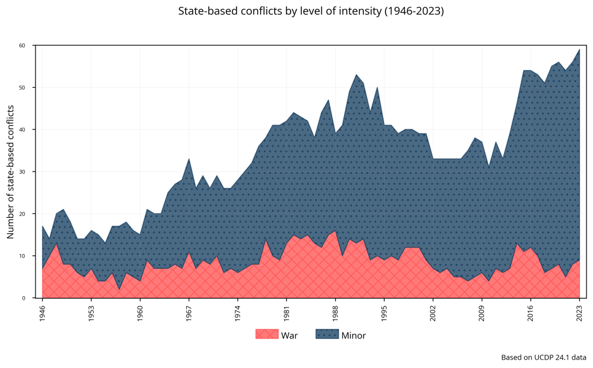

```{=html}
<style>
.reveal h2 { font-size: 1.3em !important; }
</style>
```

## Agenda

1. The Poverty-Violence Correlation
2. Two Mechanisms: Opportunity Cost and Rapacity
3. The Endogeneity Problem
4. Miguel, Satyanath, and Sergenti (2004)
5. Instrumental Variables in Practice

. . .

**Final Project Design due TONIGHT **


# From Crime to Conflict

## Last Week: The State and Security

- Crime can mobilize citizens (Bateson)
- But policing can alienate them (Weaver and Lerman)

. . .

Today: Civil war

- Civil war as failure of internal security provision
- Violence on a scale that reshapes economies and institutions


## What Is a Civil War?

What makes something a "civil war"?

. . .

Every definition is contested. One that is widely used is the **Uppsala/PRIO** definition:

> "A contested incompatibility which concerns government and/or territory where the use of armed force between two parties, of which at least one is the government of a state, results in at least **25 battle-related deaths**"

. . .

Note what this **excludes**: one-sided violence against civilians, non-state conflict between militias, anything below 25 deaths


## How Common Is Civil War?

{fig-align="center" height=4.5in}


## Civil War by the Numbers

::: incremental
- Civil wars have caused **three times** as many deaths as wars between states since WWII (Fearon and Laitin, 2003)
- In sub-Saharan Africa, **27% of country-years** experienced civil conflict between 1981 and 1999 (Miguel, Satyanath, and Sergenti, 2004)
- Overwhelmingly concentrated in the poorest countries
:::


# The Poverty-Violence Correlation

## The Empirical Pattern

```{r}
#| echo: false
#| warning: false
#| message: false
#| fig-height: 5

library(WDI)
library(ggplot2)
library(dplyr)
library(readr)
library(countrycode)
library(tidyr)

# --- Real UCDP data: count years in conflict per country ---
ucdp <- read_csv("../data/ucdp_acd.csv", show_col_types = FALSE) |>
  filter(type_of_conflict == 3,            # internal conflicts only
         year >= 2000, year <= 2020,
         !grepl(",", gwno_loc)) |>         # drop multi-location rows
  mutate(gwno_num = as.numeric(gwno_loc),
         iso3c = countrycode(gwno_num, "gwn", "iso3c")) |>
  filter(!is.na(iso3c)) |>
  distinct(iso3c, year) |>
  count(iso3c, name = "years_in_conflict")

# --- WDI GDP data ---
wdi <- WDI(indicator = "NY.GDP.PCAP.PP.KD",
           country = "all", start = 2019, end = 2019, extra = TRUE) |>
  filter(!is.na(NY.GDP.PCAP.PP.KD), region != "Aggregates") |>
  rename(gdp_pc = NY.GDP.PCAP.PP.KD) |>
  left_join(ucdp, by = "iso3c") |>
  mutate(years_in_conflict = replace_na(years_in_conflict, 0))

highlights <- filter(wdi, iso3c %in% c("SOM", "AFG", "NOR",
                                         "COD", "SSD", "IRQ", "COL",
                                         "IND", "MMR", "ETH"))

ggplot(wdi, aes(x = gdp_pc, y = years_in_conflict + 1)) +
  geom_point(alpha = 0.5, size = 2.5, color = "grey40") +
  geom_smooth(method = "lm", se = FALSE, color = "#011F5B", linewidth = 1.2) +
  ggrepel::geom_label_repel(data = highlights, aes(label = country),
                             size = 3.5, seed = 42, max.overlaps = 12,
                             color = "red") +
  scale_x_log10(labels = scales::dollar) +
  scale_y_log10() +
  labs(x = "GDP per capita (PPP, log scale, 2019)",
       y = "Years in internal conflict + 1 (log scale)",
       title = "Poorer countries spend more years at war",
       caption = "Sources: UCDP/PRIO Armed Conflict Dataset v24.1; World Bank WDI") +
  theme_minimal(base_size = 16)
```


## Arguments That Poverty Causes Violence

::: incremental
- **Opportunity cost**: when you have nothing to lose, fighting is cheap
- **State weakness**: poor states cannot buy off or suppress rebels
- **Grievance**: deprivation and inequality breed resentment
:::


## Arguments That It Does Not

::: incremental
- **Bad institutions** may cause both poverty and war
- **Geography** could cause both
- The causation could go in the **other direction**: conflict causes poverty
:::

. . .

Today we focus on **two mechanisms** that formalize the "yes" side


# Two Mechanisms

## What Is Opportunity Cost?

The **opportunity cost** of doing something is **what you give up** by doing it

. . .

::: incremental
- The opportunity cost of **joining a rebel group** is everything else you could be doing instead
- Earning wages, spending time with your family, going to school, farming your land
- All of that is increasing in **outside wages**: the better the economy, the more you give up by fighting
:::


## Opportunity Cost and Conflict

::: incremental
- If wages are **\$1/day**, joining a militia doesn't cost you much
- If wages are **\$50/day**, you are giving up a lot
- Poverty lowers the opportunity cost of fighting $\rightarrow$ more people choose violence
:::

. . .

This is the core intuition linking poverty to conflict


## Dal Bo and Dal Bo: A Model

A formal model of conflict between **producers** and **predators**:

::: incremental
- People choose between two activities: **produce** (earn wages) or **fight** (take what others produce)
- When wages fall, producing becomes less attractive
- Fighting becomes relatively better $\rightarrow$ more insurrection
:::


## But Wait: The Rapacity Effect

::: incremental
- So far: poverty makes fighting cheaper $\rightarrow$ more conflict
- But what about the **opposite**?
- More resources could mean **more things to fight over**
- Oil is discovered, land becomes more valuable $\rightarrow$ groups fight harder to **capture** it
- This is the **rapacity effect**: wealth increases can ALSO cause conflict
:::

. . .

So which is it? Does more wealth cause peace or war?


## It Depends: Can You Pillage It?

::: incremental
- **Labor-intensive** wealth (agriculture, manufacturing):
  - You can't steal someone's harvest without a workforce: the value is in the **labor**
  - A good economic shock to labor intensive products $\rightarrow$ higher wages $\rightarrow$ higher opportunity cost $\rightarrow$ **peace**
- **Capital-intensive** wealth (oil, minerals, diamonds):
  - You CAN seize a mine or an oil field: the value is in the **ground**
  - A good economic shock to capital intensive products $\rightarrow$ more valuable prize to capture $\rightarrow$ **conflict**
:::

## The Theoretical Takeaway

::: incremental
- Poverty $\rightarrow$ low opportunity cost $\rightarrow$ insurrection (opportunity cost channel)
- Wealth $\rightarrow$ more to fight over $\rightarrow$ conflict (rapacity channel)
- Which one dominates depends on the **economic structure** of the country
:::

. . .

But how do we **prove** any of this? We can't randomly make countries poor


# The Endogeneity Problem

## Three Problems with a Naive Regression

::: incremental
1. **Reverse causality**: conflict destroys income, so we confuse the effect with the cause
2. **Omitted variables**: institutions, ethnic tensions, geography may cause **both** poverty and conflict
3. **Anticipation**: if people expect instability, they stop investing $\rightarrow$ income falls *before* conflict starts
:::

. . .

We need something that changes income but has no direct effect on conflict


# Instrumental Variables

## The Core Intuition

Think of $X$ (income) as having two parts:

::: incremental
- **Clean variation**: changes in income driven by forces that have nothing to do with conflict
- **Dirty variation**: changes in income tangled up with confounders, reverse causality, anticipation
:::

. . .

OLS uses **all** the variation in $X$: clean and dirty mixed together

. . .

An instrument $Z$ lets us **extract only the clean part.** If $Z$ moves $X$ but has absolutely no relationship with $Y$ except through $X$, then the piece of $X$ that $Z$ explains is pure signal


## An Example

Does **education** ($X$) increase **earnings** ($Y$)?

::: incremental
- **Dirty variation**: motivated people get more education AND earn more: is it the schooling or the motivation?
- Observation: people who grew up **closer to a college** tend to get more education (Card, 1993)
- Proximity to a college ($Z$) shifts education for geographic reasons, not because of ability or motivation
- The part of education explained by distance is **clean**: free of the motivation confound
- Use only that clean part $\rightarrow$ **causal** effect of education on earnings
:::

## IV as a DAG

```{r}
#| echo: false
#| fig-height: 4.5
#| fig-width: 9

library(ggplot2)

nodes <- data.frame(
  letter = c("Z", "X", "Y", "U"),
  x = c(0, 2, 4, 3),
  y = c(0, 0, 0, 1.5),
  fill = c("#2ca02c", "#1f77b4", "#d62728", "#7f7f7f"),
  desc = c("Instrument", "Treatment", "Outcome", "Confounders")
)

edges <- data.frame(
  x = c(0, 2, 3, 3),
  y = c(0, 0, 1.5, 1.5),
  xend = c(2, 4, 2, 4),
  yend = c(0, 0, 0, 0),
  type = c("solid", "solid", "dashed", "dashed")
)

# Curved arrow helper
curve_arrow <- function(x0, y0, x1, y1, curvature, col, lty, lwd = 0.8) {
  geom_curve(aes(x = x0, y = y0, xend = x1, yend = y1),
             curvature = curvature, linewidth = lwd,
             color = col, linetype = lty,
             arrow = arrow(length = unit(0.25, "cm"), type = "closed"))
}

ggplot() +
  # Causal arrows (solid black)
  curve_arrow(0.4, 0, 1.6, 0, 0, "grey30", "solid", 1.2) +
  curve_arrow(2.4, 0, 3.6, 0, 0, "grey30", "solid", 1.2) +
  # Confounding arrows (dashed grey)
  curve_arrow(2.8, 1.3, 2.2, 0.25, 0.2, "#7f7f7f", "dashed", 1) +
  curve_arrow(3.2, 1.3, 3.8, 0.25, -0.2, "#7f7f7f", "dashed", 1) +
  # Excluded: Z -> Y (red, curved down)
  curve_arrow(0.4, -0.15, 3.6, -0.15, 0.4, "#d62728", "dotted", 0.9) +
  annotate("text", x = 2, y = -0.7, label = "X  exclusion restriction",
           size = 4, color = "#d62728", fontface = "italic") +
  # Excluded: U -> Z (red, curved up)
  curve_arrow(2.7, 1.4, 0.3, 0.25, 0.3, "#d62728", "dotted", 0.9) +
  annotate("text", x = 0.9, y = 1.5, label = "X  independence",
           size = 4, color = "#d62728", fontface = "italic") +
  # Nodes
  geom_point(data = nodes, aes(x = x, y = y, color = fill), size = 18) +
  geom_text(data = nodes, aes(x = x, y = y, label = letter),
            color = "white", size = 7, fontface = "bold") +
  # Labels below/above
  geom_text(data = nodes, aes(x = x,
            y = ifelse(y > 0, y + 0.45, y - 0.45),
            label = desc),
            size = 5, color = "grey30") +
  scale_color_identity() +
  theme_void() +
  coord_cartesian(xlim = c(-0.8, 4.8), ylim = c(-1, 2.2))
```


## The Three Conditions

For $Z$ to be a valid instrument for $X$ in estimating $X \rightarrow Y$:

::: incremental
1. **Relevance**: $Z$ actually moves $X$
   - "Does the instrument shift the treatment?"
2. **Exclusion restriction**: $Z$ has no direct arrow to $Y$
   - "The ONLY reason $Z$ matters for $Y$ is because it changes $X$"
3. **Independence**: $U$ has no arrow to $Z$
   - "Confounders don't affect the instrument"
:::


## How 2SLS Works

**Two-Stage Least Squares**:

::: incremental
- **Stage 1**: Regress $X$ on $Z$
  - This gives us $\widehat{X}$: the part of $X$ that is **explained by** $Z$
  - $\widehat{X}$ contains only clean variation; the dirty part is left in the residuals
- **Stage 2**: Regress $Y$ on $\widehat{X}$
  - We threw away the contaminated variation and kept only the clean part
  - What's left is the **causal effect** of $X$ on $Y$
:::


# Miguel, Satyanath, and Sergenti (2004)


## The Setting

::: incremental
- Sub-Saharan Africa: the region with the most civil wars since 1960
- Also the poorest and most agriculturally dependent region
- Agriculture is overwhelmingly **rain-fed**: only ~1% of cropland irrigated
- When rainfall drops, harvests fail, and the economy contracts
:::


## The Research Question

Do **negative rainfall shocks** (droughts) increase the probability of civil conflict?

::: incremental
- 41 sub-Saharan African countries, 1981-1999
- The instrument is **rainfall variation**: less rain $\rightarrow$ lower agricultural output $\rightarrow$ lower economic growth
- They use rainfall to isolate the clean part of income variation
:::


## Why Rainfall Works as an Instrument

::: incremental
1. **Relevance**: droughts destroy harvests $\rightarrow$ lower income
2. **Exclusion**: rainfall affects conflict *only* because it changes income
3. **Independence**: nobody controls the weather
:::

$$\text{Rainfall} \longrightarrow \text{Economic Growth} \longrightarrow \text{Conflict}$$


## First Stage: Does Rainfall Predict Growth?

::: incremental
- Current and lagged rainfall growth **significantly predict** economic growth
- A drought leads to roughly a **1-2 percentage point** decline in GDP growth
:::


## Second Stage: The Causal Effect

The decline in economic growth **caused by drought** increases conflict:

::: incremental
- A **5 percentage-point** decline in rainfall-driven growth increases the likelihood of civil conflict by roughly **12 percentage points**
- The effect comes through **lagged** growth: last year's drought predicts this year's conflict
:::


## Does the Exclusion Restriction Hold?

The instrument is only valid if rainfall affects conflict **exclusively** through income. But what if:

::: incremental
- Drought $\rightarrow$ **roads deteriorate** $\rightarrow$ harder to move troops $\rightarrow$ conflict changes for logistical reasons, not income
- Drought $\rightarrow$ **disease outbreaks** $\rightarrow$ displacement $\rightarrow$ conflict over new territory
- Drought $\rightarrow$ **crop failure** $\rightarrow$ **migration to neighboring regions** $\rightarrow$ conflict there
:::

. . .

The authors argue these channels are small relative to the economic channel. You cannot test this statistically: you have to argue it


## Connecting Back to Theory

::: incremental
- Rainfall affects **agricultural income**: labor-intensive
- You can't pillage labor so this is a shock to the **opportunity cost** channel
- Drought $\rightarrow$ harvest falls $\rightarrow$ wages fall $\rightarrow$ opportunity cost of fighting falls $\rightarrow$ conflict rises
- MSS provides evidence for the Dal Bo and Dal Bo mechanism
:::


# IV in Practice

## IV in R

```{r}
#| echo: true
#| eval: false

library(ivreg)

# OLS: uses all variation in growth (clean + dirty)
ols <- lm(conflict ~ growth, data = mss)

# IV: uses only the part of growth driven by rainfall
iv <- ivreg(conflict ~ growth | rainfall, data = mss)

summary(iv, diagnostics = TRUE)
```


## When Is IV Useful?

::: incremental
- When you suspect **endogeneity**: reverse causality, omitted variables, anticipation
- When you can find a variable that is:
  - **Relevant** (actually moves $X$)
  - **Excludable** (only affects $Y$ through $X$)
  - **Independent** (not driven by confounders)
- The hardest part is always the **exclusion restriction**: you can't test it, you have to argue it
:::


## Implications

::: incremental
- Economic shocks cause civil war: the opportunity cost mechanism is supported
- Consistent with the labor-intensive channel from Dal Bo and Dal Bo
- Policy implication: **economic interventions** (crop insurance, irrigation, diversification, aid during droughts) could help prevent conflict
:::


# Discussion

## From Crime to Civil War

Last class we talked about **crime** and the state:

::: incremental
- Crime emerges when the state fails to provide internal security
- Civil war: some people actively fight the state
:::
. . .

Is there a continuum from crime to organized violence to civil war? Or are these fundamentally different phenomena?


## Next Class

**Conflict and Development II: The Consequences of War**

- Blattman and Annan (2010): "The Consequences of Child Soldiering"
- Miguel, Saiegh, and Satyanath (2011): Civil War Exposure and Violence (on the Soccer Pitch)

