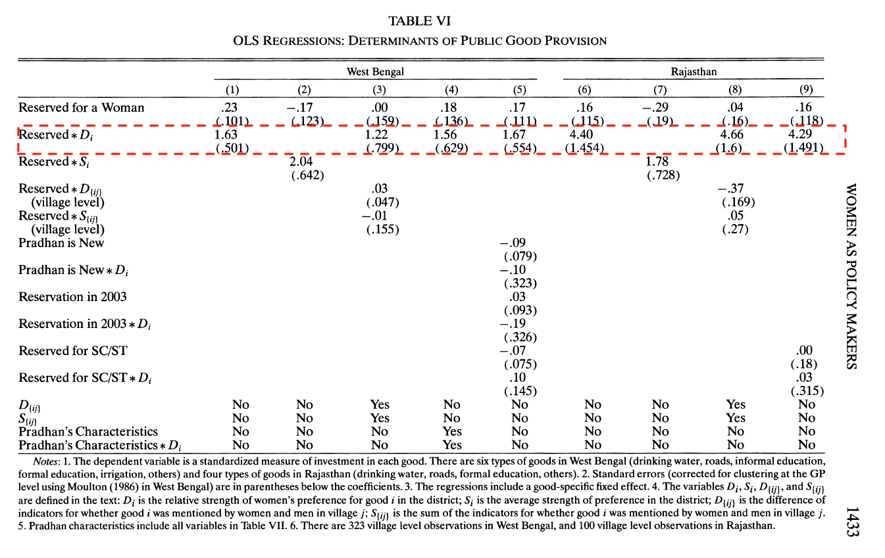

## Agenda

-   Development and Gender

-   Chattopadhyay and Duflo, 2004

-   Interaction Models

## Upcoming Deadlines

-   **Expanded Research Design** -- April 15, 2026
    -   Refined research plan: RQ, hypothesis, design, limitations
    -   Submit via Slack by 11:59pm EST

-   **Final Project** -- April 29, 2026
    -   Full analysis + professional webpage
    -   Submit via Slack by 11:59pm EST

## Gender and Representation

{fig-align="center" height="5in"}

## Gender and Representation

-   Women hold only 27.0% of legislative seats (IPU, 2023)
-   23% of cabinet positions (UNWOMEN)
-   Disputed gender gap in turnout, large variance

## Gender and Development

{fig-align="center" height="5in"}

## Gender and Development

-   Female labor force participation rate: ~47% vs. ~73% male (ILO, 2023)
-   Gender wage gap [(Pew)](https://www.pewresearch.org/social-trends/2023/03/01/the-enduring-grip-of-the-gender-pay-gap/)
-   1/3 of women have experienced GBV
-   Literacy gap: 90% male vs. 83% female (World Bank, 2022)

## Gender, Development, and Representation

-   The two are undoubtedly related

-   But could improving gender representation produce development?

```{r simple-dag, echo=FALSE, fig.width=6, fig.height=3, fig.align='center'}

par(mar = c(1, 1, 1, 1), bg = NA) 
plot(0, 0, type = "n", xlim = c(0, 10), ylim = c(0, 2), 
     xaxt = "n", yaxt = "n", xlab = "", ylab = "", 
     main = "", bty = "n")

symbols(c(3, 7), c(1, 1), circles = c(1, 1), 
        inches = FALSE, add = TRUE, bg = "white")


text(3, 1, "Gender\nRepresentation", cex = 0.9)
text(7, 1, "Development\nOutcomes", cex = 0.9)

# Add arrow
arrows(4, 1, 6, 1, length = 0.1, lwd = 1.5)
```

## From Representation to development

**Why might having more women in office improve development?**

::: incremental
-   Women may want different things

-   Women may behave differently

-   Women may be better at their job

-   Women representatives may teach about equality
:::

## Our Expectations

-   **Different outcomes?**
    -   Do women prioritize different policy domains?
-   **Better outcomes?**
    -   Potential improvements in service delivery and reduced corruption
-   **Conditionally different outcomes?**
    -   Effectiveness depends on institutional context
    -   Critical mass may be necessary
    -   Interactions with other social identities

## Empirical Test?

-   Seems like a good theory with important implications that we want to validate empirically

-   Imagine we have data on share of female legislators and many development outcomes

-   We compare places with female politicians to places with male politicians and see development differences

-   What is the problem with this?

## A (more realistic) DAG

```{r complex-dag, echo=FALSE, fig.width=8, fig.height=5, fig.align='center'}

par(mar = c(1, 1, 1, 1), bg = NA)  # Reduce margins and set transparent background
plot(0, 0, type = "n", xlim = c(0, 10), ylim = c(0, 6), 
     xaxt = "n", yaxt = "n", xlab = "", ylab = "", 
     main = "", bty = "n")  # bty="n" removes the box

# Define node positions
x_pos <- c(3, 7, 2, 5)
y_pos <- c(3, 3, 5, 5)
labels <- c("Gender\nRepresentation", "Development\nOutcomes", 
           "Previous\nDevelopment", "Gender\nNorms")

# Add nodes as circles
symbols(x_pos, y_pos, circles = rep(0.8, 4), 
        inches = FALSE, add = TRUE, bg = "white")

# Add text to nodes
text(x_pos, y_pos, labels, cex = 0.8)

# Add arrows
# Direct effect
arrows(3.8, 3, 6.2, 3, length = 0.1, lwd = 1.5)

# Confounding paths
arrows(2, 4.2, 2.7, 3.8, length = 0.1, lwd = 1, lty = 2)  # Previous dev -> Gender rep
arrows(2, 4.2, 6.3, 3.8, length = 0.1, lwd = 1, lty = 2)  # Previous dev -> Dev outcomes

arrows(5, 4.2, 3.7, 3.8, length = 0.1, lwd = 1, lty = 2)  # Gender norms -> Gender rep
arrows(5, 4.2, 6.3, 3.8, length = 0.1, lwd = 1, lty = 2)  # Gender norms -> Dev outcomes

# Add legend
legend(1, 1, 
       legend = c("Direct effect", "Confounding paths"), 
       lty = c(1, 2), 
       lwd = c(1.5, 1), 
       cex = 0.7,
       bty = "n")
```

## Gender Quotas: What are they?

-   Rules requiring minimum women's representation in politics

-   Goal: Improve gender parity in government

-   Vary by country, region, and level of government

-   Typically set minimum thresholds (20-50%)

## Gender Quotas: Types

-   **Voluntary quotas**:
    -   Set by political parties themselves
    -   No legal enforcement
-   **Mandatory quotas**:
    -   Required by law
        -   **Reserved seats**:
            -   Specific seats only women can hold
        -   **Candidate quotas**:
            -   Parties must nominate certain % of women

## Gender Quota Adoption

-   Started in 1990s, expanded rapidly

-   Now used in about 130 countries

-   Most common in newer democracies

-   Less common in older democracies (US, Japan)

-   Highest representation achieved in Rwanda (61%)

## Chattopadhyay and Duflo, 2004

::: incremental
-   India reserved 1/3 of village council (panchayat) head positions for women (1993)

-   Reserved positions assigned by random lottery

-   Randomization creates natural experiment

-   Solves confounding problem $\rightarrow$ can identify causal effects!
:::

## The Research Question

Does mandated representation of women change policy outcomes?

::: incremental
-   Reserved positions assigned by random lottery
-   Do villages with female heads invest differently than those with male heads?
:::

## Theory

**Hypothesis:** Reserved villages invest more in goods women prioritize

::: incremental
-   **Mechanism:** Heterogeneous priorities
    -   Women and men have different policy preferences
    -   Female leaders translate those preferences into policy
-   If true: representation has substantive, not just symbolic, value
:::

## Research Design

**Treatment:** Village council randomly assigned a female head (reserved seat lottery)

::: incremental
-   **Identification:** Randomization via lottery
    -   Reserved vs. non-reserved villages are comparable on all other dimensions
-   **Outcome:** Public investment decisions (type and quantity)
-   **Data:** Village councils in West Bengal and Rajasthan, India
:::

## Measuring $D_i$: Gender Differences in Requests

-   Authors surveyed villagers: *"Have you made a request to the GP in the past 6 months?"*
-   Requests = complaints or petitions for specific public goods (water, roads, irrigation...)
-   For each good $i$, $D_i$ = share of women requesting it minus share of men requesting it
-   Positive $D_i$: women want it more. Negative: men want it more.

## A bit more detail

\
$Y_{ij} = \beta_1 + \beta_2 * R_j + \beta_3 D_i * R_j + \sum_{l=1}^{N} \beta_l d_{li} + \epsilon_{ij}$

Where:
\

-   $Y_{ij}$ is an outcome of interest

-   $R_j$ takes the value of 1 if GP is reserved

-   $D_i$ is gender difference in requests for that good (women - men)

-   $d_{li}$ are good Fixed Effects!

<!--  5.49.55 p.m.-01.png){fig-align="center"} -->

## Main Findings

{fig-align="center"}

# Interaction Terms

## What are Interaction Terms?

-   An interaction term is the product of two variables used as a covariate in a regression model

-   Captures how the effect of one variable depends on the value of another variable

-   Powerful for testing conditional hypotheses
 
\
**Key Modeling Assumption**

An increase in $X$ is associated with an increase in $Y$ only when a specific condition is met

## Recap: OLS Interpretation Basics
\

$Y_{i} = \alpha + \beta_1 * X_i + \beta_2 * Z_i + \epsilon_{i}$ 

-   $\hat{\beta_1}$ represents the change in $Y$ when $X$ increases by one unit

-   $\hat{\beta_2}$ represents the change in $Y$ when $Z$ increases by one unit

- Why?

## Coefficients as Marginal Changes

A partial derivative of the equation shows how $Y$ changes when $X$ changes by 1:


\

$Y_{i} = \alpha + \beta_1 * X_i + \beta_2 * Z_i + \epsilon_{i}$ 

-   $\frac{\partial Y}{\partial X} = \beta_1$

-   $\frac{\partial Y}{\partial Z} = \beta_2$

## Interaction Effects

-   Idea, the effect of X on Y depends on Z

$Y = \alpha + \beta_1X + \beta_2Z + \beta_3(X*Z) + \epsilon$


## Think of it as another covariate!

```{r binary-table, echo=FALSE}
require(tidyverse)
# Create a table showing binary interaction
binary_example <- data.frame(
  X = c(0, 1, 0, 1),
  Z = c(0, 0, 1, 1),
 `X*Z` = c(0, 0, 0, 1)
)
knitr::kable(binary_example, caption = "")
```

- What needs to happen for the new covariate to be 1?

## New model
\

$Y_{i} = \alpha + \beta_1 * X_i + \beta_2 * Z_i + \beta_3 * Z_i * X_i + \epsilon_{i}$


-   How to interpret $\beta_3$: [Expected change in Y when the product of $X \times Z$ increases by 1 unit.]{.fragment}

-   How to interpret $\beta_1$: [Change in Y when X increases by 1 unit AND $Z =0$]{.fragment}

-   How to interpret $\beta_2$: [Change in Y when X increases by 1 unit AND $X =0$]{.fragment}

## Back to Math!

\ 
**Why does the interpretation of $\beta_1$ and $\beta_2$ change?**

$Y_{i} = \alpha + \beta_1 * X_i + \beta_2 * Z_i + \beta_3 * Z_i * X_i \epsilon_{i}$ 

-   $\frac{\partial Y}{\partial X} = \beta_1 + \beta_3*Z_i$

-   $\frac{\partial Y}{\partial Z} = \beta_2  + \beta_3*X_i$

## Three Simple Rules for Interaction

1.  Use for conditional hypotheses

2.  Always include all constituent terms 

3.  Interpret $\beta_1$ and $\beta_2$ correctly

```{r setup-data, echo=FALSE, warning=FALSE, message=FALSE}
library(tidyverse)
library(marginaleffects)
set.seed(12)

# Binary moderator: effect of women's representation depends on quota
interaction_data <- tibble(
  women_rep = runif(200, 0, 1),
  quota     = sample(0:1, 200, replace = TRUE)
) %>%
  mutate(policy_outcome = 1 + (-.5)*women_rep + 1.5*quota + 3*(women_rep*quota) + rnorm(n(), 0, 0.5))

model_binary <- lm(policy_outcome ~ women_rep * quota, data = interaction_data)

# Continuous moderator: effect of reservation depends on preference gap (D_i)
cont_data <- tibble(
  reservation = sample(0:1, 200, replace = TRUE),
  pref_gap    = runif(200, -1, 1)   # D_i: women minus men requests
) %>%
  mutate(investment = 0.5 + 0.2*reservation + 0.1*pref_gap +
           2*(reservation*pref_gap) + rnorm(n(), 0, 0.3))

model_cont <- lm(investment ~ reservation * pref_gap, data = cont_data)
```

## Marginal Effects: The Idea

Recall:

$$\frac{\partial Y}{\partial X} = \beta_1 + \beta_3 \cdot Z$$

- The effect of $X$ on $Y$ is **not a single number** -- it depends on $Z$
- `marginaleffects` evaluates this at specified values of $Z$ and computes uncertainty

. . .

Two cases: $Z$ is **binary** vs. $Z$ is **continuous**

## Binary Moderator: Two Estimates

```{r}
#| echo: true
#| warning: false

# Effect of women's representation on policy outcome, by quota status
slopes(model_binary,
       variables = "women_rep",
       by = "quota")
```

## Binary Moderator: Plot

```{r}
#| echo: false
#| warning: false
#| fig-align: center
#| fig-height: 4.5

plot_slopes(model_binary,
            variables = "women_rep",
            condition = "quota") +
  scale_x_discrete(labels = c("0" = "No quota", "1" = "Quota")) +
  labs(x = NULL,
       y = "Effect of women's representation\non policy outcome") +
  theme_minimal(base_size = 16)
```

## Continuous Moderator: A Line, Not Two Points

When $Z$ is continuous, the marginal effect varies **across the full range of $Z$**

. . .

Back to C&D logic: as $D_i$ increases (women want a good more relative to men), does the effect of reservation on investment grow?

## Continuous Moderator: Plot

```{r}
#| echo: true
#| code-fold: true
#| code-summary: "Show code"
#| warning: false
#| fig-align: center
#| fig-height: 4.5

plot_slopes(model_cont,
            variables = "reservation",
            condition = "pref_gap") +
  geom_hline(yintercept = 0, linetype = "dashed", color = "grey40") +
  labs(x = expression(D[i] ~ "(gender gap in requests: women - men)"),
       y = "Effect of GP reservation\non public investment",
       caption = "Simulated data") +
  theme_minimal(base_size = 16)
```

## What to Look For

**Binary moderator**
- Two point estimates with CIs -- does the effect change sign or magnitude?

**Continuous moderator**
- A line with CI band -- where does the effect become significant? Where does it flip?

. . .

Both are $\beta_1 + \beta_3 \cdot Z$ evaluated at different values of $Z$ -- `marginaleffects` handles the standard errors

