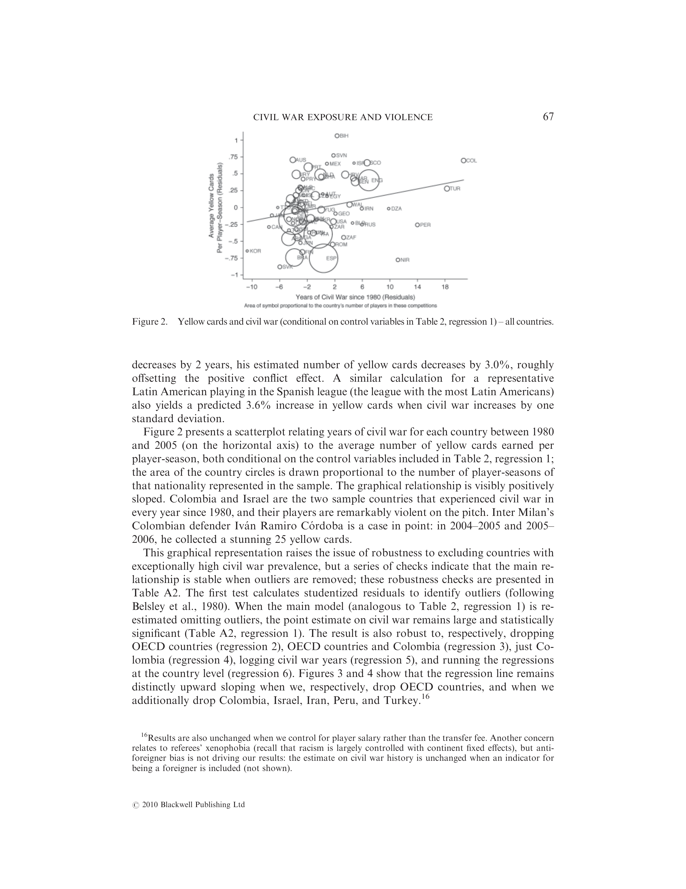

```{=html}
<style>
.reveal h2 { font-size: 1.3em !important; }
</style>
```

## Agenda

1. A Puzzle: Soccer and Civil War
2. The Costs of Civil War
3. Consequences of Child Soldiering (Blattman and Annan, 2010)

# A Puzzle

## Does War Follow You Home?

::: incremental
- Miguel, Saiegh, and Satyanath (2011) study **thousands of professional soccer players** in European leagues
- They compare players from countries with civil war histories to players from peaceful countries
- Players from civil war countries receive significantly **more yellow and red cards** — even controlling for position, age, league, and talent
- But they do NOT score more or fewer goals — the effect is specific to **violent behavior**
:::

. . .

Conflict doesn't just destroy economies. It changes **people**.


## The Soccer Data

{fig-align="center" height=4.5in}

Yellow cards and civil war exposure (conditional on controls). Colombia and Israel are outliers.

## Why This Matters

::: incremental
- Violence "follows people" even **outside** the conflict zone
- The consequences of war extend beyond economics — they are **behavioral and psychological**
- This motivates our question today: what does conflict destroy, and how long do the effects last?
:::


# Recap: What Causes Conflict?

## Last Class

::: incremental
- Poverty lowers the **opportunity cost** of fighting (Dal Bo and Dal Bo)
- Weak states cannot **credibly commit** to peace
- Miguel, Satyanath, and Sergenti (2004): rainfall shocks $\rightarrow$ income drops $\rightarrow$ civil conflict
- The causal link from poverty to conflict is **real**
:::

. . .

Today: the other side of the conflict trap. What does conflict **cause**?


# The Costs of Civil War

## Blattman and Miguel (2010)

A comprehensive review of the **causes and consequences** of civil war

. . .

Three categories of destruction:

::: incremental
- **Human capital**: lives, health, education
- **Physical capital**: infrastructure, assets, investment
- **Institutions**: state capacity, trust, rule of law
:::


## Human Capital

::: incremental
- **Death**: combat kills, but most civilian casualties come from disease, displacement, and famine
- **Health**: war-related malnutrition in Zimbabwe led to children being significantly shorter as adults (Alderman, Hoddinott, and Kinsey, 2006)
- **Health**: in Burundi, children in war-affected regions had height-for-age ~0.5 standard deviations lower (Bundervoet, Verwimp, and Akresh, 2009)
- **Education**: schools destroyed, children recruited, families displaced
- Akresh and de Walque (2008): Rwandan genocide reduced educational attainment by almost a full year
:::


## Physical Capital

::: incremental
- Infrastructure destroyed: roads, bridges, factories, hospitals
- Capital flight: mobile capital flees to foreign assets; new investment dries up
- Agricultural collapse: in Mozambique, 80% of the cattle stock was lost; in northern Uganda, families lost cattle, homes, and assets (Blattman and Miguel, 2010)
- Cerra and Saxena (2008): output declines **6%** in the immediate aftermath of civil war
:::

. . .

But physical capital can recover — cities bombed in WWII (Japan, Germany) returned to pre-war population trends within 20–25 years.


## Institutional Collapse

::: incremental
- State capacity erodes: tax collection, public services, rule of law
- Corruption and war economies emerge: natural resource looting, drug trade
- Social trust is damaged
- Formal and informal institutions that took decades to build can be destroyed in years
:::

. . .

Blattman and Miguel (2010): *"The social and institutional legacies of conflict are arguably the most important but least understood of all war impacts"*


## The Recovery Debate

::: incremental
- **Pessimistic view**: civil war sets countries back decades, effects are permanent
- **Optimistic view**: countries can "bounce back" — the "Phoenix effect"
- Miguel and Roland (2011): Vietnam districts that were heavily bombed recovered to similar economic levels as less-bombed districts
- But recovery is **uneven**: physical capital rebuilds faster than human capital and institutions
:::

. . .

The truth depends on **what** was destroyed — and on **who** was affected.


# Blattman and Annan (2010)

## Context: Northern Uganda

::: incremental
- The Lord's Resistance Army (LRA) waged a brutal insurgency in northern Uganda from the late 1980s
- Led by Joseph Kony
- The LRA **abducted children and young adults** to serve as soldiers, porters, and laborers
- Tens of thousands abducted, mostly boys aged 10–24
:::


## The Research Question

What are the **long-run consequences** of forced military service on:

::: incremental
- Human capital (education, skills)
- Economic outcomes (employment, earnings)
- Psychological well-being
:::

. . .

Why is this hard to study?


## The Identification Problem

::: incremental
- You can't just compare ex-combatants to non-combatants
- People who fight may be systematically different: poorer, less educated, more aggressive
- **Selection bias**: the same things that lead to recruitment may also affect outcomes
:::

. . .

So how do Blattman and Annan solve this?


## The LRA as a Natural Experiment

The LRA's abduction strategy was essentially **random**:

::: incremental
- *"Targets were generally unplanned and arbitrary; they raided whatever homesteads they encountered, regardless of wealth or other traits"* (p. 887)
- Strategy: **abduct first, sort out later** — keep all adolescent and young adult males
- Rural Acholi households live in isolation, making them vulnerable to roving raiding parties
- Result: within a community, who was taken was largely a matter of **bad luck**
:::

. . .

The authors verify this: abductees and non-abductees look similar on pre-war characteristics (F-test p-value = 0.40).


## Data

::: incremental
- Survey of **741 male youth** aged 14–30 in 2005–2006
- From **8 sub-counties** in two war-affected districts (Kitgum and Pader)
- Compared those who were abducted to those who were not
- Detailed measures of education, employment, earnings, health, and psychological distress
:::


## Results: Human Capital

::: incremental
- Abductees had **0.75 fewer years of education** — a 10% reduction relative to the non-abducted average of 7.6 years
- Were **15 percentage points less likely** to be functionally literate — nearly twice as likely to be illiterate as non-abductees
- Large effects on the **youngest abductees** — those taken during critical schooling years
:::

. . .

Abduction interrupted education at a crucial moment, and most never caught up.


## Results: Economic Outcomes

::: incremental
- Abductees' wages were **33% lower** (one-third less in daily earnings)
- Were significantly less likely to be engaged in **skilled work**
- More likely to be in subsistence agriculture
- The education gap explains much (but not all) of the earnings gap
:::


## Results: Psychological Costs

::: incremental
- Abductees reported significantly higher levels of **psychological distress**
- Higher rates of aggression and social difficulties
- Those who experienced more **violence during captivity** had worse outcomes
- The psychological scars may be as consequential as the economic ones
:::

. . .

Remember the soccer paper: violence follows people. Blattman and Annan show us **why**.


## What Do We Learn?

::: incremental
- Conflict doesn't just destroy infrastructure — it destroys **people's potential**
- Children and young people bear disproportionate costs
- The effects persist **long after** the fighting stops
- Education loss alone generates a lifetime of lower earnings
- And the psychological costs compound everything
:::


# Discussion

## The Conflict Trap, Revisited

::: incremental
- **Last class**: poverty causes conflict (MSS 2004)
- **Today**: conflict destroys human capital, physical capital, institutions, and people's psychology
- Destroyed human capital $\rightarrow$ lower earnings $\rightarrow$ poverty $\rightarrow$ more conflict
- The **micro** evidence (Blattman and Annan) confirms the **macro** pattern (Blattman and Miguel review)
:::

. . .

The trap is real. How do you break it?


## Discussion Questions

::: incremental
- Given what MSS showed about economic shocks causing conflict, and what we see here about conflict destroying human capital — how does the trap perpetuate itself?
- What kinds of **post-conflict interventions** would address the damage documented by Blattman and Annan?
- Is physical capital or human capital harder to rebuild? Why?
- The soccer paper shows behavioral effects far from the conflict zone. What does this imply for **refugee and diaspora** communities?
:::


## Next Class

**Health and Development**

- Reading: Chen et al. (2013) — air pollution and life expectancy in China
- We'll learn a new causal inference method: **Regression Discontinuity Design**
