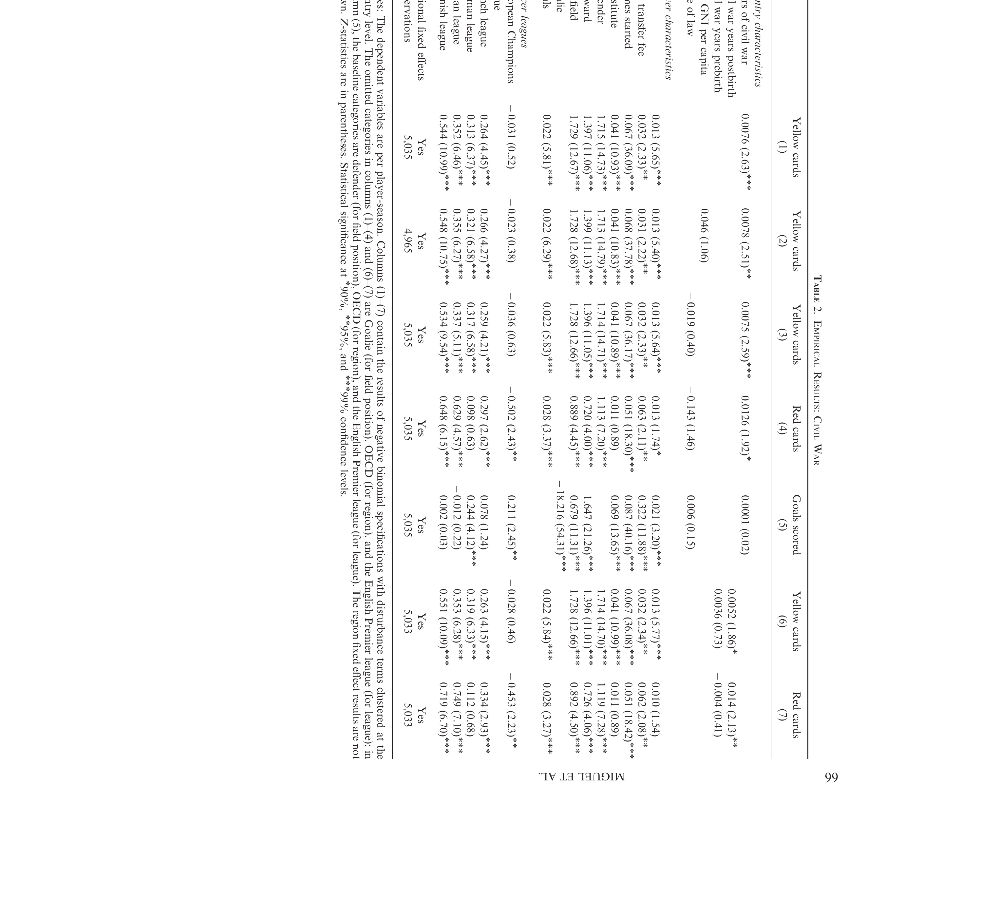

```{=html}
<style>
.reveal h2 { font-size: 1.3em !important; }
</style>
```

## Agenda

1. Last Week: What Causes Conflict?
2. Blattman and Annan (2010): The Consequences of Child Soldiering
3. Violence and Political Participation
4. Miguel, Saiegh, and Satyanath (2011): Civil War and the Soccer Pitch


# Last Week

## What Causes Conflict?

::: incremental
- Poverty lowers the **opportunity cost** of fighting (Dal Bo and Dal Bo)
- Wealth can also cause conflict if it increases the **returns to fighting**: rapacity
- Other explanations: grievance, ethnic fractionalization, weak institutions
- Conflict is both a cause and a consequence of poverty complicating causal analyses
- We used **instrumental variables** to try to isolate the causal effect of income on conflict
:::

. . .

Today: the other side. What does conflict **do** to people?


# What Does Conflict Destroy?

## Three Kinds of Destruction

::: incremental
- **Physical capital**: roads, bridges, factories, livestock
- **Human capital**: education interrupted, health damaged, skills lost
- **People themselves**: psychology, behavior, trust
:::

. . .

Most of what we know about the first two comes from macro data. To understand the third, we need micro evidence: what happens to individuals?


# Blattman and Annan (2010)

## Setting

::: incremental
- Northern Uganda, late 1980s onwards
- The Lord's Resistance Army (LRA), led by Joseph Kony, waged a brutal insurgency
- The LRA **abducted children and young adults** to serve as soldiers, porters, and laborers
- Tens of thousands abducted, mostly boys aged 10-24
:::

. . .

**What do you think happens to these children in the long run?**


## Research Question

What are the **long-run consequences** of forced military service on education, economic outcomes, and psychological well-being?


## Hypotheses

::: incremental
- **H1 (human capital)**: abduction interrupts education and skill formation $\rightarrow$ lower earnings, worse economic outcomes
- **H2 (psychology)**: exposure to extreme violence $\rightarrow$ lasting psychological distress, aggression, difficulty reintegrating
:::

. . .

**What would make this hard to study? Why can't we just compare soldiers to non-soldiers?**


## The Identification Problem

::: incremental
- You can't just compare ex-combatants to non-combatants
- People who fight may be systematically different: poorer, less educated, more aggressive
- **Selection bias**: the same things that lead to recruitment may also affect outcomes
:::


## Strategy

The LRA's abduction strategy was essentially **random**:

::: incremental
- *"Targets were generally unplanned and arbitrary; they raided whatever homesteads they encountered"* (p. 887)
- Strategy: **abduct first, sort out later**: keep all adolescent and young adult males
- Rural Acholi households live in isolation, making them vulnerable to roving raiding parties
- Within a community, who was taken was largely a matter of **bad luck**
:::

. . .

**What assumption does this rely on? What could go wrong?**


## Data

::: incremental
- Survey of **741 male youth** aged 14-30 in 2005-2006
- **8 sub-counties** in two war-affected districts (Kitgum and Pader)
- Compared abductees to non-abductees **within the same communities**
- **Outcomes**: years of education, literacy, daily earnings, employment type, psychological distress
:::


## Results: Human Capital

::: incremental
- Abductees had **0.75 fewer years of education**: a 10% reduction
- Were **15 percentage points less likely** to be functionally literate
- Largest effects on the **youngest abductees**: those taken during critical schooling years
:::

. . .

**Why would age at abduction matter?**


## Results: Economic Outcomes

::: incremental
- Abductees' wages were **33% lower**
- Significantly less likely to be engaged in **skilled work**
- More likely to be in subsistence agriculture
- The education gap explains much (but not all) of the earnings gap
:::

. . .

**If education doesn't explain the full gap, what else could?**


## Mechanism: Decomposing the Earnings Gap

::: incremental
- **Education** accounts for a large share of the earnings difference
- But **psychological distress** independently predicts worse outcomes, even conditional on education
- Those who witnessed or committed more violence during captivity had worse outcomes regardless of schooling
- It's not just lost years of school: violence itself leaves a mark
:::


## Results: Psychological Costs

::: incremental
- Abductees reported significantly higher levels of **psychological distress**
- Higher rates of aggression and social difficulties
- The **intensity of violence experienced** matters more than the duration of abduction
- Someone abducted for 6 months who saw killings had worse outcomes than someone abducted for 2 years who did not
:::


# The Surprising Finding

## Violence and Political Participation

In a companion paper, Blattman (2009) uses the **same natural experiment** in northern Uganda and finds something unexpected:

::: incremental
- Abductees were **more likely to vote** than non-abductees
- More likely to be **community leaders**
- More engaged in **collective action**
:::

. . .

Development outcomes worsen, but political participation **increases**


## Why?

::: incremental
- Exposure to violence may change people's **relationship to the state**: they want to shape the political order that failed to protect them
- War creates **shared identity** among survivors and a sense of collective purpose
- Similar to what Bateson (2012) found with crime: victimization can be a **mobilizing** experience
:::

. . .

How can the same experience destroy someone's economic prospects and make them MORE politically engaged? What does that tell us about what conflict does to people?


# Miguel, Saiegh, and Satyanath (2011)

## Motivation

Blattman and Annan showed conflict changes people psychologically: more distress, more aggression

. . .

But that evidence comes from **within** the conflict zone

. . .

Can we detect behavioral consequences of war in a completely different setting, years later, thousands of miles away?


## Setting

::: incremental
- Professional soccer: people from **very different countries** compete under **identical rules**
- Same referees, same leagues, same competition
- Violent behavior (fouls, yellow and red cards) is **precisely recorded**
- Skill (goals, assists) is also recorded separately
:::


## Research Question

Do players who grew up in countries experiencing civil war exhibit **more violent behavior** on the soccer pitch?

. . .

Before we go on: **what do you think?** What would you predict, and why?


## Hypothesis

**H1**: civil war exposure during formative years increases propensity toward violent behavior, even outside of war

. . .

**Mechanism**: growing up surrounded by violence normalizes aggression as a way of dealing with conflict and competition

. . .

**What alternative stories could explain the same pattern?**


## Data

::: incremental
- Thousands of players in top European leagues (England, France, Germany, Italy, Spain)
- **Treatment**: years of civil war in the player's home country (1980-2005)
- **Outcomes**: yellow cards, red cards, goals scored
- **Controls**: player position, age, minutes played, team quality, league
:::


## Strategy

::: incremental
- Compare players from **different countries** playing in the **same league**
- Two players, same team, same position, same age: one from a country with 10 years of civil war, one from a peaceful country
- **Assumption**: conditional on controls, nationality is not correlated with unobserved determinants of on-field aggression
:::

. . .

**What could violate this assumption?**


## Descriptive Evidence

{fig-align="center" width=100%}


## Main Results

{fig-align="center" width=100%}


## Reading the Table

::: incremental
- More years of civil war $\rightarrow$ significantly **more yellow and red cards**
- **No effect on goals scored**: aggression, not skill
- Holds controlling for position, age, league, team quality
- Robust to dropping outliers (Colombia, Israel)
:::

. . .

**Why does the "no effect on goals" matter?**


## Placebo Tests in Observational Data

How do you build confidence in a result you can't experimentally verify?

::: incremental
- Ask: **if my story is right, what else should be true?**
- And critically: **what should NOT be true?**
- If your treatment affects an outcome it shouldn't, your story has a problem
- If it does NOT affect that outcome, that's reassuring
:::

. . .

A placebo test checks whether the pattern is **specific** to the mechanism you claim


## Placebo Tests in This Paper

::: incremental
- **Should be true**: civil war exposure $\rightarrow$ more cards (aggression) $\checkmark$
- **Should NOT be true**: civil war exposure $\rightarrow$ more goals
  - If war predicted goals, something else is going on: playing style, desperation, not aggression
  - Result: **no effect on goals** $\checkmark$
- **Should be true**: effect stronger for players **younger** during the civil war (more impressionable)
:::

. . .

The "no effect on goals" is the placebo: it rules out stories where war just makes you a different *kind* of player


## Threats

::: incremental
- **Selection**: maybe only the most aggressive players from war countries make it to European leagues
- **Referee bias**: could referees card players from certain countries more harshly?
- **Omitted variables**: poverty, inequality, culture may correlate with both war and aggression
:::

. . .

**How would you design a test to rule out referee bias?** Hint: think about what should vary if it's the ref's perception vs the player's behavior


## Connecting the Papers

::: incremental
- Blattman and Annan: conflict destroys education, earnings, psychological health
- Blattman (2009): but it also increases political engagement
- Miguel, Saiegh, Satyanath: and it changes **behavior** years later, thousands of miles away
- The common thread: war reshapes the people who lived through it
:::


# Discussion

## Discussion

::: incremental
- Blattman and Annan show economic devastation; Blattman (2009) shows political mobilization. Can both be true? What does that mean for post-conflict societies?
- The soccer paper shows behavioral effects far from the conflict zone. What does this imply for **refugee and diaspora** communities?
- If the consequences of conflict are this persistent, what kinds of **interventions** could actually help?
:::


## Next Class

**Health and Development**

- Reading: Chen et al. (2013): air pollution and life expectancy in China
- A new causal inference method: **Regression Discontinuity Design**
