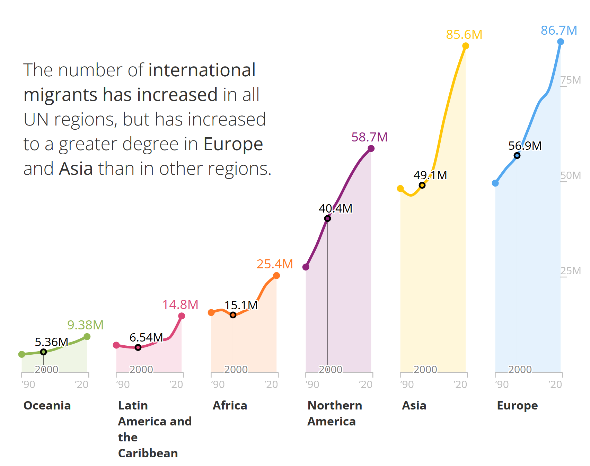
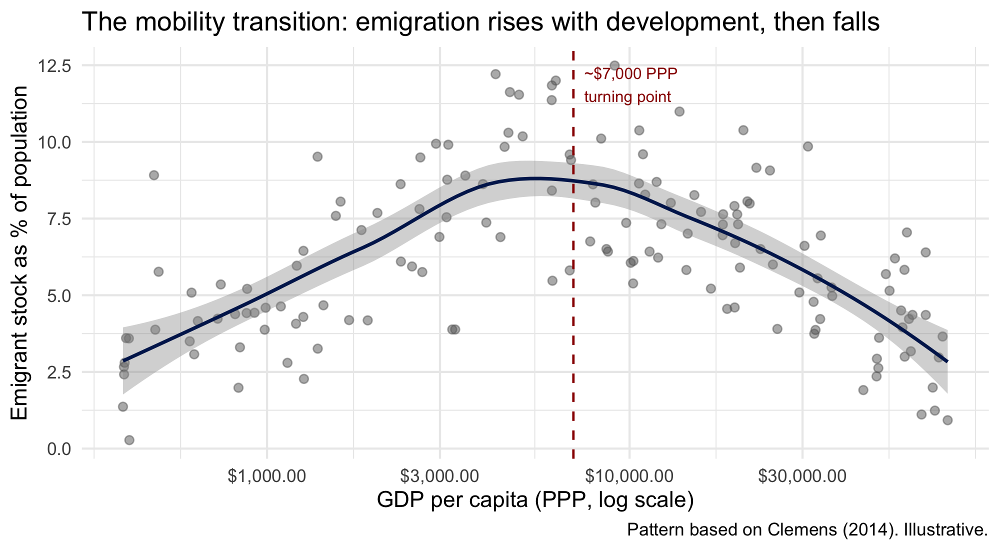
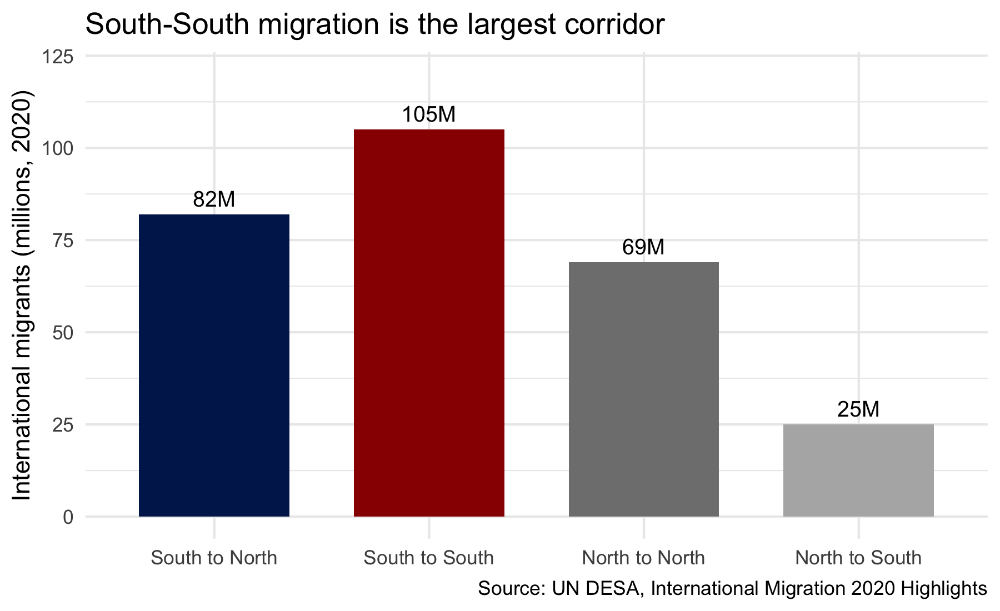
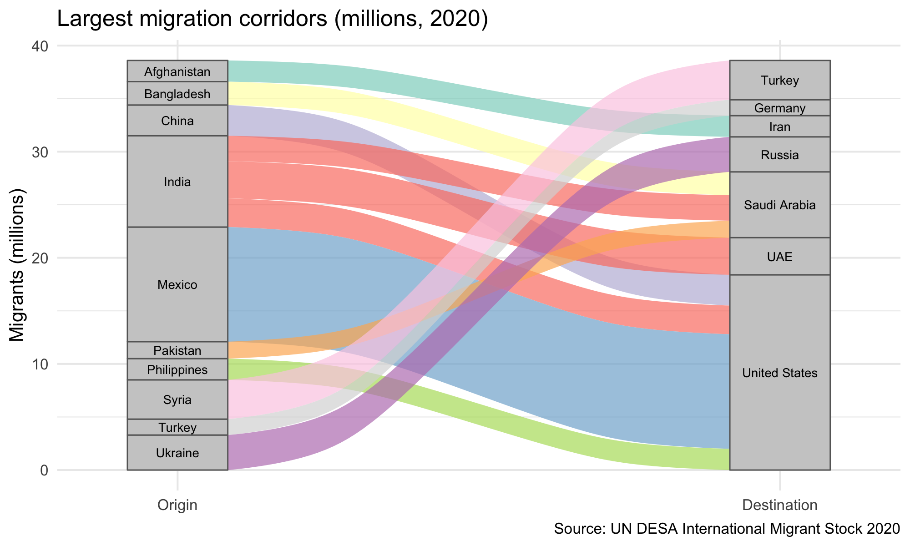
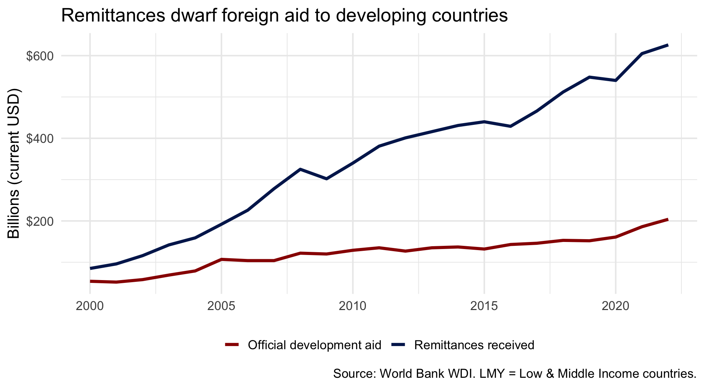

```{=html}
<style>
.reveal h2 { font-size: 1.3em !important; }
</style>
```

## Agenda

1. Types of Migration
2. Why Do People Migrate?
3. Who Actually Migrates?
4. Where Do They Go?
5. Does Migration Drain Origin Countries?
6. Yang (2008): Remittances and Household Investment


# From Conflict to Migration

## Last Class: The Consequences of Civil War

::: incremental
- Conflict destroys human capital, changes behavior, politicizes people
- One of the most immediate consequences of conflict is displacement
- Today: what does migration mean for development?
:::

# Types of Migration

## Forced vs Voluntary

::: incremental
- **Forced**: conflict, persecution, disaster (refugees, asylum seekers, IDPs)
- **Voluntary**: economic opportunity, family reunification, education
- Of ~281 million international migrants, ~36 million are refugees or asylum seekers (**~13%**, UNHCR 2023)
- Is the difference btw forced and voluntary clear cut?
:::

## The Scale

{fig-align="center" height=5in}


# Why Do People Migrate?

## The Place Premium

Clemens, Montenegro, and Pritchett (2008) estimate the wage gap for **observably identical workers** across borders:

::: incremental
- A Bolivian worker earns **3x more** just by working in the US
- A Nigerian worker earns **7x more**
- These gaps dwarf returns to education, capital, or any other intervention
- The biggest price distortion in the world economy is on wages! 
:::

. . .

So why doesn't everyone move?


## The Opportunity Cost of Staying

::: incremental
- Same logic as the conflict literature: people weigh costs and benefits
- The **opportunity cost of staying** is the wage you could earn elsewhere
- If wages at home are low, the returns to migration are enormous
- Migration is an investment: pay upfront costs now, earn returns later
:::

. . .

**So does that mean the poorest people migrate?**


# Who Actually Migrates?

## What do you think?

**If migration is driven by opportunity cost, should the poorest people be the most likely to migrate?**

. . .

The conventional wisdom in policy circles says yes — and that development will reduce migration

- Bill Clinton on NAFTA: *"as the benefits of economic growth are spread in Mexico ... there will be less illegal immigration"* (White House 1993)
- EU Commission (2008): migration policy should *"focus much more on ... improving the socio-economic situation in low-income and middle-income countries"*


## Migration as Investment

If migration is an investment, **not everyone can afford it**:

::: incremental
- Moving costs money: transport, visas, fees, settling in a new place
- You need **information**: where to go, how to get there, who can help
- You need **networks**: a cousin, a friend, a community at the destination
- The poorest people have the most to gain but **cannot pay the upfront cost**
:::


## Two Forces

So what happens as countries develop?

::: incremental
- **More financial reason to stay**: wages at home rise, the gap with abroad shrinks
- **But easier to leave**: people can afford the trip, transport is cheaper, diaspora networks grow, information flows improve
:::

. . .

Which effect dominates?


## The Mobility Transition

Clemens (2014) reviews 45 years of evidence:

::: incremental
- At low incomes, the **ability effect** dominates: development makes migration more affordable $\rightarrow$ emigration **rises**
- Only after ~PPP \$7,000-8,000 does the **incentive effect** kick in: wages at home are high enough that fewer people want to leave
- Result: an **inverted-U** between development and emigration
:::


## Macro Evidence: The Migration Hump

{fig-align="center" height=5in}


# Where Do They Go?

## Does that mean migrants move to the richest countries?

**What would you predict?**

. . .

Not necessarily.


## South-South Migration

{fig-align="center" height=5in}


## South-South Migration

::: incremental
- **South-South** migration (105M) is larger than South-North (82M) (UN DESA 2020)
- Most migration happens between neighboring countries, not across continents
- Afghan refugees go to Iran and Pakistan, not Germany
- Proximity, language, networks, and lower barriers matter more than wage gaps
:::


## Major Migration Corridors

{fig-align="center" height=5in}


# Does Migration Drain Origin Countries?

## Remittances vs Foreign Aid

{fig-align="center" height=5in}


## Remittances Are Huge — But Are They Productive?

::: incremental
- Remittances exceeded **$600 billion** in 2022 — larger than all foreign aid (World Bank)
- But money alone doesn't guarantee development
- Do families spend it on consumption (food, goods) or **investment** (education, business)?
:::

. . .

This is what Yang (2008) studies.


# Yang (2008)

## Setting

::: incremental
- The Philippines: one of the world's largest migrant-sending countries
- Millions of Filipino workers abroad, mostly in the Middle East, East Asia, and the US
- They send remittances home to their families
- What do families do with this money?
:::


## Research Question

Do remittances increase household investment in human capital and entrepreneurship in origin communities?

. . .

**What would you predict? Do families spend remittances on consumption (food, goods) or investment (education, business)?**


## Hypothesis

::: incremental
- **H1**: remittance income increases investment in education and entrepreneurship
- **Mechanism**: remittances relax credit constraints that prevent poor households from making productive investments
- **Alternative**: families might just consume more (better food, nicer house) without changing their long-run trajectory
:::


## Selection Problem

::: incremental
- Migrants are not a random sample of the origin population
- They tend to be younger, healthier, more educated, more risk-tolerant
- This creates a measurement problem: if we compare migrants to non-migrants, we're comparing different kinds of people
- Sound familiar? (Connect to selection bias in Blattman and Annan)
:::


## The Identification Problem

::: incremental
- Can't just compare households that receive remittances to those that don't
- Households with migrants abroad are different: more connected, more entrepreneurial, possibly wealthier to begin with
- Need exogenous variation in remittance income
:::

. . .

**What could serve as an instrument here?**


## Strategy

::: incremental
- Filipino migrants work in many different countries
- **Exchange rate shocks**: when the currency of the destination country appreciates against the Philippine peso, the same salary is worth MORE in pesos back home
- These exchange rate movements are driven by global macro forces, not by individual migrant or household decisions
- **Instrument**: exchange rate shocks specific to where a household's migrant works
:::


## The Instrument in Detail

Yang uses the **1997 Asian financial crisis**:

::: incremental
- Some currencies **appreciated** against the peso (USD, Saudi riyal) $\rightarrow$ remittances worth more
- Others **depreciated** (Malaysian ringgit, HK dollar) $\rightarrow$ remittances worth less
- Each household gets a different shock depending on **where their migrant works**
- Which country the migrant went to was decided **before** the crisis — not a response to it
:::


## Identifying Assumptions

Instrument valid if exchange rate shocks are **unrelated to household type**

::: incremental
- **Threat**: richer households send migrants to dollar-pegged countries $\rightarrow$ controls for pre-crisis household characteristics
- **Threat**: crisis changes labor demand, migrants come home $\rightarrow$ shows return rates don't differ across destinations
- **Key**: variation comes from **which currency** your migrant earns in, decided before the crisis
:::


## Data

::: incremental
- Panel of ~1,600 Filipino households with migrants abroad
- Track household spending, education enrollment, entrepreneurial activity
- Match each household to the destination country of their migrant
- Observe exchange rate changes over time
:::


## Results: Investment in Education

::: incremental
- Positive exchange rate shocks (bigger remittances) lead to significantly MORE spending on education
- Children in recipient households are more likely to stay in school
- The effect is concentrated in households with school-age children
:::


## Results: Entrepreneurship

::: incremental
- Households receiving larger remittances are more likely to start small businesses
- More hours worked in self-employment
- Remittances are functioning as startup capital
:::


## Results: NOT Just Consumption

::: incremental
- The increase in investment is NOT just an increase in overall spending
- Households shift the COMPOSITION of their spending toward productive investment
- This is the key finding: remittances change behavior, not just income
:::


## Mechanisms

::: incremental
- Why investment rather than consumption?
- Remittances relax **credit constraints**: families couldn't borrow to send kids to school or start a business, but now they can
- This is a story about market failures in developing countries: if credit markets worked, families would already be investing
:::


## What Do We Learn?

::: incremental
- Migration generates massive financial flows to developing countries
- These flows fund human capital and entrepreneurship, not just consumption
- Remittances may be doing more for development than foreign aid
- But remember: only families who can send migrants abroad benefit
:::


# Discussion

## Migration as Development Policy

::: incremental
- If migration is this effective at reducing poverty and increasing investment, should development policy focus on enabling migration?
- Remittances dwarf foreign aid: should we facilitate movement rather than send money?
- If poverty causes conflict (MSS) and remittances alleviate poverty, could facilitating migration help prevent conflict?
- But migration is politically toxic in destination countries: how do you square the development case with domestic politics?
:::


## Discussion

::: incremental
- Yang shows remittances fund education, but the most educated people leave. Is migration a net positive or negative for origin countries?
- Migration requires resources: the poorest can't move. Does this make migration a regressive development tool?
- How does this connect to the conflict classes: displacement as forced migration vs economic migration as choice?
:::


## Next Class

**Data Wrangling Workshop**

- No readings
- Bring your laptop
