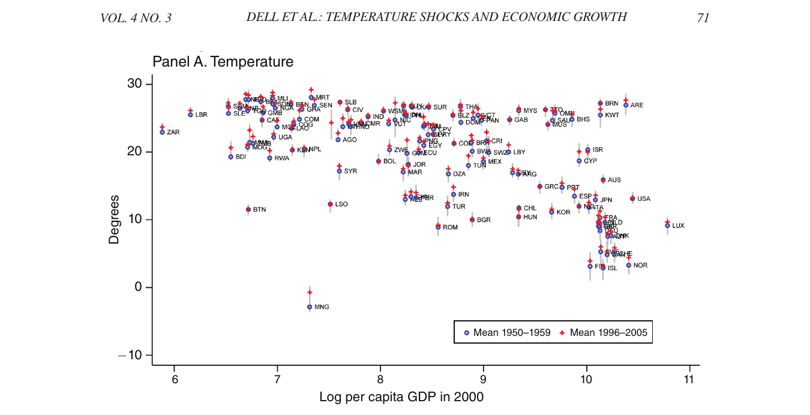
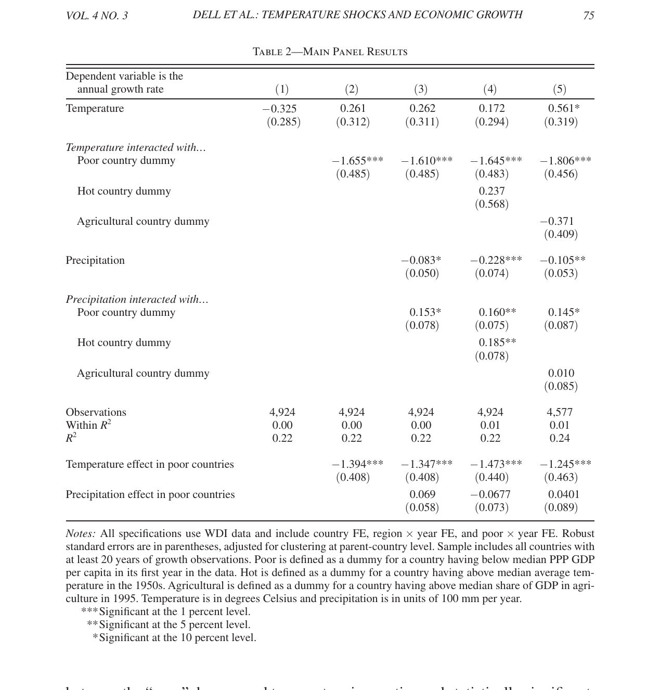

```{=html}
<style>
.reveal h2 { font-size: 1.3em !important; }
</style>
```

## Agenda

1. Climate and Development
2. Dell, Jones & Olken (2012)
3. Interpreting Logged Variables

## Deadlines

- **Expanded Research Design** due Wednesday, April 15 by 11:59pm via Slack
  - Make sure your html renders properly and you can see the plots if you open it on a web browser!

# Climate and Development

## The Planet Is Warming

{fig-align="center" height="5in"}

## Who Caused It

{fig-align="center" height="5in"}


## Should Climate Change Affect Development?

::: incremental
- **Agriculture**: crop yields fall above optimal temperature thresholds
- **Labor productivity**: heat stress reduces output, especially outdoor and manual work
- **Health**: heat illness, expanded disease vectors (malaria, dengue)
- **Conflict**: resource scarcity increases stress and violence
- **Infrastructure**: extreme weather destroys capital
:::

## Who Suffers

{fig-align="center" height="5in"}

# Dell, Jones & Olken (2012)

## Hot Countries Are Poor

{fig-align="center" height="4.5in"}

## What Do You Notice?

::: incremental
- Hotter places tend to be poorer. Does that mean heat *causes* poverty?
- What else differs between Nigeria and Norway besides temperature?
- Colonization history, institutions, geography, disease burden, trade access...
- The cross-country pattern cannot isolate the effect of temperature
:::

## Theory

If temperature does affect growth, where would we expect to see it most?

::: incremental
- Places with less capacity to adapt: rain-fed agriculture, weak health systems, fragile institutions
- So ... poor countries
:::

## Data and Model

125 countries, 1950--2003. Temperature from gridded weather data. GDP growth from Penn World Tables.

$$\Delta \ln y_{it} = \beta_1 T_{it} + \beta_2 P_{it} + \alpha_i + \gamma_t + \epsilon_{it}$$

- $T_{it}$: mean temperature in country $i$, year $t$, relative to that country's mean over the full sample (1950--2003)
- $\alpha_i$: country fixed effects
- $\gamma_t$: year fixed effects

## The Identification Strategy

::: incremental
- Country and Year FE absorb everything time-invariant for the country and year including "climate"
- $T_{it}$ measures was this year unusually hot *for this country*? **Weather**
- **Identification assumption:** conditional on country and year FE, year-to-year temperature fluctuations are uncorrelated with other determinants of GDP growth (i.e., $T_{it}$ is exogenous)
:::

## What the Assumption Allows and Forbids

```{r dag-identification, echo=FALSE, warning=FALSE, message=FALSE, fig.height=3.8, fig.align='center'}
library(ggplot2)

ggplot() +
  # T → Y (solid, main causal path)
  annotate("segment", x = 0.8, y = 2, xend = 3.2, yend = 2,
           linewidth = 1.1, arrow = arrow(length = unit(0.22, "cm"), type = "closed")) +
  annotate("text", x = 2, y = 2.18, size = 3,
           label = "via agriculture, labor, health, conflict") +
  # U → T (dashed — the threat)
  annotate("segment", x = 2, y = 3.5, xend = 0.35, yend = 2.35,
           linewidth = 0.9, linetype = "dashed",
           arrow = arrow(length = unit(0.2, "cm"), type = "open")) +
  # U → Y (dashed — the threat)
  annotate("segment", x = 2, y = 3.5, xend = 3.65, yend = 2.35,
           linewidth = 0.9, linetype = "dashed",
           arrow = arrow(length = unit(0.2, "cm"), type = "open")) +
  # Nodes
  annotate("label", x = 0, y = 2, label = "Temperature\ndeviation\n(T_it)",
           size = 3.4, fontface = "bold", label.padding = unit(0.45, "lines"),
           label.r = unit(0.15, "lines")) +
  annotate("label", x = 4, y = 2, label = "GDP\ngrowth\n(Y_it)",
           size = 3.4, fontface = "bold", label.padding = unit(0.45, "lines"),
           label.r = unit(0.15, "lines")) +
  annotate("label", x = 2, y = 3.7, label = "Unobserved confounder (U_it)",
           size = 3.2, fontface = "italic", label.padding = unit(0.35, "lines"),
           label.r = unit(0.15, "lines"), fill = "gray95", color = "gray30") +
  # FE note
  annotate("text", x = 2, y = 1.3, size = 2.9, color = "gray40",
           label = "Country FE: absorbs geography, institutions  |  Year FE: absorbs global shocks") +
  # Examples
  annotate("text", x = 2, y = 0.7, size = 2.9, color = "gray30", fontface = "italic",
           label = "e.g., drought raises temperature AND cuts harvest -> GDP falls (addressed by controlling for precipitation)") +
  xlim(-0.8, 4.8) + ylim(0.3, 4.3) +
  theme_void()
```

## Reading the Table

```{=html}
<div style="display:grid; grid-template-columns: 62% 38%; gap: 1.5em; align-items: center;">

<div style="position:relative;">
  

  <!-- Box 1: col(1) temperature row -->
  <div class="fragment current-visible" data-fragment-index="1"
    style="position:absolute; top:13%; left:33%; width:14%; height:8%;
           border:3px solid red; border-radius:3px; background:rgba(255,0,0,0.08);">
  </div>

  <!-- Box 2: col(2) poor dummy interaction (-1.655***) -->
  <div class="fragment current-visible" data-fragment-index="2"
    style="position:absolute; top:22%; left:45%; width:13%; height:8%;
           border:3px solid red; border-radius:3px; background:rgba(255,0,0,0.08);">
  </div>

  <!-- Box 3: temperature effect in poor countries bottom row (-1.394***) -->
  <div class="fragment" data-fragment-index="3"
    style="position:absolute; top:63%; left:45%; width:13%; height:7%;
           border:3px solid red; border-radius:3px; background:rgba(255,0,0,0.08);">
  </div>
</div>

<div style="font-size:0.85em;">
  <p class="fragment fade-in" data-fragment-index="1">
    Col (1): no effect on average across all countries.
  </p>
  <p class="fragment fade-in" data-fragment-index="2">
    Col (2): temperature interacted with a poor country dummy. Large and significant (-1.655***).
  </p>
  <p class="fragment fade-in" data-fragment-index="3">
    Marginal effect in poor countries: β_temp + β_interaction = <strong>-1.4pp</strong>. Same logic as <code>slopes()</code>.
  </p>
</div>

</div>
```

## What the Paper Argues

::: incremental
- The rich-poor asymmetry suggests climate change will widen global inequality
- Historical emissions came overwhelmingly from rich countries; damages fall on poor ones
- These are effects on *growth rates*, not levels; compounding matters enormously
- A 1.3pp drag sustained over decades means massive foregone development
- Adaptation is possible but requires investment poor countries cannot self-finance
:::

# Interpreting Logged Variables

## Why Log? Reason 1: Skewed Distributions

```{r log-skew, echo=FALSE, warning=FALSE, message=FALSE, fig.height=4, fig.align='center'}
library(WDI)
library(ggplot2)
library(dplyr)
library(patchwork)

wdi <- WDI(indicator = "NY.GDP.PCAP.PP.KD", country = "all",
           start = 2019, end = 2019, extra = TRUE) |>
  filter(!is.na(NY.GDP.PCAP.PP.KD), region != "Aggregates") |>
  rename(gdp = NY.GDP.PCAP.PP.KD)

p1 <- ggplot(wdi, aes(x = gdp)) +
  geom_histogram(bins = 40, fill = "#011F5B", alpha = 0.7) +
  labs(x = "GDP per capita (USD)", y = "", title = "Raw GDP") +
  theme_minimal(base_size = 14)

p2 <- ggplot(wdi, aes(x = log(gdp))) +
  geom_histogram(bins = 40, fill = "#990000", alpha = 0.7) +
  labs(x = "Log GDP per capita", y = "", title = "Log GDP") +
  theme_minimal(base_size = 14)

p1 + p2
```

## Why Log? Reason 2: A One-Unit Increase Is Not the Same

::: columns
::: {.column .fragment width="50%"}
**From $403 to $1,097**

- Log distance: **1 unit**
- Dollar jump: $694
:::

::: {.column .fragment width="50%"}
**From $22,026 to $59,874**

- Log distance: **1 unit**
- Dollar jump: $37,848
:::
:::

. . .

::: {.fragment}
<br><br>
A $700 raise is *a lot* if you earn $400. Not so much if you earn $40,000. Log GDP measures gains *proportionally*.
:::

## Log Scale vs. Dollar Scale

```{r rulers, echo=FALSE, warning=FALSE, message=FALSE, fig.height=3.5, fig.align='center'}
library(ggplot2)
library(scales)
library(tibble)
library(patchwork)

steps <- tibble(
  lx  = 6:11,
  dx  = exp(6:11),
  lab = paste0("$", comma(round(exp(6:11))))
)

base_theme <- theme_minimal(base_size = 13) +
  theme(axis.text.y = element_blank(), axis.ticks.y = element_blank(),
        panel.grid.major.y = element_blank(), panel.grid.minor = element_blank(),
        plot.title = element_text(face = "bold", hjust = 0.5))

p_log <- ggplot(steps, aes(x = lx, y = 0)) +
  geom_line(linewidth = 0.9, color = "#990000") +
  geom_point(size = 4, color = "#990000") +
  scale_x_continuous(breaks = 6:11, labels = steps$lab) +
  labs(x = NULL, y = NULL, title = "Log scale: equal steps") +
  base_theme +
  theme(axis.text.x = element_text(size = 10, angle = 30, hjust = 1))

p_lev <- ggplot(steps, aes(x = dx, y = 0)) +
  geom_line(linewidth = 0.9, color = "#011F5B") +
  geom_point(size = 4, color = "#011F5B") +
  scale_x_continuous(breaks = exp(6:11), labels = steps$lab) +
  labs(x = NULL, y = NULL, title = "Dollar scale: same values, very unequal steps") +
  base_theme +
  theme(axis.text.x = element_text(size = 10, angle = 30, hjust = 1))

p_log / p_lev
```

::: incremental
- **Log**: proportional changes matter (income, GDP, population)
- **Levels**: absolute changes matter (temperature, vote share)
- Modeling choice: Dell logs GDP, not temperature
:::

## Caution: Coefficients Mean Something Different

The familiar reading: $\hat{\beta}$ = "a one-unit increase in $X$ raises $Y$ by $\hat{\beta}$ units"

. . .

**When $Y$ is $\ln Y$:** $\hat{\beta} \times 100 \approx$ % change in $Y$

**When $Y$ is $\Delta \ln Y$ (already a growth rate):** $\hat{\beta}$ is directly a percentage point change

. . .

Interpretation also changes if $X$ is logged

