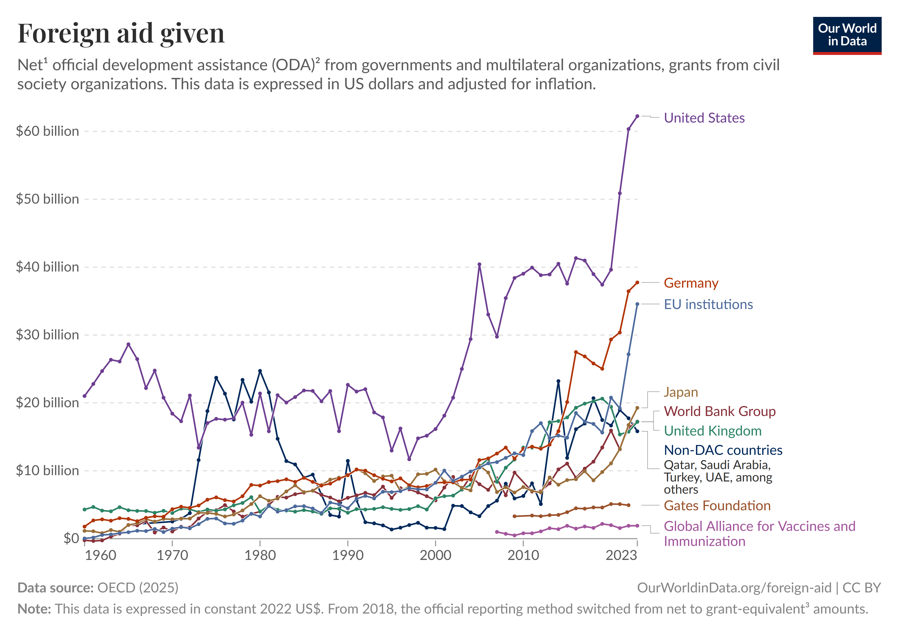
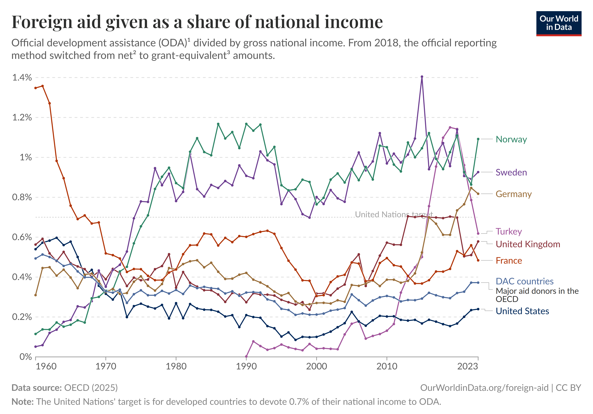
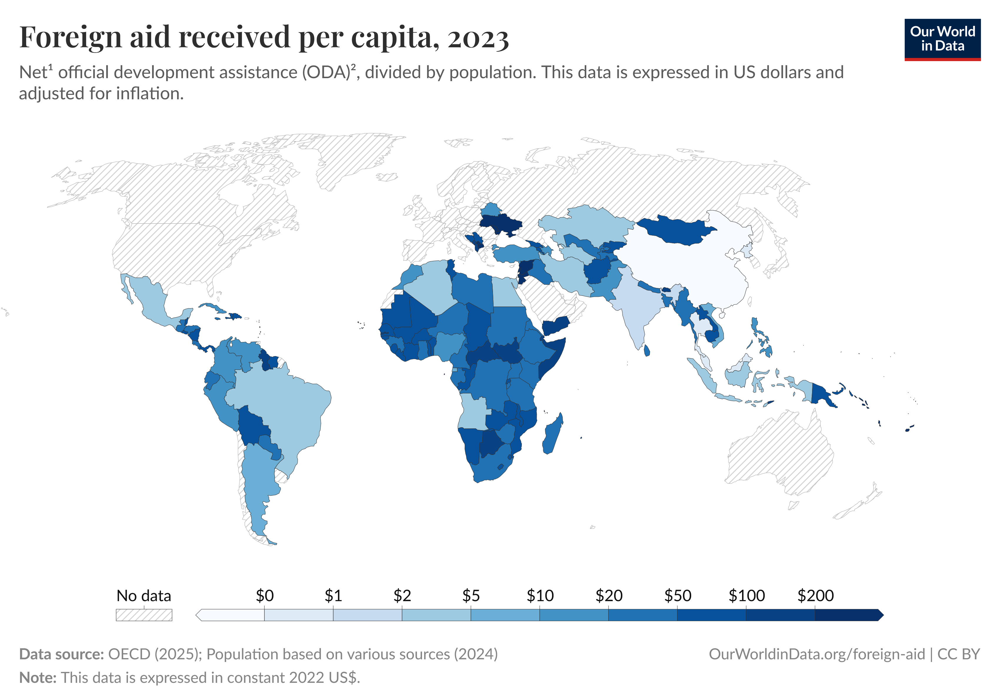
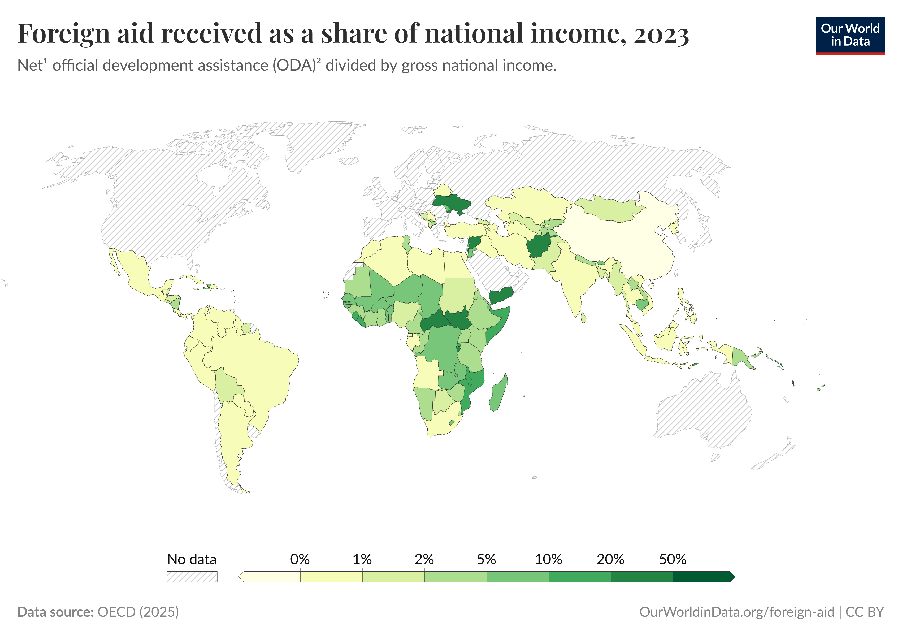
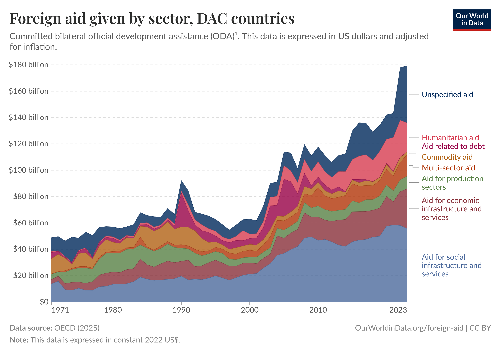

```{=html}
<style>
.reveal h2 { font-size: 1.3em !important; }
</style>
```

## Agenda

1. Foreign Aid and Development
2. Clemens, Radelet, Bhavnani & Bazzi (2012)

## Deadlines

- **Final Project Test** due today (April 15) by 11:59pm

# Foreign Aid and Development

## How Much Aid Flows?

{fig-align="center" height="5in"}

## Who Gives?

{fig-align="center" height="5in"}

## Who Receives?

{fig-align="center" height="5in"}

## Aid Dependence

{fig-align="center" height="5in"}

## What Goes Where?

{fig-align="center" height="5in"}

## What Is the Goal?

::: incremental
- **Development**: Reduce global poverty
- **Humanitarian**: Relief during crisis and disasters
- **Strategic**: geopolitical influence, commercial access?
:::

## Does aid foster development?

Your government receives $500 million from abroad

. . .

Does it spur development, and if so, why?

. . .

## Econ 101: The case for "Yes"

::: incremental
- Poor countries are caught in a trap: low income → low savings → low investment → low income
- Aid injects foreign capital and breaks the cycle
- In capital-scarce economies, returns to investment are high
:::

## Econ 101: The case for "Maybe"

::: incremental
- Any large foreign inflow appreciates the local currency
- Imports become cheap; exports become expensive on world markets
- Manufacturing and agriculture contract
:::

## Poli Sci 101: The case for "Yes"

::: incremental
- Poor governments often cannot fund public goods: courts, schools, clinics
- Politicians have short-term incentives, investment in public goods requires longer time horizons
- Aid can fund investments with long time horizons that short electoral cycles make unattractive
:::

## Poli Sci 101: Against

::: incremental
- A government funded by donors answers to donors, not citizens
- If aid makes governments less reliant on taxation → less representation; citizens lose leverage over the state
- Aid creates rents worth capturing: incentives to divert and steal
:::

## The Counterfactual

::: incremental
- Question: does aid produce development in recipient countries, relative to development had they not received aid?
- Empirically tough to answer! Aid goes to poorer, slower-growing countries and those in crisis
:::

## Macro Empirical Evidence is Mixed

::: incremental
- **Burnside & Dollar (2000)**: positive, but only with good policy
- **Rajan & Subramanian (2008)**: no robust effect, even with good policy
- **Hansen & Tarp (2001)**: positive but diminishing returns
- Micro-level RCTs: often positive for specific, well-targeted programs
:::

# Clemens, Radelet, Bhavnani & Bazzi (2012)

## Four Decades, Three Answers

::: incremental
- **Boone (1996)**: no effect on investment or growth across 96 countries
- **Burnside & Dollar (2000)**: aid raises growth, but only with good policy
- **Rajan & Subramanian (2008)**: no robust effect, even with good policy
- Similar data, similar periods, three different conclusions
:::

## Two Fixable Problems

::: incremental
- CRBB argue the divergence comes from two resolvable research design choices
- **Measurement**: what counts as development aid, and over what time horizon?
- **Identification**: how do you separate the effect of aid from the effect of everything that moves with aid?
:::

## Time Horizon

::: incremental
- A road raises productivity for decades; food relief addresses a crisis this week
- Testing whether **all aid** raises GDP **this year** is asking whether food relief builds roads
- The time horizon should depend on what type of aid you are measuring
:::

## Aid Types

::: incremental
- **Early-impact**: budget support, roads, energy, agriculture; plausible growth effect within a few years
- **Long-horizon**: education, health, technical cooperation; growth effects arrive over a generation
- **No clear growth mechanism**: humanitarian aid, food relief, emergency assistance
:::

## Decision 1: Lag

We receive aid in *t* - when should we measure development?

::: incremental
- **(a) Same period**: potential reverse causation
- **(b) Next period**: allows time for aid to work
- **(c) Much longer**: plausible for infrastructure, but a lot of things change
:::

. . .

CRBB choose **(b)**: does Aid($t-1$) predict Growth($t$)?

## Decision 2: Aid

What type aid should spur development?

::: incremental
- **(a) All disbursements**: food relief, technical assistance, emergency aid, budget support, infrastructure; everything in the data
- **(b) Project aid**: tied to specific outputs; excludes budget support, which can also fund productive investment
- **(c) Early-impact only**: budget support, roads, energy, agriculture; roughly 45-53% of total flows
:::

. . .

CRBB choose **(c)**

## The Causal Problem

Even with the right measure and the right lag, a problem remains.

::: incremental
- Countries that receive more aid tend to be poorer and slower-growing
- Aid and low growth travel together in the data
- Is aid **causing** slow growth, or is slow growth **causing** more aid?
:::


## Decision 3: Confounders

Poor, conflict-prone countries attract more aid and grow more slowly.

. . .

**The problem**: geography, colonial history, institutions, conflict all affect both aid receipt and growth; none of these are caused by aid


## FE vs. First-Differencing

::: incremental
- **Country FE**: deviation from country long-run mean; was Nigeria above its own average when aid was higher?
$$y_{it} - \bar{y}_i = \beta(\text{Aid}_{i,t-1} - \overline{\text{Aid}}_i)$$
- **First-difference**: change from previous period; did Nigeria grow faster when aid increased?
$$\Delta y_{it} = \beta \,\Delta\text{Aid}_{i,t-1}$$
- FD looks at period-to-period changes
:::

## What They Find

::: incremental
- Results consistent across all three reanalyzed datasets
- **+1 pp in Aid/GDP** is followed on average by:
  - **+0.1 to 0.2 pp** in annual real GDP per capita growth
  - **+0.3 to 0.5 pp** in Investment/GDP
- Positive but modest; diminishing returns set in and the effect turns negative at high aid levels
:::

## Is This Actually Causal?

::: incremental
- **Time-varying confounders**: a crisis can simultaneously trigger more aid and hurt growth; lagging and differencing do not fully remove this
- **Mean reversion**: bad growth attracts aid AND predicts recovery; aid may look effective simply because bad years do not persist
:::

## Mean Reversion

```{r mean-reversion, echo=FALSE, warning=FALSE, message=FALSE, fig.height=4.2, fig.align='center'}
library(ggplot2)

set.seed(42)
n <- 200
parent_h <- rnorm(n, 175, 9)
child_h  <- 0.5 * parent_h + 87.5 + rnorm(n, 0, 6)

ggplot(data.frame(p = parent_h, c = child_h), aes(p, c)) +
  geom_point(alpha = 0.35, color = "#011F5B", size = 1.8) +
  geom_smooth(method = "lm", color = "#990000", se = FALSE, linewidth = 1.1) +
  geom_abline(slope = 1, intercept = 0, linetype = "dashed", color = "gray55", linewidth = 0.8) +
  annotate("text", x = 158, y = 194, label = "slope = 1\n(no reversion)", size = 3, color = "gray45") +
  annotate("text", x = 192, y = 174, label = "actual slope\n(regression to mean)", size = 3, color = "#990000") +
  labs(x = "Parent height (cm)", y = "Child height (cm)",
       title = "Galton (1886): very tall parents have tall children, but not as tall as themselves") +
  theme_minimal(base_size = 13)
```

## Aid and Mean Reversion

::: incremental
- A country has a terrible growth year; donors respond with more aid
- The next period, growth recovers, partly because bad years do not persist
- A researcher observes: aid was followed by growth
- But the recovery may have happened regardless
:::

## Measurement is Crucial! 

## What the Paper Argues

::: incremental
- Aid causes some growth on average: modest, with wide variation across recipients
- High aid dependence shows diminishing returns; it cannot substitute for domestic investment
:::

# Why This Matters Now

## US Aid Has Collapsed

```{=html}
<!-- Replace with chart: US ODA 2000-2025, e.g. OECD DAC or devex.com screenshot -->
```

::: incremental
- The US is historically the world's largest bilateral donor
- In early 2025, the Trump administration dismantled USAID and froze most foreign assistance
- Dozens of countries lost their primary external funding source within weeks
:::

## Who Gets Hurt?

::: incremental
- Countries where aid is 10 to 20% of GDP face acute fiscal shortfalls with no capacity to absorb them
- Sub-Saharan Africa: highest aid dependence, weakest domestic revenue base
- Health programs (HIV treatment, malaria, TB) face immediate disruption
- Aid cuts reduce investment and remove shock buffers in the countries least able to absorb them
:::
